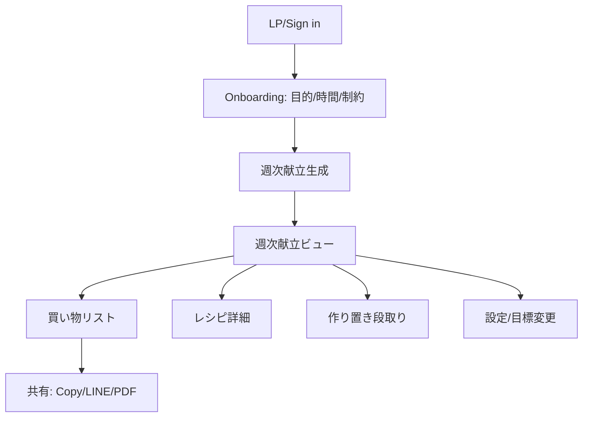
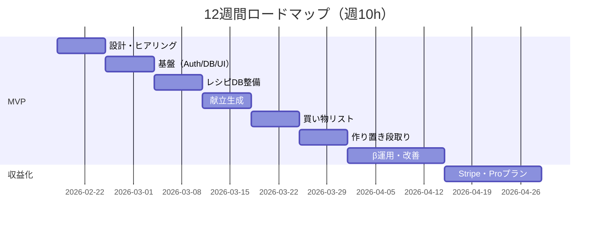

# 学生が立ち上げるプロダクト型ビジネス案B：筋トレ×自炊「献立と買い物を1クリック化」詳細ビジネス戦略

## エグゼクティブサマリ

本提案は、**筋トレを継続したいが「食事が面倒」で詰む層**に対し、**筋トレ目的（増量/減量/維持）に合わせた献立作成と買い物を“1クリック”で完了**させるプロダクト（Webアプリ/PWA）を、学生が週10時間・初期資金10万円以内で立ち上げる実務計画です。  
価値の核は「記録（ログ）を頑張らせる」ではなく、**“実行”までを自動化して習慣化コストを下げる**ことです。食事計画（meal planning）が健康的な食事や肥満リスクの低さと関連するという観察研究や、買い物リスト利用が食事の質（Healthy Eating Index）やBMIの良好さと関連する報告があり、**「計画＋買い物リスト」は行動変容に効くレバー**になり得ます。citeturn35view0turn40view0

市場環境として、日本のフィットネス市場は**2024年度に7,100億円前後で過去最高更新見込み**という調査があり、健康志向・店舗拡大に加え、**SNSを活用したプロモーション強化**が言及されています。citeturn36view1 またスポーツ庁の世論調査では、この1年間に実施した運動種目で「トレーニング」は**全体13.3%**（男女別も提示）で、一定の母数が存在します。citeturn36view2turn36view3 さらに食品宅配（ネットスーパー等含む）市場は**2024年度2兆6,380億円**、ミールキット市場は**約1,900億円規模**と推計されており、献立・買い物・調理の時短ニーズが強いことがうかがえます。citeturn14search1

競合は「あすけん」「カロミル」などの食事管理・PFC可視化アプリが強く、価格も月額**約480円帯**が見られます（例：あすけんアプリ決済 1か月480円、カロミル プレミアムプラン480円）。citeturn2view0turn3view0 一方で競合の主戦場は**“記録→分析”**であり、**筋トレ×自炊の「実行」**（作り置き前提の献立、買い物導線、食材使い切り）に尖った「軽量・高速」体験は、学生プロダクトでも差別化の余地があります。

ローンチ戦略は**SNS中心（ショート動画/図解）＋コミュニティ型（LINEオープンチャット/Discord）**を基本とし、行動データとして日本の通信利用動向調査の要点に「SNS利用が高い」ことが示されています（インターネット利用目的でSNSが最上位81.9%との要約）。citeturn21search3  
売上目標（月1〜5万円）に対しては、月額780円なら**約13〜64人の有料会員**で到達可能です（Stripe決済手数料3.6%を差し引いても成立）。citeturn42view0

---

## 概要と価値提案

### 解く課題

筋トレ継続のボトルネックは「トレーニングそのもの」より、**食事（自炊）の意思決定と実行コスト**になりがちです。典型的には以下が積み上がります。

- 献立を考えるのが面倒（意思決定疲れ）
- PFC/たんぱく質目標に合わせるのが難しい（知識負債）
- 買い物が面倒（買い忘れ・無駄買い・食材ロス）
- 作り置きや時短の段取りが組めない（平日に崩壊）

この「計画の欠如」は行動変容上の弱点になり得ます。例えば、Meal planning は健康的な食事・肥満の少なさと関連し得ることが示され、因果は断定できないが肥満予防に関係し得ると結論づけています。citeturn35view0 また、買い物リストを常に使うことが、食事の質（Healthy Eating Index）やBMIの良好さと関連するという研究報告があります。citeturn40view0

### 誰の、どんな課題を、どう解決するか

**ターゲット**：筋トレをしていて「自炊もやりたい」が、献立～買い物で崩れる層（学生/若手社会人/ジム通い初心者〜中級者）  
**提供価値**：  
- 目的別（増量/減量/維持）に合わせた**週次献立**を自動生成  
- その献立から**買い物リストを自動集約**（カテゴリ別、分量、代替可）  
- 「作り置き」前提の**段取り（何をいつ作るか）**まで提示  
→ ユーザーは「考える」を減らし、「実行する」だけになる

### 提案するプロダクトの形

- **Webアプリ（PWA）**：ストア審査なし、開発が軽い、SNS導線（リンク）に強い  
- 栄養計算は、文部科学省の**日本食品標準成分表**データ（Excel公開）や食品成分データベースをもとに、**“代表値であり変動がある”**前提で表示（免責と注意喚起をUIに組み込む）。citeturn30search2turn24search1turn30search1

> 注意：本プロダクトは医療行為・治療目的ではなく、一般的な生活改善支援。持病、服薬、摂食障害等の懸念がある場合は医療職へ相談、を明示。

---

## 市場分析

### トレンド根拠

フィットネス需要は回復・拡大傾向が示され、2024年度のフィットネス市場は**7,100億円前後**で過去最高更新見込み、健康志向と店舗拡大、さらに**SNS活用プロモーション強化**が会員増に寄与したとされています。citeturn36view1turn36view0  
運動実施の裾野も広く、スポーツ庁調査では「この1年間に実施した種目」で**トレーニングが全体13.3%**（男性15.4%、女性11.1%）として上位に位置します。citeturn36view2turn36view3

食領域では、食品宅配市場（生協個配・ネットスーパー等含む）が**2024年度2兆6,380億円**、ミールキットが**約1,900億円規模**と推計され、献立・買い物・調理の時短ニーズが明確です。citeturn14search1

アプリ市場側でも、ヘルスケアアプリの動向として、App Apeデータに基づき「MAU500以上のヘルスケアアプリ数1,788」「1日平均起動回数2.8回」などが示され、健康領域アプリの厚みと利用習慣の存在がうかがえます。citeturn16search0

### 国内外の類似サービス比較表

> 目的：あなたの案（筋トレ×自炊×買い物ワンクリック）が、既存の「記録・分析」中心アプリや、宅配サービスとどこで差別化できるかを可視化。

| 分類 | サービス | 主機能の重心 | 献立生成 | 買い物リスト | PFC/栄養 | 価格帯（目安） | 強み | 弱み（あなたの勝ち筋） |
|---|---|---|---|---|---|---|---|---|
| 国内・食事管理 | あすけん | 記録→分析→アドバイス | （コース/機能はあるが主軸は記録） | △（Myセット等はあるが「買い物完了」導線は薄い） | ◎（PFC表示/カスタム等：プレミアム）citeturn27view0 | アプリ決済：月480円（Web月475円）citeturn2view0 | 会員規模が大きく信頼性（累計1,300万人）citeturn29search0 | “実行（献立→買い物→作り置き）”の一気通貫が弱い：ここに特化できる |
| 国内・食事管理 | カロミル | 記録＋PFC | ◎（献立作成プランあり）citeturn3view0 | △（献立は作れるが「買い物ワンクリック」体験は限定的になりやすい） | ◎ | 月360円（献立作成）/月480円（プレミアム）citeturn3view0 | 献立作成機能が既にある | 「筋トレ自炊」の作業（作り置き・食材使い切り・時短）に尖らせて勝つ |
| 海外・献立特化 | Eat This Much | 献立自動生成 | ◎ | ◎（自動買い物リスト、配達統合等）citeturn8view0 | ◎ | $5/月（年契約換算）citeturn8view0 | 「献立→買い物」体験の完成度 | 日本の食材・スーパー導線・和食/高たんぱく自炊にローカライズ余地 |
| 海外・献立/レシピ | Mealime | 献立＋買い物 | ◎ | ◎（レシピ→食料品リスト、パートナー送信）citeturn10search7 | △（Proで栄養表示等） | Pro：$2.99/月citeturn10search7 | 忙しい層向けの設計が洗練 | 筋トレ向けPFC最適化・“作り置き前提”の弱さ |
| 海外・総合 | MyFitnessPal | 記録（強）＋食事プラン（追加） | ○ | ○（meal planning/grocery delivery言及）citeturn7view0 | ◎ | 月$19.99（米App Store表示例）citeturn7view0 | 世界的ブランド/DB | 高機能・高価格で過剰。日本の「安く・早く・自炊」ニーズに軽量特化で勝つ |
| 海外・栄養/プラン | Fitia | 食事プラン（減量/筋肥大） | ◎ | ○（自動買い物リスト）citeturn9search3 | ◎ |（表示はアプリ内課金） | 筋肥大プラン文脈あり | 日本語UI/和食/食材の入手性に課題が出やすい |
| 代替（宅配） | nosh | 宅配（調理不要） | × | × | △（栄養設計はあるが自炊ではない） | 6食4,318円などciteturn33view0 | “面倒ゼロ” | 自炊派やコスパ重視、食材選好が強い層は離脱しがち |
| 代替（置き換え） | BASE FOOD | 置き換え（パン等） | × | × | △ | 継続割：初回20%OFF/以降10%OFF、送料500円等citeturn34view0 | 忙しい層に刺さる | “料理したい/献立を整えたい”層には別ニーズ |

結論として、日本には「食事管理」は強いが、**筋トレ自炊の“実行設計（作り置き・買い物・使い切り）”に極端に寄せた軽量プロダクト**は、学生でも勝ち筋を作れます。

### 市場規模推定

ここでは「推計の透明性」を優先し、公開統計＋合理仮定でレンジを出します。

前提データ（根拠）  
- 日本の総人口は約**1億2,295万人**（統計局の人口推計のポイントとして提示）。citeturn15search1  
- 15〜64歳人口**7,353万人**、65歳以上人口**3,620.6万人**（同ポイント）。citeturn15search1  
- 「この1年間に実施した種目」でトレーニング**13.3%**。citeturn36view2turn36view3

推計（例）  
- 20歳以上人口は厳密値が必要ですが、本稿では近似として「15歳以上人口（約1.097億）から15–19歳を控除」→**約1.05億人**と置きます（保守的な概算）。citeturn15search1  
- トレーニング実施者（年ベース） ≒ 1.05億 × 13.3% ≒ **約1,400万人**（TAMの入口）。citeturn36view2turn36view3  
- そのうち「筋トレ目的が明確（増量/減量）」「自炊を週数回」「献立/買い物が課題」などの条件を満たし、献立課金に興味を持つ層を**20%**と仮定 → **約280万人（SAM）**  
- 学生プロダクトがSNS中心で半年以内にリーチできるシェアを**0.5〜2%**と仮定 → **約1.4万〜5.6万人（SOM候補）**

マネタイズ換算（年額換算）  
- 月額780円（後述）を年額にすると9,360円。  
- SAM（280万人）が全員課金するわけではないが、理論上の“支払可能市場”レンジは 280万 × 9,360円 ≒ **約262億円/年**（上限の参考値）。  
- 実際の学生目標は月1〜5万円なので、必要課金者は13〜64人（到達難易度は“市場”ではなく“獲得設計”が支配）。

### 主要競合の強み・弱み（あなたが勝つポイント）

あすけん  
- 強み：食事記録・栄養アドバイス基盤が強く、プレミアムでPFC表示/画像解析など機能が広い。citeturn27view0turn27view0turn2view0  
- 弱み：ユーザーに「記録」を要求しやすい。あなたは「記録の努力」を減らし、**献立→買い物→調理**の“実行”を主役にできる。

カロミル  
- 強み：献立作成プランが明示されている。citeturn3view0  
- 弱み：筋トレ特化の「作り置き段取り」「スーパー導線」「食材使い切り」まで突き抜けているとは限らない。あなたは“筋トレ自炊”に機能の全てを寄せ、軽量UIで勝つ。

海外献立アプリ（Eat This Much / Mealime）  
- 強み：献立→買い物リスト体験が成熟。citeturn8view0turn10search7  
- 弱み：日本の食材・分量・和食・スーパー文化・価格感のローカライズが不十分になり得る。あなたの勝ちは**日本語×日本の食材×筋トレ飯**の一点突破。

---

## ペルソナ

> 各ペルソナに「行動」「課題」「KPI」を設定し、MVPの“捨てる/作る”判断に直結させます。

### 増量したいジム初心者の大学生

- 属性：19〜23歳、週2〜3回ジム、バイト/授業で忙しい、料理スキル中〜低  
- 行動：YouTube/TikTokで筋トレ情報収集、プロテインは飲むが食事が雑  
- 課題：たんぱく質が足りない、献立がマンネリ、買い物/自炊が面倒で継続できない  
- 重要KPI：  
  - 週の献立生成回数（≥1回/週）  
  - 買い物リスト閲覧→チェック率（≥70%）  
  - 1週間あたりの「目標たんぱく質達成日数」（自己申告で可、≥4日/週）

### 減量したい若手社会人（時短重視）

- 属性：23〜30歳、週1〜2回ジムor宅トレ、残業あり、外食/コンビニ多め  
- 行動：健康アプリを入れるが続かない、平日は料理15分以内が限界  
- 課題：平日の意思決定が苦痛、カロリー管理が破綻、買い忘れで外食になる  
- 重要KPI：  
  - “作り置きDay”の実行率（週1回）  
  - 平日自炊回数（≥3回/週）  
  - 退会理由「使ってない（Not enough usage）」を減らす（後述の運用KPI）

### コスパ重視の筋トレ中級者（自炊慣れ）

- 属性：20代後半〜30代前半、週3〜5回トレ、PFC理解あり、弁当持参もする  
- 行動：自作テンプレ飯を回しているが、飽き/栄養バランス/食材ロスが出る  
- 課題：マンネリ、食材の余り、増量/減量期で献立を切り替えるのが面倒  
- 重要KPI：  
  - 既存テンプレ飯の置換率（提案レシピ採用率≥30%）  
  - 食材ロス自己申告（週あたり廃棄回数↓）  
  - 継続課金（月次継続率）

---

## プロダクト設計とUX/UI

### コア機能

コア機能は「価値の鎖」を切らない3点に絞ります。

#### ワンクリック献立生成

- 入力：目的（増量/減量/維持）、週のトレ日、体重（任意）、料理可能時間、予算感、好き嫌い/アレルギー  
- 出力：7日分（最低でも平日5日分）の献立（例：昼/夜の2食＋プロテイン/間食の簡易提案）  
- “筋トレ飯”設計：たんぱく質目標は、運動する健康成人の蛋白摂取量の一般的目安レンジ（例：体重あたり1.4〜2.0g/kg/日）など、学術団体のポジションスタンドを参考レンジとしてUIに提示しつつ、医療助言ではない免責を明示。citeturn22search2

#### 自動買い物リスト集約

- 献立→食材を名寄せ（鶏むね、鶏胸などの正規化）、必要量を合算  
- カテゴリ別（肉/魚/卵乳/野菜/主食/調味料）に並べ、店舗でチェックしやすく  
- まずは「コピー」「印刷」「LINE共有」から開始（ネットスーパー統合は後回し）

買い物リストの利用が食事の質やBMIと関連する報告があるため、**この機能自体が価値の中心**になります。citeturn40view0turn40view1

#### 作り置き段取り（バッチ調理）

- 「日曜60分」「水曜30分」など、ユーザーの可処分時間に合わせて段取り提示  
- 例：日曜に鶏むね2kgを下処理→平日3レシピに分岐  
- “作り置き”により平日の意思決定と調理時間を圧縮する

### 追加機能候補（MVP後）

- 余り食材の救済（「キャベツが余る→2レシピ提案」）
- 食材単価の学習（ユーザーのレシート入力で“あなたの近所価格”に最適化）
- 外食/コンビニ置換（「今日は無理」ボタン→低ダメージ代替）
- 週間のPFC達成度ダッシュボード（“記録”ではなく“履行”中心）
- レシピの難易度フィルタ（電子レンジのみ等）
- 競合にある機能（画像解析・バーコード）は後回し（重くなる）

### 画面一覧と簡易ワイヤー

#### スクリーン一覧

- S0：LP/ログイン
- S1：オンボーディング（目的/時間/予算/制約）
- S2：週次献立（カレンダー）
- S3：買い物リスト（カテゴリ別+チェック）
- S4：レシピ詳細（材料・手順・栄養）
- S5：作り置き段取り（タイムライン）
- S6：設定（目標/アレルギー/NG食材）

#### ワイヤー（ASCII）

**S2：週次献立**
```
[今週の目標] 増量 / たんぱく目安: 140g/日
[作り置きDay] 日曜 60分  (変更)

月  昼: 鶏むね塩麹 + 米     夜: 豆腐そぼろ丼
火  昼: ツナ卵オートミール  夜: 鮭+野菜レンチン
...

[ボタン] 買い物を1クリック化 →（S3）
```

**S3：買い物リスト**
```
肉・魚
[ ] 鶏むね 1200g
[ ] 鮭 2切
卵・乳
[ ] 卵 10個
野菜
[ ] ブロッコリー 2株
...

[ボタン] コピーして買い物メモ
[ボタン] LINEに送る
[ボタン] 印刷用PDF
```

**S5：作り置き段取り**
```
日曜 60分で今週が楽になる
00:00  米を炊く（3合）
00:05  鶏むね下処理（塩麹/酒）
00:20  野菜を切る（玉ねぎ/人参）
00:35  そぼろを作る
00:55  保存（冷蔵/冷凍）
```

---

## MVP仕様と開発計画

### MVPの到達定義

- 週次献立を自動生成できる  
- その献立から買い物リストが自動生成され、ユーザーが実際に買い物で使える  
- レシピ詳細と最低限の段取りが見られる  
- 課金（サブスク）は最短で2ヶ月目に導入（最初はWaitlistでも可）

### 画面フロー（mermaid）



### 技術スタック（学生・週10時間前提の最適解）

- フロント：Next.js（App Router） + TypeScript  
- UI：Tailwind CSS + shadcn/ui（任意）
- DB/Auth：Supabase（Postgres + Auth + Row Level Security）
- サーバー：Next.js Route Handler（軽量API）
- ホスティング：Vercel（無料枠→必要なら有料）
- 決済：Stripe（Webサブスク）  
  - 国内カード手数料：**3.6%/成功取引**（Stripe公式）citeturn42view0
- 栄養データ：  
  - 初期はレシピDBを手作り（30〜50レシピ）  
  - 拡張で文科省の食品成分表データ（Excel公開）と食品成分DBを参照し、成分値は代表値である旨を明記。citeturn30search2turn30search1turn24search1

### API設計（最小）

- `POST /api/plan/generate`：ユーザー条件→週次プラン生成
- `GET /api/plan/:id`：プラン取得
- `GET /api/plan/:id/grocery`：買い物リスト取得
- `GET /api/recipes/:id`：レシピ詳細
- `POST /api/billing/create-checkout-session`：Stripe Checkout
- `POST /api/webhooks/stripe`：購読状態同期

### データモデル（概略）

- `users`（Supabase Auth）
- `user_profile`：目的、活動量、制約、予算、調理時間
- `recipes`：レシピ名、調理時間、難易度、カテゴリ、栄養（PFC）
- `ingredients`：食材名、単位、同義語
- `recipe_ingredients`：レシピ×食材×量
- `plans`：週次プラン（開始日、目標、生成条件）
- `plan_items`：日×食×レシピID
- `grocery_items`：プラン×食材×合算量（生成キャッシュ）

### 献立生成ロジック（MVPは“賢い単純さ”）

LLMで最初から全文生成すると、コスト・品質・再現性が不安定になります。学生の勝ち筋は「**制約付き選択問題**」として扱うことです。

- レシピを「高たんぱく低脂質」「高炭水」「レンチン」「作り置き向き」などタグ付け
- 目的に応じて  
  - 増量：高たんぱく＋十分な炭水化物  
  - 減量：高たんぱく＋低脂質＋野菜多め  
- 週のトレ日を重み付け（トレ日=炭水多め）
- “食材の共通化”をスコアに入れる（買い物点数を上げる）

> ここが差別化：競合が“栄養の正確性”や“記録の網羅性”に寄りがちなのに対し、あなたは「買い物と作り置きがラク」＝継続しやすさを最適化する。

### 開発工数見積（週10時間）

| フェーズ | 内容 | 見積時間 |
|---|---|---:|
| 設計 | 要件定義、画面遷移、DB設計 | 6h |
| 基盤 | Next.js + Supabase Auth + レイアウト | 10h |
| レシピDB | 初期30〜50レシピ投入（手作業+CSV） | 8h |
| 献立生成 | ルールベース生成 + 保存 | 12h |
| 買い物リスト | 名寄せ、カテゴリ表示、共有導線 | 10h |
| UI仕上げ | オンボーディング、献立ビュー、段取り画面 | 12h |
| 計測/運用 | PostHog等、ログ、エラーハンドリング | 6h |
| 合計 | MVP（課金なし） | **64h（約6〜7週）** |

課金を入れる場合は追加で +10〜15h（Stripe Checkout + Webhook + 制限機能）。

---

## マネタイズと収支モデル

### 価格プラン設計（競合整合）

国内競合の月額は、あすけん（1ヶ月480円）citeturn2view0、カロミル（プレミアム480円/献立作成360円）citeturn3view0 など、**月300〜500円帯が強い**です。  
一方、あなたの提供価値は「献立＋買い物＋段取り」の“実行”なので、**もう少し高い価格でも価値説明が可能**です（ただし学生向けに入口を低く）。

提案プラン：

- Free：  
  - 3日分献立生成（月1回まで）  
  - 買い物リストは閲覧のみ（共有/印刷不可）
- Pro（月額）：**¥780/月**  
  - 週次献立（無制限）  
  - 買い物リスト（コピー/LINE/PDF）  
  - 作り置き段取り  
- Pro（年額）：¥7,800/年（実質650円/月）
- 学生トライアル：14日無料（学生証提示は不要、自己申告でOKにして摩擦を減らす）

### LTV（仮定）

LTVは「ARPU × 継続期間」で概算します。継続はプロダクトの“習慣価値”が最重要。RevenueCatの2025レポートでは、Health & Fitnessカテゴリの**trial-to-paidの中央値39.9%**、上位10%は68.3%とされ、設計次第で大きく伸びることが示唆されています。citeturn26view0  
ただし、あなたはWebアプリでストア課金ではないため、ここでは保守的に：

- ARPU：780円/月
- 継続期間（仮定レンジ）：3〜6ヶ月  
- LTV：2,340〜4,680円

目標（月1〜5万円）に対しては、LTVよりも「**初期獲得→初週の実行**」が支配的です（使わないと解約される）。

### 収支モデル（試算表）

Stripeの国内カード手数料は3.6%。citeturn42view0  
（他コストは極力無料枠で抑える想定）

| 指標 | 月1万円目標 | 月5万円目標 |
|---|---:|---:|
| Pro価格 | 780円 | 780円 |
| 必要課金者数（概算） | 13人 | 64人 |
| 売上（総額） | 10,140円 | 49,920円 |
| 決済手数料（3.6%） | ▲365円 | ▲1,797円 |
| 月次固定費（無料運用想定） | 0〜2,000円 | 0〜2,000円 |
| 概算利益 | 約7,700〜9,700円 | 約46,000〜48,000円 |

---

## マーケティング戦略・ロードマップ・リスク管理・テンプレ&ファイル群

### マーケティング戦略

#### なぜSNS中心が合理的か

- フィットネス業界の会員増の背景として、SNS活用プロモーション強化が言及されています。citeturn36view1  
- 通信利用動向調査（要点）として、インターネット利用目的でSNSが高い比率であることが示されています（SNS利用81.9%との要約）。citeturn21search3  

よって、学生が資金をかけずに勝つなら「**SNS→LP→無料生成→実行→共有**」のループが最短です。

#### 獲得ファネル設計（KPI）

- 認知KPI：再生数、保存数、プロフィール遷移率
- 興味KPI：LP CTR、メール/LINE登録率、無料献立生成完了率
- 活性KPI：買い物リスト表示率、チェック率、週次再生成率
- 収益KPI：Free→Pro転換率、月次継続率、解約理由（Not enough usageを潰す）

#### 初月〜6ヶ月の獲得計画（資金ほぼゼロ）

| 月 | 目的 | 施策 | 目標KPI（目安） |
|---|---|---|---|
| 1ヶ月目 | 問題検証 | TikTok/IGで毎週5本、β募集、10人インタビュー | β登録30人、献立生成20件 |
| 2ヶ月目 | MVP公開 | 無料3日献立→買い物リスト共有導線、継続観察 | 週次再生成率30% |
| 3ヶ月目 | 課金開始 | Pro開始、初月割引、紹介コード | 有料10人 |
| 4ヶ月目 | 伸長 | “作り置き”特化コンテンツ、UGC促進 | 週次再生成率40% |
| 5ヶ月目 | 最適化 | 退会理由分析、オンボーディング改善 | 解約率↓ |
| 6ヶ月目 | 収益安定 | マイクロインフルエンサー提携 | 有料50〜70人 |

#### 広告案（小額でも効く形）

- 1日300円×7日でテスト（2,100円）  
- クリエイティブは「Before/After（買い物時間）」「献立の悩み→1クリック」を短尺で  
- LPは“機能説明”より“成果物（買い物リスト見本）”を前面に

### SNS投稿テンプレ（本文末にファイルとして10本分を出力）

方針：投稿は「筋トレ理論」より「**今日の自炊がラクになる**」に寄せる。視聴者の行動は“保存”が最重要。

### ロードマップ（0→1 週次タスク表）

> 週10時間前提。8週でMVP、12週で課金・収益化まで。

| 週 | ゴール | タスク |
|---|---|---|
| Week1 | 課題確定 | 競合100分触る、ターゲット10人ヒアリング、要件確定 |
| Week2 | 画面とDB | ワイヤー、Supabase設計、Auth/基本UI |
| Week3 | レシピDB | 30レシピ作成（材料・PFC・手順） |
| Week4 | 献立生成 | ルール生成→保存→表示 |
| Week5 | 買い物リスト | 名寄せ・カテゴリ・共有（コピー/LINE） |
| Week6 | 作り置き段取り | タイムライン表示、UX磨き |
| Week7 | β運用 | 10〜30人に配布、ログ取得、改善 |
| Week8 | MVP公開 | LP公開、無料献立枠で拡散 |
| Week9-12 | 収益化 | Stripe導入、Pro制限、紹介機能、KPI運用 |

#### 3ヶ月・6ヶ月目標

- 3ヶ月：有料10人、無料→有料導線の型を作る
- 6ヶ月：有料50〜70人（目標売上4〜5万円圏）、継続率改善（“使ってない”を潰す）

#### mermaid タイムライン



### リスクと対策

- 栄養の正確性リスク：食品成分値は代表値で変動があることが公式通知で示されているため、UIで「目安」表記と免責、医療相談導線を明示。citeturn24search1turn30search1  
- 競合過多：食事管理アプリ自体は巨大（例：あすけん累計1,300万人）citeturn29search0。勝ち方は「筋トレ×自炊の実行」へ尖らせ、**狭い勝ち筋**（作り置き・買い物・使い切り）に集中。  
- 継続率：サブスクは「Not enough usage」が主要解約理由になりやすい（一般に解約理由として利用不足が上位に来ることが示される）。citeturn26view0 → 初週に価値体験（献立→買い物→調理）を達成させるオンボーディングを最重要にする。  
- 決済/法務：個人情報・健康情報に類するデータを扱うため、最小収集・暗号化・削除要求対応・プライバシーポリシー整備。  
- 開発時間不足：LLM全面依存を避け、ルールベース＋小さなレシピDBでMVPを成立させる。

### 必要ドキュメント一覧（テンプレ付き）

- PRD（要件定義）
- 画面遷移図/ワイヤー
- DB設計書
- API仕様書
- プライバシーポリシー
- 利用規約
- FAQ
- LPコピー/素材台本
- 投資家向け1枚資料

（テンプレは後半の「ファイル群」に含めます）

### 実行に必要なコスト見積（初期・月次）と資金調達案

#### 初期費用（〜10万円内）

- ドメイン：〜2,000円/年（目安）
- 最小ツール：0〜5,000円（必要なら）
- 広告テスト：0〜5,000円（任意）
- 合計：**0〜1万円程度**で開始可能（無料枠前提）

#### 月次費用（成長後）

- Vercel/Supabase：無料〜（増えたら有料へ）
- 決済手数料：Stripe 3.6%（国内カード）citeturn42view0
- 分析ツール：無料枠
- 合計：**売上連動＋固定0〜数千円**

#### 資金調達案（学生向け・軽量）

- 収益化前の「β有料」：初期ユーザーに“共同開発プラン”として月500円で先行提供
- 学内/自治体の起業支援・ビジコン
- 小規模なら融資よりも、**SNSで先に顧客（課金者）を作る方が速い**

### 参考ソース優先リスト（日本語優先・一次情報優先）

| 優先度 | ソース | 使いどころ |
|---|---|---|
| 最優先 | スポーツ庁「スポーツの実施状況等に関する世論調査」 | 筋トレ人口・行動傾向の根拠 citeturn36view2turn36view3turn36view5 |
| 最優先 | 帝国データバンク「フィットネス市場」 | 市場規模・SNSプロモ言及 citeturn36view1turn36view0 |
| 最優先 | 文科省「日本食品標準成分表」 | 栄養計算の一次データ citeturn30search2turn30search1 |
| 高 | 矢野経済研究所（プレス） | 食品宅配/ミールキット市場 citeturn14search1 |
| 高 | Stripe公式料金 | 決済手数料 citeturn42view0 |
| 補助 | あすけん/カロミル公式ヘルプ | 競合価格・機能 citeturn2view0turn27view0turn3view0 |
| 補助 | 研究論文（meal planning / grocery list） | “計画＋買い物リスト”の合理性 citeturn35view0turn40view0 |
| 補助 | RevenueCatレポート | サブスク転換のベンチマーク citeturn26view0 |

---

## すぐ使えるファイル群（Markdown / CSV / コードブロック）

以下は、そのままコピペして使える“ファイル想定”の内容です（コードブロック＝ファイル本体）。

### VibeCoding用設計書（Markdown）

```markdown
# VibeCoding設計書.md
プロダクト名（仮）: BulkPlan（筋トレ×自炊：献立と買い物を1クリック化）
作成日: 2026-02-18
前提: 学生が週10hで開発、初期資金10万円以内、目標 月1〜5万円

## 目的
- 筋トレ目的（増量/減量/維持）に沿った「週次献立」と「買い物リスト」を、最小の入力で自動生成する。
- ユーザーに“記録”を強制せず、“実行”をラクにする。

## 非目的（MVPではやらない）
- 画像解析・バーコード読み取り
- 外食/コンビニの全メニューDB
- 医療用途（治療・診断・栄養指導の代替）

## ターゲット
- 筋トレをしているが食事設計が面倒な学生・若手社会人
- 自炊はしたい（or せざるを得ない）が、献立と買い物で崩れる層

## 体験（最重要）
1) オンボーディング（30秒〜60秒）
2) 週次献立が出る（例: 平日5日でも可）
3) 「買い物リスト」ボタン → 即チェック可能
4) 「作り置き段取り」→ 週1回のバッチで平日がラクになる

## 画面
- / (LP)
- /app (ダッシュボード)
- /app/onboarding
- /app/plan/[week]
- /app/plan/[week]/grocery
- /app/recipes/[id]
- /app/prep (作り置き段取り)
- /app/settings
- /app/billing

## 技術スタック
- Next.js (App Router) + TypeScript
- Tailwind CSS + shadcn/ui（任意）
- Supabase（Auth, Postgres, RLS）
- Vercel deploy
- Stripe Checkout + Webhook
- PostHog（任意、無料枠）

## データモデル（SQLイメージ）
### user_profile
- user_id (uuid, PK, FK auth.users)
- goal (enum: bulk/cut/maintain)
- training_days (int 0-7)
- time_per_day_min (int)
- budget_level (enum: low/med/high)
- allergies (text[])
- dislikes (text[])
- created_at, updated_at

### recipes
- id (uuid PK)
- name (text)
- tags (text[]) 例: high_protein, microwave, batchable, low_fat, high_carb
- minutes (int)
- servings (int)
- p (float) protein_g
- f (float) fat_g
- c (float) carb_g
- kcal (float)
- instructions (markdown)
- created_at

### ingredients
- id (uuid PK)
- name (text)
- canonical_name (text) 例: 鶏むね
- unit (text) 例: g, 個, ml

### recipe_ingredients
- recipe_id (uuid FK)
- ingredient_id (uuid FK)
- amount (float)
- note (text) 例: 「お好みで」

### plans
- id (uuid PK)
- user_id (uuid FK)
- week_start (date)
- goal_snapshot (text)
- created_at

### plan_items
- plan_id (uuid FK)
- day_index (int 0-6)
- meal_slot (enum: lunch/dinner/snack)
- recipe_id (uuid FK)

## API
### POST /api/plan/generate
input:
- goal, training_days, time_per_day_min, dislikes, allergies, budget_level
output:
- plan_id

ロジック:
- 1) 候補レシピをタグでフィルタ
- 2) 目標に応じてスコア（例: cut=low_fat優先）
- 3) 週内で食材共通化スコアを最大化（買い物がラク）
- 4) plan_items生成、grocery集約もキャッシュ

### GET /api/plan/:id
- plan_items + recipe概要

### GET /api/plan/:id/grocery
- ingredientのcanonical_nameで合算したリストを返す

## Copilot / Codex向け VibeCodingガイド
### ルール
- まず「動く最小」を作る（UIは後で磨く）
- DBは増やさず、recipesは最初CSV seed
- LLMはMVPでは使わない（品質/コスト/再現性のため）

### コーディング規約
- strict TypeScript
- UIコンポーネントは `components/` に集約
- domainロジック（献立生成）は `lib/planner/` に隔離
- APIは `app/api/**/route.ts`

### プロンプト例（Copilot Chat用）
- 「Next.js App Routerで、Supabase Auth前提のログイン/ログアウトを実装して。RLSも設定するSQLも出して」
- 「recipes, ingredients, recipe_ingredients のseedをCSVから投入するスクリプトを書いて」
- 「plan生成のスコアリング関数を、goal別に分岐する形で実装して」

## MVPのDefinition of Done
- オンボーディング完了 → 週次献立が表示される
- 買い物リストが合算され、コピー可能
- レシピ詳細が表示される
- 10人のβが「買い物リストを実際に使えた」と回答
```

### LP用短文（3種トーン）

```markdown
# LPコピー.md

## トーンA：ストレート（成果訴求）
筋トレ飯、もう迷わない。  
目的（増量/減量）を選ぶだけで、1週間の献立と買い物リストが完成。  
「考える時間」を減らして、ちゃんと食べて、ちゃんと伸びる。

CTA：無料で3日分を作る

## トーンB：フレンドリー（学生/初心者向け）
筋トレは続くのに、食事で詰む…それ、献立のせい。  
押すだけで「今週なに食べる？」が終わるアプリ作ってます。  
買い物リストも出るから、スーパーで迷わない！

CTA：β版に参加する（無料）

## トーンC：ロジカル（習慣化）
継続できない理由は、意思が弱いからじゃない。  
「献立決め」「買い物」「作り置き」の負荷が高すぎるだけ。  
1クリックで“実行”まで設計して、筋トレを習慣にする。
```

### SNS投稿テンプレ10本（ハッシュタグ付き）

```markdown
# SNSテンプレ10本.md

1)
【筋トレ×自炊】結局続くのは「献立が決まってる人」。
今週の増量献立→買い物リストまで1クリックで作った。
欲しい人、β参加して〜
#筋トレ #自炊 #増量 #ダイエット #作り置き

2)
“何食べればいいか分からない”を0にする。
目的選ぶ→献立出る→買い物終わる。
これだけで平日が救われる。
#筋トレ飯 #時短 #献立 #買い物

3)
【作り置き60分】で平日5日がラクになる段取り。
- 鶏むね下処理
- そぼろ
- 野菜カット
この流れ、テンプレ化した。
#作り置き #筋トレごはん #時短レシピ

4)
減量期、食事が一番しんどい。
トレはできるのに、献立が決まらなくて外食…あるある。
「減量献立＋買い物」自動化してみた。
#減量 #ダイエット #PFC #自炊

5)
スーパーで悩む時間＝筋肉が減る（比喩）。
買い物リストが最初から出てると、寄り道しない。
#筋トレ #買い物リスト #健康習慣

6)
今日の結論：プロテインより「明日の献立」。
明日何食べるか決まってると、継続できる。
#筋トレ初心者 #習慣化 #自炊

7)
自炊できないんじゃなくて、
“決めることが多すぎる”だけ。
献立→買い物→段取りをまとめて1クリック化した。
#時短 #意思決定疲れ #食事管理

8)
【β募集】筋トレしてる人で
「食事がめんどい」勢、手伝ってください。
使った感想ください。改善します。
#βテスター募集 #筋トレ #自炊

9)
今週の筋トレ飯テンプレ：
月: 鶏むね
火: 鮭
水: 豆腐そぼろ
木: ツナ卵
金: カレー（高たんぱく）
→買い物は1回で終わらせる
#献立 #筋肉飯 #食材使い切り

10)
「記録が続かない」人へ。
記録じゃなくて、実行をラクにするのが正解。
献立と買い物を先に作ってしまおう。
#食事管理 #筋トレ継続 #自炊アプリ
```

### 初期ユーザー向けFAQ（20問）

```markdown
# FAQ_初期ユーザー向け.md

1. これはダイエットアプリ？筋トレアプリ？
- 筋トレ目的の「自炊を続ける」ための献立・買い物支援です（医療用途ではありません）。

2. 栄養計算は正確？
- 食品成分値は目安です。食材や調理で変わるため、参考値として表示します。

3. どんな人に向いてる？
- 筋トレしていて、自炊したいのに献立と買い物で崩れる人。

4. 逆に向いてない人は？
- 食事を完全に専門家に管理してもらう必要がある方、医療的制限が厳しい方など。

5. 何を入力すれば使える？
- 目的（増量/減量/維持）、忙しさ（調理時間）、苦手食材など。

6. 体重入力は必須？
- 任意です。入れると提案精度が上がる想定。

7. 献立は何日分？
- MVPでは週次（7日）を基本。まずは平日5日だけのモードも用意可能。

8. 買い物リストはどう使う？
- カテゴリ別に表示し、チェックしながら買い物できます。コピー/LINE共有も可能。

9. ネットスーパーに直接送れる？
- MVPでは未対応。将来的に検討します（需要が多ければ優先）。

10. 作り置きの提案はある？
- あります。週1回のバッチ調理を想定した段取りを表示します。

11. 料理が苦手でも使える？
- 電子レンジ中心・フライパン1つなど、難易度別に用意予定です。

12. アレルギー対応は？
- 除外食材として指定できます（完全保証はできないため注意喚起をします）。

13. どんなレシピが入ってる？
- 筋トレ向けのシンプルな自炊（鶏むね、卵、豆腐、魚、米、オートミール等）中心。

14. レシピ数は？
- MVPは30〜50から開始し、反応を見て増やします。

15. 無料で使える？
- 無料枠（3日献立/月1回など）を用意し、気に入ったらProへ。

16. Proはいくら？
- 想定は月額780円（変更の可能性あり）。

17. 解約は簡単？
- はい。ワンクリックで解約できる設計にします。

18. 個人情報は安全？
- 最小限の情報だけを保存し、削除要請にも対応します。

19. 要望は出せる？
- β期間は最優先で反映します。フォーム/Discordで受付。

20. いつ正式リリース？
- まずはβで10〜30人の継続利用が確認できたら公開を拡大します。
```

### 投資家向け1枚資料（日本語・要点）

```markdown
# Investor_OnePager.md

## 事業概要
筋トレ×自炊のボトルネック「献立・買い物」を1クリックで自動化するPWA。
“記録”ではなく“実行”をラクにして継続を作る。

## 課題
- 筋トレ継続の失速要因が「食事の意思決定と買い物」に集中
- 既存の食事管理アプリは記録負荷が高く、実行導線が弱い

## ソリューション
- 目的別（増量/減量/維持）週次献立生成
- 献立→買い物リスト自動集約（共有/印刷）
- 作り置き段取り提示

## 市場
- フィットネス市場：7,100億円規模（国内調査）
- トレーニング実施者：運動実施種目で上位（全体13.3%）
- 食の時短需要：食品宅配市場2.6兆円、ミールキット約1,900億円

## 競合と差別化
- 競合：あすけん/カロミル（記録・分析が主軸）
- 差別化：筋トレ自炊の“実行”に特化（作り置き・買い物・使い切り）

## 収益モデル
- Freemium → Pro（月額780円）
- 目標：有料50〜70人で月4〜5万円売上（学生でも到達可能）

## 現状と次のマイルストーン
- MVP：6〜8週で実装可能（週10h）
- 次：β30人→課金10人→6ヶ月で課金50人
```

### 開発タスクのGitHub Issueテンプレ（20件）

```markdown
# GitHub_Issues_20.md

## Issue 01: プロジェクト初期化（Next.js + TS）
- 目的: 開発基盤を作る
- AC:
  - Next.js(App Router) + TypeScriptで起動
  - ESLint/Prettier設定
- 見積: 2h
- ラベル: setup

## Issue 02: Supabase Auth導入
- AC:
  - Emailログイン/ログアウトが動作
  - /app配下は認証必須
- 見積: 4h
- ラベル: auth

## Issue 03: DBスキーマ作成（profiles/recipes/ingredients）
- AC:
  - Supabaseにテーブル作成
  - RLS設定（user_profileは本人のみ）
- 見積: 4h
- ラベル: db

## Issue 04: レシピseed投入（CSV→DB）
- AC:
  - 30レシピ以上が投入される
  - recipe_ingredientsが紐づく
- 見積: 4h
- ラベル: data

## Issue 05: オンボーディング画面
- AC:
  - goal/training_days/time/budget/dislikesを保存
- 見積: 6h
- ラベル: ui

## Issue 06: 献立生成ロジックv0
- AC:
  - profileに基づき週次planを生成
  - plan_itemsが作成される
- 見積: 8h
- ラベル: planner

## Issue 07: 週次献立ビュー
- AC:
  - 7日表示
  - meal_slotごとにレシピ表示
- 見積: 6h
- ラベル: ui

## Issue 08: 買い物リスト集約（名寄せ）
- AC:
  - canonical_nameで合算
  - カテゴリ分け表示
- 見積: 8h
- ラベル: grocery

## Issue 09: 買い物リストのチェックUI
- AC:
  - チェック状態をローカル保存（MVP）
- 見積: 4h
- ラベル: ui

## Issue 10: 買い物リスト共有（コピー/LINE）
- AC:
  - クリックでテキストコピー
  - LINE共有リンク（URL生成）※可能なら
- 見積: 4h
- ラベル: share

## Issue 11: レシピ詳細ページ
- AC:
  - 材料、手順、PFC表示
- 見積: 6h
- ラベル: recipe

## Issue 12: 作り置き段取りページ
- AC:
  - 週次planから段取りテンプレを表示
- 見積: 6h
- ラベル: prep

## Issue 13: 計測（PostHog等）導入
- AC:
  - onboarding完了、plan生成、grocery閲覧イベント送信
- 見積: 3h
- ラベル: analytics

## Issue 14: エラー/例外ハンドリング
- AC:
  - plan生成失敗時の復帰導線
- 見積: 3h
- ラベル: reliability

## Issue 15: LP（Waitlist）作成
- AC:
  - 価値訴求、CTA、登録フォーム
- 見積: 4h
- ラベル: marketing

## Issue 16: 利用規約/プライバシー（雛形掲載）
- AC:
  - /legalで表示
- 見積: 2h
- ラベル: legal

## Issue 17: Stripe Checkout導入（Pro）
- AC:
  - Pro購入→webhook→pro権限付与
- 見積: 8h
- ラベル: billing

## Issue 18: Pro制限（Free枠制限）
- AC:
  - Freeは月1回まで生成 等
- 見積: 4h
- ラベル: billing

## Issue 19: 初期ユーザー導線（紹介コード）
- AC:
  - codeでPro割引（簡易）
- 見積: 6h
- ラベル: growth

## Issue 20: βフィードバック収集フォーム
- AC:
  - アプリ内から送信できる
- 見積: 2h
- ラベル: ops
```

### 収支モデルのCSV表（ダミーデータ可）

```csv
month,visitors,signups,active_users,paid_users,price_yen,gross_revenue_yen,stripe_fee_rate,stripe_fees_yen,hosting_yen,tools_yen,ads_yen,net_profit_yen
1,800,60,30,0,780,0,0.036,0,0,0,0,0
2,1200,90,60,5,780,3900,0.036,140,0,0,0,3760
3,1600,120,90,12,780,9360,0.036,337,0,0,1000,8023
4,2200,150,130,25,780,19500,0.036,702,0,0,2000,16798
5,3000,200,180,45,780,35100,0.036,1264,0,0,3000,30836
6,3800,240,220,65,780,50700,0.036,1825,0,0,5000,43875
```

以上です。