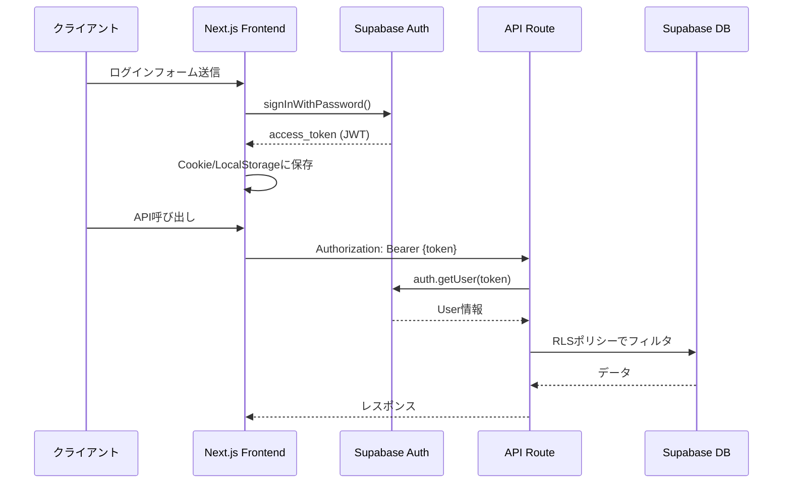

# BulkCart API仕様書

**作成日**: 2026年2月18日  
**バージョン**: 1.0  
**認証**: Supabase Auth（JWT）  
**ベースURL**: `https://bulkcart.vercel.app/api`（Production）

---

## 目次

1. [認証・認可フロー](#1-認証認可フロー)
2. [エンドポイント一覧](#2-エンドポイント一覧)
3. [API詳細仕様](#3-api詳細仕様)
4. [エラーハンドリング](#4-エラーハンドリング)
5. [セキュリティ](#5-セキュリティ)
6. [レート制限](#6-レート制限)

---

## 1. 認証・認可フロー

### 1.1 認証方式

BulkCartは**Supabase Auth**を使用したJWTベースの認証を採用します。



### 1.2 認証エンドポイント

Supabase Authが提供する標準エンドポイントを使用（Next.jsのAPI Routeは不要）。

| メソッド | エンドポイント | 説明 |
|---|---|---|
| `POST` | `https://{project}.supabase.co/auth/v1/signup` | 新規登録 |
| `POST` | `https://{project}.supabase.co/auth/v1/token?grant_type=password` | ログイン |
| `POST` | `https://{project}.supabase.co/auth/v1/logout` | ログアウト |
| `POST` | `https://{project}.supabase.co/auth/v1/token?grant_type=refresh_token` | トークン更新 |

**クライアント側実装**:
```typescript
import { createClient } from '@supabase/supabase-js';

const supabase = createClient(
  process.env.NEXT_PUBLIC_SUPABASE_URL!,
  process.env.NEXT_PUBLIC_SUPABASE_ANON_KEY!
);

// ログイン
const { data, error } = await supabase.auth.signInWithPassword({
  email: 'user@example.com',
  password: 'password123'
});

// セッション取得
const { data: { session } } = await supabase.auth.getSession();

// ログアウト
await supabase.auth.signOut();
```

### 1.3 認可（Authorization）

**RLS（Row-Level Security）ポリシー**によってDB層で認可を実施。API Routeでは追加の認可チェックは不要。

**例**:
```sql
-- user_profileテーブルのRLSポリシー
CREATE POLICY "Users can view their own profile"
ON user_profile
FOR SELECT
USING (auth.uid() = id);
```

---

## 2. エンドポイント一覧

### 2.1 エンドポイントサマリ

| カテゴリ | エンドポイント | メソッド | 認証 | 説明 |
|---|---|---|---|---|
| **プロフィール** | `/api/profile` | `GET` | ✅ | ユーザープロフィール取得 |
| | `/api/profile` | `POST` | ✅ | オンボーディング（初回プロフィール作成） |
| | `/api/profile` | `PATCH` | ✅ | プロフィール更新 |
| **献立生成** | `/api/plan/generate` | `POST` | ✅ | 週次献立生成 |
| **献立管理** | `/api/plan/[planId]` | `GET` | ✅ | 献立詳細取得 |
| | `/api/plan/[planId]` | `DELETE` | ✅ | 献立削除 |
| | `/api/plan/history` | `GET` | ✅ | 献立履歴一覧取得 |
| **買い物リスト** | `/api/plan/[planId]/grocery` | `GET` | ✅ | 買い物リスト取得 |
| **作り置き段取り** | `/api/plan/[planId]/prep` | `GET` | ✅ | 作り置き段取り取得 |
| **レシピ** | `/api/recipes` | `GET` | 🔓 | レシピ一覧取得（フィルタ付き） |
| | `/api/recipes/[recipeId]` | `GET` | 🔓 | レシピ詳細取得 |
| **サブスク** | `/api/subscription` | `GET` | ✅ | サブスク状態取得 |
| **課金** | `/api/billing/create-checkout-session` | `POST` | ✅ | Stripe Checkout Session作成 |
| **Webhook** | `/api/webhooks/stripe` | `POST` | 🔐 | Stripe Webhook（署名検証） |

**凡例**:
- ✅: JWT認証必須
- 🔓: 認証不要（パブリック）
- 🔐: Webhook署名検証

---

## 3. API詳細仕様

### 3.1 プロフィール API

#### 3.1.1 `GET /api/profile`

**説明**: ログイン中のユーザープロフィールを取得。

**認証**: 必須（JWT）

**Request**:
```http
GET /api/profile HTTP/1.1
Authorization: Bearer {access_token}
```

**Response**:
```json
{
  "id": "uuid-1234",
  "goal": "bulk",
  "weight_kg": 70.5,
  "training_days_per_week": 4,
  "cooking_time_weekday": 15,
  "cooking_time_weekend": 60,
  "budget_per_month": 30000,
  "allergies": ["卵", "乳製品"],
  "dislikes": ["セロリ", "パクチー"],
  "created_at": "2026-02-01T10:00:00Z",
  "updated_at": "2026-02-15T12:30:00Z"
}
```

**TypeScript型**:
```typescript
export type Goal = 'bulk' | 'cut' | 'maintain';

export interface UserProfile {
  id: string;
  goal: Goal;
  weight_kg: number | null;
  training_days_per_week: number;
  cooking_time_weekday: number;
  cooking_time_weekend: number;
  budget_per_month: number | null;
  allergies: string[];
  dislikes: string[];
  created_at: string;
  updated_at: string;
}
```

**エラーケース**:
- `401 Unauthorized`: トークンなし/無効
- `404 Not Found`: プロフィール未作成（オンボーディング未完了）

---

#### 3.1.2 `POST /api/profile`

**説明**: オンボーディング時の初回プロフィール作成。

**認証**: 必須（JWT）

**Request**:
```http
POST /api/profile HTTP/1.1
Authorization: Bearer {access_token}
Content-Type: application/json

{
  "goal": "bulk",
  "weight_kg": 70.5,
  "training_days_per_week": 4,
  "cooking_time_weekday": 15,
  "cooking_time_weekend": 60,
  "budget_per_month": 30000,
  "allergies": ["卵"],
  "dislikes": ["セロリ"]
}
```

**Zodバリデーション**:
```typescript
import { z } from 'zod';

export const CreateProfileSchema = z.object({
  goal: z.enum(['bulk', 'cut', 'maintain']),
  weight_kg: z.number().min(30).max(200).nullable().optional(),
  training_days_per_week: z.number().int().min(0).max(7),
  cooking_time_weekday: z.number().int().min(5).max(120),
  cooking_time_weekend: z.number().int().min(5).max(240),
  budget_per_month: z.number().int().min(5000).max(100000).nullable().optional(),
  allergies: z.array(z.string()).default([]),
  dislikes: z.array(z.string()).default([])
});

export type CreateProfileInput = z.infer<typeof CreateProfileSchema>;
```

**Response**:
```json
{
  "id": "uuid-1234",
  "goal": "bulk",
  "weight_kg": 70.5,
  "training_days_per_week": 4,
  "cooking_time_weekday": 15,
  "cooking_time_weekend": 60,
  "budget_per_month": 30000,
  "allergies": ["卵"],
  "dislikes": ["セロリ"],
  "created_at": "2026-02-18T10:00:00Z",
  "updated_at": "2026-02-18T10:00:00Z"
}
```

**エラーケース**:
- `400 Bad Request`: バリデーションエラー
- `409 Conflict`: プロフィール既存在

---

#### 3.1.3 `PATCH /api/profile`

**説明**: プロフィール更新。

**認証**: 必須（JWT）

**Request**:
```http
PATCH /api/profile HTTP/1.1
Authorization: Bearer {access_token}
Content-Type: application/json

{
  "goal": "cut",
  "training_days_per_week": 5,
  "allergies": ["卵", "乳製品"]
}
```

**Response**:
```json
{
  "id": "uuid-1234",
  "goal": "cut",
  "training_days_per_week": 5,
  "allergies": ["卵", "乳製品"],
  "updated_at": "2026-02-18T11:00:00Z"
}
```

**エラーケース**:
- `400 Bad Request`: バリデーションエラー
- `404 Not Found`: プロフィール未作成

---

### 3.2 献立生成 API

#### 3.2.1 `POST /api/plan/generate`

**説明**: ユーザープロフィールに基づいて週次献立を生成。

**認証**: 必須（JWT）

**課金制限**: Free（月1回）、Pro（無制限）

**Request**:
```http
POST /api/plan/generate HTTP/1.1
Authorization: Bearer {access_token}
Content-Type: application/json

{
  "week_start_date": "2026-02-17"
}
```

**Request Schema**:
```typescript
export const GeneratePlanSchema = z.object({
  week_start_date: z.string().regex(/^\d{4}-\d{2}-\d{2}$/)
});
```

**Response**:
```json
{
  "id": "plan-uuid-5678",
  "user_id": "uuid-1234",
  "week_start_date": "2026-02-17",
  "goal": "bulk",
  "total_protein_g": 980.5,
  "total_calories": 14560,
  "created_at": "2026-02-18T10:30:00Z",
  "items": [
    {
      "id": "item-uuid-1",
      "day_of_week": 0,
      "meal_slot": "lunch",
      "recipe": {
        "id": "recipe-uuid-1",
        "name": "鶏むね塩麹焼き",
        "protein_g": 38.0,
        "fat_g": 5.2,
        "carb_g": 1.5,
        "calories": 198,
        "cooking_time": 30,
        "difficulty": "easy",
        "tags": ["high-protein", "low-fat", "batchable"]
      }
    },
    {
      "id": "item-uuid-2",
      "day_of_week": 0,
      "meal_slot": "dinner",
      "recipe": {
        "id": "recipe-uuid-2",
        "name": "白米",
        "protein_g": 5.0,
        "fat_g": 0.6,
        "carb_g": 74.0,
        "calories": 320,
        "cooking_time": 50,
        "difficulty": "easy",
        "tags": ["high-carb", "batchable"]
      }
    }
  ]
}
```

**TypeScript型**:
```typescript
export interface PlanItem {
  id: string;
  day_of_week: number; // 0=月, 6=日
  meal_slot: 'lunch' | 'dinner' | 'snack';
  recipe: Recipe;
}

export interface Plan {
  id: string;
  user_id: string;
  week_start_date: string;
  goal: Goal;
  total_protein_g: number | null;
  total_calories: number | null;
  created_at: string;
  items: PlanItem[];
}
```

**エラーケース**:
- `400 Bad Request`: プロフィール未作成、リクエスト不正
- `403 Forbidden`: Free枠使い切り（Pro登録促進）
- `500 Internal Server Error`: 献立生成失敗（制約条件満たせず）

**Pro登録促進レスポンス**:
```json
{
  "error": "FREE_PLAN_LIMIT_REACHED",
  "message": "今月の無料枠を使い切りました。Proプランで無制限に献立生成できます。",
  "upgrade_url": "/pricing"
}
```

---

### 3.3 献立管理 API

#### 3.3.1 `GET /api/plan/[planId]`

**説明**: 献立詳細取得。

**認証**: 必須（JWT）

**Request**:
```http
GET /api/plan/plan-uuid-5678 HTTP/1.1
Authorization: Bearer {access_token}
```

**Response**: `POST /api/plan/generate`と同じ形式

**エラーケース**:
- `404 Not Found`: 献立が存在しない or 他人の献立

---

#### 3.3.2 `DELETE /api/plan/[planId]`

**説明**: 献立削除。

**認証**: 必須（JWT）

**Request**:
```http
DELETE /api/plan/plan-uuid-5678 HTTP/1.1
Authorization: Bearer {access_token}
```

**Response**:
```json
{
  "message": "献立を削除しました",
  "deleted_id": "plan-uuid-5678"
}
```

**エラーケース**:
- `404 Not Found`: 献立が存在しない or 他人の献立

---

#### 3.3.3 `GET /api/plan/history`

**説明**: 献立履歴一覧取得（ページネーション付き）。

**認証**: 必須（JWT）

**Request**:
```http
GET /api/plan/history?page=1&limit=10 HTTP/1.1
Authorization: Bearer {access_token}
```

**Query Parameters**:
| パラメータ | 型 | デフォルト | 説明 |
|---|---|---|---|
| `page` | `number` | 1 | ページ番号（1始まり） |
| `limit` | `number` | 10 | 1ページあたりの件数（最大50） |

**Response**:
```json
{
  "plans": [
    {
      "id": "plan-uuid-5678",
      "week_start_date": "2026-02-17",
      "goal": "bulk",
      "total_protein_g": 980.5,
      "total_calories": 14560,
      "created_at": "2026-02-18T10:30:00Z"
    },
    {
      "id": "plan-uuid-1234",
      "week_start_date": "2026-02-10",
      "goal": "bulk",
      "total_protein_g": 975.0,
      "total_calories": 14320,
      "created_at": "2026-02-11T09:00:00Z"
    }
  ],
  "pagination": {
    "page": 1,
    "limit": 10,
    "total": 15,
    "total_pages": 2
  }
}
```

---

### 3.4 買い物リスト API

#### 3.4.1 `GET /api/plan/[planId]/grocery`

**説明**: 献立から生成された買い物リストを取得。

**認証**: 必須（JWT）

**Request**:
```http
GET /api/plan/plan-uuid-5678/grocery HTTP/1.1
Authorization: Bearer {access_token}
```

**Response**:
```json
{
  "plan_id": "plan-uuid-5678",
  "week_start_date": "2026-02-17",
  "categories": [
    {
      "category": "meat",
      "category_name": "肉類",
      "items": [
        {
          "ingredient_id": "ingredient-uuid-1",
          "name": "鶏むね",
          "amount": 1200.0,
          "unit": "g",
          "estimated_price": 600
        }
      ]
    },
    {
      "category": "egg_dairy",
      "category_name": "卵・乳製品",
      "items": [
        {
          "ingredient_id": "ingredient-uuid-2",
          "name": "卵",
          "amount": 12.0,
          "unit": "個",
          "estimated_price": 180
        }
      ]
    },
    {
      "category": "vegetable",
      "category_name": "野菜",
      "items": [
        {
          "ingredient_id": "ingredient-uuid-3",
          "name": "ブロッコリー",
          "amount": 400.0,
          "unit": "g",
          "estimated_price": 200
        }
      ]
    },
    {
      "category": "grain",
      "category_name": "穀物",
      "items": [
        {
          "ingredient_id": "ingredient-uuid-4",
          "name": "米",
          "amount": 2100.0,
          "unit": "g",
          "estimated_price": 210
        }
      ]
    },
    {
      "category": "seasoning",
      "category_name": "調味料",
      "items": [
        {
          "ingredient_id": "ingredient-uuid-5",
          "name": "塩麹",
          "amount": 150.0,
          "unit": "g",
          "estimated_price": 75
        }
      ]
    }
  ],
  "total_estimated_price": 1265
}
```

**TypeScript型**:
```typescript
export interface GroceryItem {
  ingredient_id: string;
  name: string;
  amount: number;
  unit: string;
  estimated_price: number | null;
}

export interface GroceryCategory {
  category: 'meat' | 'fish' | 'egg_dairy' | 'vegetable' | 'grain' | 'seasoning';
  category_name: string;
  items: GroceryItem[];
}

export interface GroceryList {
  plan_id: string;
  week_start_date: string;
  categories: GroceryCategory[];
  total_estimated_price: number;
}
```

**エラーケース**:
- `404 Not Found`: 献立が存在しない or 買い物リスト未生成

---

### 3.5 作り置き段取り API

#### 3.5.1 `GET /api/plan/[planId]/prep`

**説明**: 作り置き段取りタイムラインを取得。

**認証**: 必須（JWT）

**Request**:
```http
GET /api/plan/plan-uuid-5678/prep HTTP/1.1
Authorization: Bearer {access_token}
```

**Response**:
```json
{
  "plan_id": "plan-uuid-5678",
  "week_start_date": "2026-02-17",
  "prep_day": "日曜日",
  "total_time_minutes": 90,
  "tasks": [
    {
      "time": "00:00",
      "duration_minutes": 5,
      "task": "米を炊く（2.1kg）",
      "description": "炊飯器にセット。炊き上がり後、容器に分けて冷凍",
      "recipes": ["白米", "玄米"]
    },
    {
      "time": "00:05",
      "duration_minutes": 10,
      "task": "鶏むね下処理（1.2kg）",
      "description": "1cm厚にカット、塩麹に漬ける（冷蔵5日間保存可）",
      "recipes": ["鶏むね塩麹焼き", "鶏むね照り焼き"]
    },
    {
      "time": "00:15",
      "duration_minutes": 12,
      "task": "ゆで卵作成（12個）",
      "description": "沸騰後8分、冷水で冷やす（冷蔵5日間保存可）",
      "recipes": ["ゆで卵", "卵サラダ"]
    },
    {
      "time": "00:27",
      "duration_minutes": 30,
      "task": "鶏むね塩麹焼き（600g）",
      "description": "フライパンで両面焼く。冷蔵保存容器へ",
      "recipes": ["鶏むね塩麹焼き"]
    },
    {
      "time": "00:57",
      "duration_minutes": 20,
      "task": "ブロッコリー茹で（400g）",
      "description": "沸騰後3分、冷水で冷やす（冷蔵4日間保存可）",
      "recipes": ["サラダ", "付け合わせ"]
    }
  ]
}
```

**TypeScript型**:
```typescript
export interface PrepTask {
  time: string; // HH:MM形式
  duration_minutes: number;
  task: string;
  description: string;
  recipes: string[];
}

export interface PrepTimeline {
  plan_id: string;
  week_start_date: string;
  prep_day: string;
  total_time_minutes: number;
  tasks: PrepTask[];
}
```

**エラーケース**:
- `404 Not Found`: 献立が存在しない or 段取り未生成

---

### 3.6 レシピ API

#### 3.6.1 `GET /api/recipes`

**説明**: レシピ一覧取得（フィルタ・ページネーション付き）。

**認証**: 不要（パブリック）

**Request**:
```http
GET /api/recipes?tags=high-protein&difficulty=easy&page=1&limit=20 HTTP/1.1
```

**Query Parameters**:
| パラメータ | 型 | デフォルト | 説明 |
|---|---|---|---|
| `tags` | `string` | - | タグフィルタ（カンマ区切り）。例: `high-protein,low-fat` |
| `difficulty` | `string` | - | 難易度フィルタ（`easy`, `medium`, `hard`） |
| `max_cooking_time` | `number` | - | 最大調理時間（分） |
| `page` | `number` | 1 | ページ番号 |
| `limit` | `number` | 20 | 1ページあたりの件数（最大100） |

**Response**:
```json
{
  "recipes": [
    {
      "id": "recipe-uuid-1",
      "name": "鶏むね塩麹焼き",
      "description": "作り置き可。冷蔵5日間。しっとり柔らか",
      "cooking_time": 30,
      "difficulty": "easy",
      "protein_g": 38.0,
      "fat_g": 5.2,
      "carb_g": 1.5,
      "calories": 198,
      "tags": ["high-protein", "low-fat", "batchable", "chicken"],
      "image_url": "https://storage.bulkcart.app/recipes/torimune-shiokoji.jpg"
    }
  ],
  "pagination": {
    "page": 1,
    "limit": 20,
    "total": 50,
    "total_pages": 3
  }
}
```

---

#### 3.6.2 `GET /api/recipes/[recipeId]`

**説明**: レシピ詳細取得（食材・手順含む）。

**認証**: 不要（パブリック）

**Request**:
```http
GET /api/recipes/recipe-uuid-1 HTTP/1.1
```

**Response**:
```json
{
  "id": "recipe-uuid-1",
  "name": "鶏むね塩麹焼き",
  "description": "作り置き可。冷蔵5日間。しっとり柔らか",
  "cooking_time": 30,
  "difficulty": "easy",
  "protein_g": 38.0,
  "fat_g": 5.2,
  "carb_g": 1.5,
  "calories": 198,
  "tags": ["high-protein", "low-fat", "batchable", "chicken"],
  "image_url": "https://storage.bulkcart.app/recipes/torimune-shiokoji.jpg",
  "ingredients": [
    {
      "ingredient_id": "ingredient-uuid-1",
      "name": "鶏むね",
      "amount": 300.0,
      "unit": "g",
      "notes": null
    },
    {
      "ingredient_id": "ingredient-uuid-5",
      "name": "塩麹",
      "amount": 30.0,
      "unit": "g",
      "notes": "漬け込み用"
    }
  ],
  "steps": [
    {
      "step": 1,
      "text": "鶏むねを1cm厚にカットする"
    },
    {
      "step": 2,
      "text": "塩麹に30分以上漬け込む（前日夜に漬けると良い）"
    },
    {
      "step": 3,
      "text": "フライパンで両面を中火で焼く（各5分）"
    },
    {
      "step": 4,
      "text": "中まで火が通ったら完成。冷蔵保存容器へ"
    }
  ],
  "created_at": "2026-01-15T10:00:00Z"
}
```

**TypeScript型**:
```typescript
export interface RecipeIngredient {
  ingredient_id: string;
  name: string;
  amount: number;
  unit: string;
  notes: string | null;
}

export interface RecipeStep {
  step: number;
  text: string;
}

export interface RecipeDetail {
  id: string;
  name: string;
  description: string | null;
  cooking_time: number;
  difficulty: 'easy' | 'medium' | 'hard';
  protein_g: number;
  fat_g: number;
  carb_g: number;
  calories: number;
  tags: string[];
  image_url: string | null;
  ingredients: RecipeIngredient[];
  steps: RecipeStep[];
  created_at: string;
}
```

**エラーケース**:
- `404 Not Found`: レシピが存在しない

---

### 3.7 サブスクリプション API

#### 3.7.1 `GET /api/subscription`

**説明**: サブスク状態取得。

**認証**: 必須（JWT）

**Request**:
```http
GET /api/subscription HTTP/1.1
Authorization: Bearer {access_token}
```

**Response**:
```json
{
  "user_id": "uuid-1234",
  "status": "free",
  "plan_generation_count_this_month": 1,
  "plan_generation_limit": 1,
  "current_period_end": null,
  "stripe_customer_id": null
}
```

**Pro会員の場合**:
```json
{
  "user_id": "uuid-1234",
  "status": "pro",
  "plan_generation_count_this_month": 5,
  "plan_generation_limit": null,
  "current_period_end": "2026-03-18T00:00:00Z",
  "stripe_customer_id": "cus_xxxxxx"
}
```

**TypeScript型**:
```typescript
export interface Subscription {
  user_id: string;
  status: 'free' | 'pro' | 'cancelled';
  plan_generation_count_this_month: number;
  plan_generation_limit: number | null; // nullは無制限
  current_period_end: string | null;
  stripe_customer_id: string | null;
}
```

---

### 3.8 課金 API

#### 3.8.1 `POST /api/billing/create-checkout-session`

**説明**: Stripe Checkout Session作成。

**認証**: 必須（JWT）

**Request**:
```http
POST /api/billing/create-checkout-session HTTP/1.1
Authorization: Bearer {access_token}
Content-Type: application/json

{
  "price_id": "price_xxxxxx",
  "success_url": "https://bulkcart.app/subscription/success",
  "cancel_url": "https://bulkcart.app/pricing"
}
```

**Response**:
```json
{
  "session_id": "cs_test_xxxxxx",
  "url": "https://checkout.stripe.com/c/pay/cs_test_xxxxxx"
}
```

**クライアント側実装**:
```typescript
// Checkoutページへリダイレクト
const response = await fetch('/api/billing/create-checkout-session', {
  method: 'POST',
  headers: {
    'Content-Type': 'application/json',
    'Authorization': `Bearer ${token}`
  },
  body: JSON.stringify({
    price_id: 'price_xxxxxx',
    success_url: window.location.origin + '/subscription/success',
    cancel_url: window.location.origin + '/pricing'
  })
});

const { url } = await response.json();
window.location.href = url;
```

**エラーケース**:
- `400 Bad Request`: 既にPro会員
- `500 Internal Server Error`: Stripe API失敗

---

### 3.9 Webhook API

#### 3.9.1 `POST /api/webhooks/stripe`

**説明**: Stripe Webhookエンドポイント。課金状態の更新を受け取る。

**認証**: Stripe署名検証（`stripe-signature`ヘッダー）

**Request**:
```http
POST /api/webhooks/stripe HTTP/1.1
stripe-signature: t=1234567890,v1=xxxxxx
Content-Type: application/json

{
  "type": "customer.subscription.created",
  "data": {
    "object": {
      "id": "sub_xxxxxx",
      "customer": "cus_xxxxxx",
      "status": "active",
      "current_period_end": 1709769600
    }
  }
}
```

**処理対象イベント**:
| イベント | 処理内容 |
|---|---|
| `customer.subscription.created` | サブスク作成 → statusを'pro'に更新 |
| `customer.subscription.updated` | サブスク更新 → current_period_end更新 |
| `customer.subscription.deleted` | サブスク解約 → statusを'cancelled'に更新 |
| `invoice.payment_succeeded` | 支払い成功 → ログ記録 |
| `invoice.payment_failed` | 支払い失敗 → statusを'cancelled'に更新、ユーザーに通知 |

**Response**:
```json
{
  "received": true
}
```

**実装例**:
```typescript
import { headers } from 'next/headers';
import Stripe from 'stripe';
import { createClient } from '@supabase/supabase-js';

const stripe = new Stripe(process.env.STRIPE_SECRET_KEY!);
const supabase = createClient(
  process.env.SUPABASE_URL!,
  process.env.SUPABASE_SERVICE_ROLE_KEY! // RLSバイパス
);

export async function POST(req: Request) {
  const body = await req.text();
  const signature = headers().get('stripe-signature')!;

  let event: Stripe.Event;
  try {
    event = stripe.webhooks.constructEvent(
      body,
      signature,
      process.env.STRIPE_WEBHOOK_SECRET!
    );
  } catch (err) {
    return Response.json({ error: 'Invalid signature' }, { status: 400 });
  }

  switch (event.type) {
    case 'customer.subscription.created':
      // subscriptionsテーブル更新
      break;
    case 'customer.subscription.deleted':
      // statusを'cancelled'に
      break;
  }

  return Response.json({ received: true });
}
```

---

## 4. エラーハンドリング

### 4.1 エラーレスポンス形式

すべてのエラーは以下の統一形式で返却します。

```json
{
  "error": "ERROR_CODE",
  "message": "ユーザー向けメッセージ",
  "details": {
    "field": "validation error details"
  }
}
```

**TypeScript型**:
```typescript
export interface ErrorResponse {
  error: string;
  message: string;
  details?: Record<string, string | string[]>;
}
```

### 4.2 HTTPステータスコード

| コード | 説明 | 用途 |
|---|---|---|
| `200 OK` | 成功 | GET, PATCH成功 |
| `201 Created` | 作成成功 | POST成功 |
| `204 No Content` | 成功（レスポンスなし） | DELETE成功 |
| `400 Bad Request` | リクエスト不正 | バリデーションエラー |
| `401 Unauthorized` | 認証エラー | トークンなし/無効 |
| `403 Forbidden` | 認可エラー | 課金制限、権限不足 |
| `404 Not Found` | リソース不存在 | プロフィール/献立/レシピが存在しない |
| `409 Conflict` | 重複エラー | 既存プロフィール作成試行 |
| `422 Unprocessable Entity` | 処理不可 | 献立生成失敗（制約条件満たせず） |
| `429 Too Many Requests` | レート制限 | API呼び出し過多 |
| `500 Internal Server Error` | サーバーエラー | DB接続失敗、予期しないエラー |

### 4.3 エラーコード一覧

| エラーコード | HTTPステータス | 説明 |
|---|---|---|
| `UNAUTHORIZED` | 401 | 認証トークンなし/無効 |
| `PROFILE_NOT_FOUND` | 404 | プロフィール未作成（オンボーディング未完了） |
| `PROFILE_ALREADY_EXISTS` | 409 | プロフィール既存在 |
| `PLAN_NOT_FOUND` | 404 | 献立が存在しない |
| `PLAN_GENERATION_FAILED` | 422 | 献立生成失敗（制約条件満たせず） |
| `FREE_PLAN_LIMIT_REACHED` | 403 | Free枠使い切り |
| `RECIPE_NOT_FOUND` | 404 | レシピが存在しない |
| `VALIDATION_ERROR` | 400 | バリデーションエラー |
| `STRIPE_ERROR` | 500 | Stripe API失敗 |
| `INTERNAL_SERVER_ERROR` | 500 | 予期しないエラー |

### 4.4 バリデーションエラー例

```json
{
  "error": "VALIDATION_ERROR",
  "message": "入力内容に誤りがあります",
  "details": {
    "goal": "必須項目です",
    "training_days_per_week": "0から7の整数を入力してください",
    "allergies": "配列である必要があります"
  }
}
```

---

## 5. セキュリティ

### 5.1 認証（Supabase Auth）

**JWT検証フロー**:
```typescript
import { createServerClient } from '@supabase/ssr';
import { cookies } from 'next/headers';

export async function GET(req: Request) {
  const cookieStore = cookies();
  const supabase = createServerClient(
    process.env.NEXT_PUBLIC_SUPABASE_URL!,
    process.env.NEXT_PUBLIC_SUPABASE_ANON_KEY!,
    {
      cookies: {
        get(name: string) {
          return cookieStore.get(name)?.value;
        }
      }
    }
  );

  const { data: { user }, error } = await supabase.auth.getUser();
  if (error || !user) {
    return Response.json({ error: 'UNAUTHORIZED' }, { status: 401 });
  }

  // ユーザー認証済み。user.idを使用
}
```

### 5.2 RLS（Row-Level Security）

データベースレイヤーでの認可はRLSポリシーで実施。API Routeでは追加の認可チェック不要。

**例**: user_profileテーブル
```sql
CREATE POLICY "Users can view their own profile"
ON user_profile
FOR SELECT
USING (auth.uid() = id);
```

### 5.3 入力検証（Zod）

**全てのユーザー入力はZodでバリデーション**:
```typescript
import { z } from 'zod';

const schema = z.object({
  goal: z.enum(['bulk', 'cut', 'maintain']),
  training_days_per_week: z.number().int().min(0).max(7)
});

export async function POST(req: Request) {
  const body = await req.json();
  const result = schema.safeParse(body);
  
  if (!result.success) {
    return Response.json({
      error: 'VALIDATION_ERROR',
      message: '入力内容に誤りがあります',
      details: result.error.flatten().fieldErrors
    }, { status: 400 });
  }

  // result.dataを使用
}
```

### 5.4 XSS対策

**フロントエンド**:
- React JSXは自動エスケープ
- `dangerouslySetInnerHTML`の使用禁止
- ユーザー入力をURLに埋め込む場合は`encodeURIComponent`

**バックエンド**:
- JSONレスポンスのみ返却（HTMLレンダリングなし）
- Content-Type: application/json

### 5.5 CSRF対策

**Supabase Auth使用時はCSRF対策不要**（Same-Site Cookie + JWTトークン）。

### 5.6 レート制限

**Vercel Edge Middleware**でレート制限を実施:
```typescript
// middleware.ts
import { Ratelimit } from '@upstash/ratelimit';
import { Redis } from '@upstash/redis';

const ratelimit = new Ratelimit({
  redis: Redis.fromEnv(),
  limiter: Ratelimit.slidingWindow(10, '10s') // 10秒間に10リクエスト
});

export async function middleware(req: Request) {
  const ip = req.headers.get('x-forwarded-for') ?? 'anonymous';
  const { success } = await ratelimit.limit(ip);

  if (!success) {
    return Response.json({ error: 'TOO_MANY_REQUESTS' }, { status: 429 });
  }

  return NextResponse.next();
}
```

---

## 6. レート制限

### 6.1 レート制限ポリシー

| エンドポイント | 制限 | 理由 |
|---|---|---|
| `POST /api/plan/generate` | 10回/時間/ユーザー | 献立生成コスト高 |
| `POST /api/billing/*` | 5回/分/ユーザー | 課金処理保護 |
| その他全エンドポイント | 100回/分/ユーザー | DoS攻撃防止 |

### 6.2 レート制限レスポンス

```json
{
  "error": "TOO_MANY_REQUESTS",
  "message": "リクエスト数が上限に達しました。しばらくしてから再度お試しください。",
  "retry_after": 60
}
```

**ヘッダー**:
```http
HTTP/1.1 429 Too Many Requests
X-RateLimit-Limit: 100
X-RateLimit-Remaining: 0
X-RateLimit-Reset: 1709769600
Retry-After: 60
```

---

## 7. API実装ガイドライン

### 7.1 ディレクトリ構成

```
app/
├── api/
│   ├── profile/
│   │   └── route.ts           # GET, POST, PATCH /api/profile
│   ├── plan/
│   │   ├── generate/
│   │   │   └── route.ts       # POST /api/plan/generate
│   │   ├── history/
│   │   │   └── route.ts       # GET /api/plan/history
│   │   └── [planId]/
│   │       ├── route.ts       # GET, DELETE /api/plan/[planId]
│   │       ├── grocery/
│   │       │   └── route.ts   # GET /api/plan/[planId]/grocery
│   │       └── prep/
│   │           └── route.ts   # GET /api/plan/[planId]/prep
│   ├── recipes/
│   │   ├── route.ts           # GET /api/recipes
│   │   └── [recipeId]/
│   │       └── route.ts       # GET /api/recipes/[recipeId]
│   ├── subscription/
│   │   └── route.ts           # GET /api/subscription
│   ├── billing/
│   │   └── create-checkout-session/
│   │       └── route.ts       # POST /api/billing/create-checkout-session
│   └── webhooks/
│       └── stripe/
│           └── route.ts       # POST /api/webhooks/stripe
```

### 7.2 API Route実装テンプレート

```typescript
// app/api/profile/route.ts
import { NextRequest, NextResponse } from 'next/server';
import { createServerClient } from '@supabase/ssr';
import { cookies } from 'next/headers';
import { z } from 'zod';

const ProfileSchema = z.object({
  goal: z.enum(['bulk', 'cut', 'maintain']),
  training_days_per_week: z.number().int().min(0).max(7)
});

// 認証ヘルパー
async function getAuthenticatedUser() {
  const cookieStore = cookies();
  const supabase = createServerClient(
    process.env.NEXT_PUBLIC_SUPABASE_URL!,
    process.env.NEXT_PUBLIC_SUPABASE_ANON_KEY!,
    {
      cookies: {
        get(name: string) {
          return cookieStore.get(name)?.value;
        }
      }
    }
  );

  const { data: { user }, error } = await supabase.auth.getUser();
  if (error || !user) {
    throw new Error('UNAUTHORIZED');
  }

  return { user, supabase };
}

// GET /api/profile
export async function GET(req: NextRequest) {
  try {
    const { user, supabase } = await getAuthenticatedUser();

    const { data, error } = await supabase
      .from('user_profile')
      .select('*')
      .eq('id', user.id)
      .single();

    if (error) {
      return NextResponse.json(
        { error: 'PROFILE_NOT_FOUND', message: 'プロフィールが見つかりません' },
        { status: 404 }
      );
    }

    return NextResponse.json(data);
  } catch (error) {
    if (error instanceof Error && error.message === 'UNAUTHORIZED') {
      return NextResponse.json(
        { error: 'UNAUTHORIZED', message: '認証が必要です' },
        { status: 401 }
      );
    }

    return NextResponse.json(
      { error: 'INTERNAL_SERVER_ERROR', message: 'サーバーエラーが発生しました' },
      { status: 500 }
    );
  }
}

// POST /api/profile
export async function POST(req: NextRequest) {
  try {
    const { user, supabase } = await getAuthenticatedUser();
    const body = await req.json();

    // バリデーション
    const result = ProfileSchema.safeParse(body);
    if (!result.success) {
      return NextResponse.json(
        {
          error: 'VALIDATION_ERROR',
          message: '入力内容に誤りがあります',
          details: result.error.flatten().fieldErrors
        },
        { status: 400 }
      );
    }

    // プロフィール作成
    const { data, error } = await supabase
      .from('user_profile')
      .insert({
        id: user.id,
        ...result.data
      })
      .select()
      .single();

    if (error) {
      if (error.code === '23505') { // UNIQUE制約違反
        return NextResponse.json(
          { error: 'PROFILE_ALREADY_EXISTS', message: 'プロフィールは既に存在します' },
          { status: 409 }
        );
      }

      throw error;
    }

    return NextResponse.json(data, { status: 201 });
  } catch (error) {
    if (error instanceof Error && error.message === 'UNAUTHORIZED') {
      return NextResponse.json(
        { error: 'UNAUTHORIZED', message: '認証が必要です' },
        { status: 401 }
      );
    }

    return NextResponse.json(
      { error: 'INTERNAL_SERVER_ERROR', message: 'サーバーエラーが発生しました' },
      { status: 500 }
    );
  }
}
```

### 7.3 コーディング規約

**参照**: `otherService/CodingGuide.ja.md`

- **必須**: `any`型禁止、型安全性の徹底
- **必須**: 全ユーザー入力をZodでバリデーション
- **必須**: エラーは統一形式で返却
- **推奨**: 認証処理は共通ヘルパー関数化
- **推奨**: Supabase Clientは関数内で生成（cookieアクセスのため）

---

## 8. API変更履歴

### v1.0（2026-02-18）
- 初回リリース
- プロフィール、献立生成、買い物リスト、作り置き段取り、レシピ、サブスク、課金APIを実装

---

**ドキュメント完**  
**次のステップ**: `app/api/` ディレクトリに実際のAPI Routeを実装してください。
