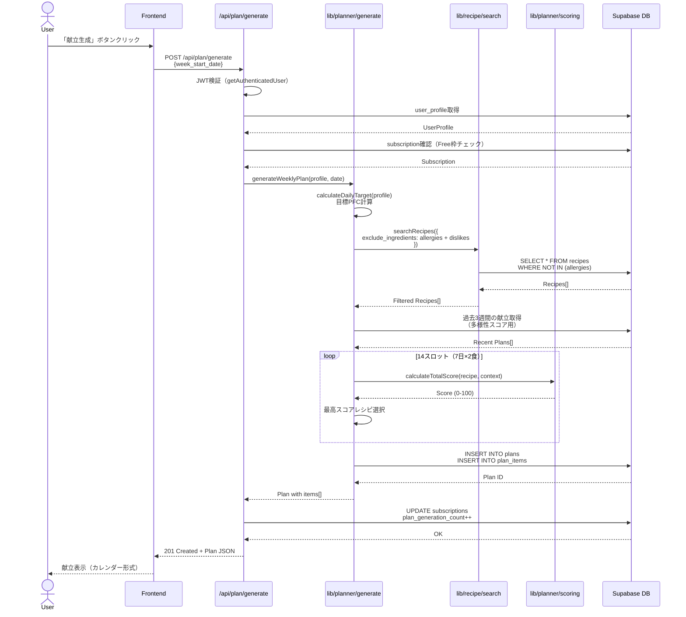
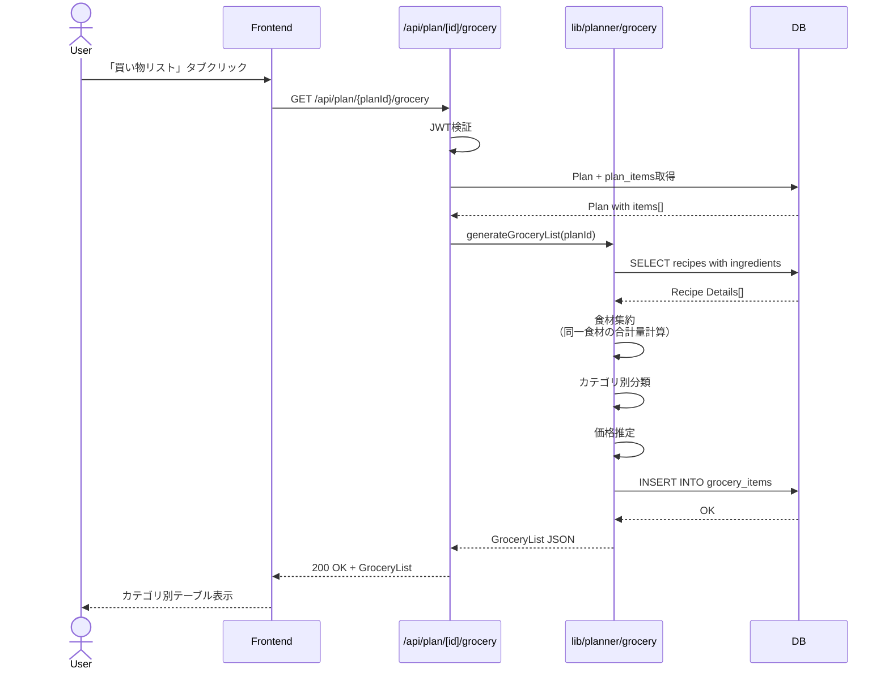
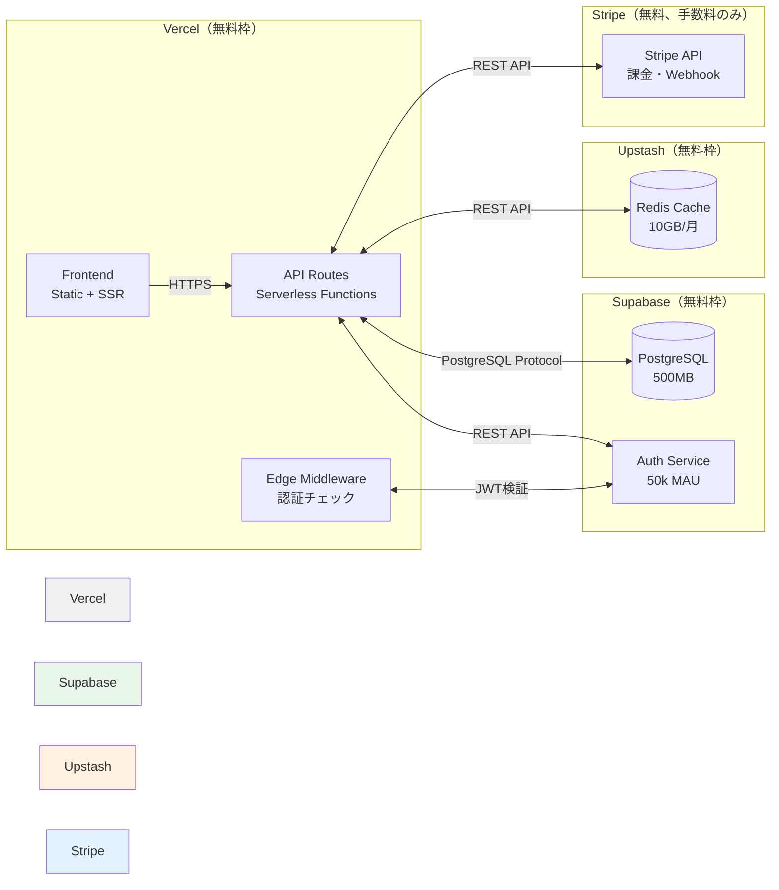

# BulkCart シンプルアーキテクチャ設計書（コストゼロ版）

**作成日**: 2026年2月20日  
**バージョン**: 1.0  
**目的**: MVP向けの最小構成アーキテクチャ（月額コスト: $0）

---

## 目次

1. [概要](#1-概要)
2. [システムアーキテクチャ](#2-システムアーキテクチャ)
3. [技術スタック](#3-技術スタック)
4. [ディレクトリ構造](#4-ディレクトリ構造)
5. [データフロー](#5-データフロー)
6. [デプロイメント](#6-デプロイメント)
7. [コスト試算](#7-コスト試算)

---

## 1. 概要

### 1.1 設計方針

**MCP Serverを廃止**し、全てのロジックをNext.jsプロジェクト内に統合します。

**メリット**:
- ✅ **コストゼロ**: Railway/Renderが不要（月$5-10削減）
- ✅ **デプロイが簡単**: Vercelプロジェクト1つだけ
- ✅ **低レイテンシ**: HTTP通信のオーバーヘッドなし
- ✅ **保守が簡単**: 単一リポジトリ、TypeScriptで統一

**デメリット**:
- ❌ MCPプロトコルの標準化メリットなし（将来的にClaude統合する場合は再設計必要）

**対象**: MVP（最小機能製品）。Pro版で機能追加する際に、必要に応じてMCP Serverを分離。

### 1.2 MVP機能スコープ

| 機能 | 実装場所 | 説明 |
|---|---|---|
| **レシピ検索** | `lib/recipe/search.ts` | Supabase直接クエリ |
| **献立生成** | `lib/planner/generate.ts` | Greedyアルゴリズム実装 |
| **買い物リスト** | `lib/planner/grocery.ts` | 食材集約ロジック |
| **作り置き段取り** | `lib/planner/prep.ts` | タイムライン生成 |
| **栄養計算** | `lib/nutrition/calculate.ts` | PFC合計計算 |

---

## 2. システムアーキテクチャ

### 2.1 全体アーキテクチャ図

```mermaid
graph TB
    subgraph "クライアント層"
        WebApp[Web App<br/>Next.js 14 App Router<br/>React + TypeScript]
    end

    subgraph "API層（Next.js API Routes）"
        AuthAPI[/api/auth<br/>Supabase Auth]
        ProfileAPI[/api/profile<br/>User Profile CRUD]
        PlanAPI[/api/plan/generate<br/>献立生成]
        RecipeAPI[/api/recipes<br/>レシピ検索]
        GroceryAPI[/api/plan/[id]/grocery<br/>買い物リスト]
        PrepAPI[/api/plan/[id]/prep<br/>作り置き段取り]
    end

    subgraph "ビジネスロジック層（lib/）"
        RecipeLib[lib/recipe/search.ts<br/>レシピフィルタリング]
        PlannerLib[lib/planner/generate.ts<br/>献立生成ロジック]
        GroceryLib[lib/planner/grocery.ts<br/>買い物リスト集約]
        PrepLib[lib/planner/prep.ts<br/>段取り生成]
        NutritionLib[lib/nutrition/calculate.ts<br/>PFC計算]
        ScoringLib[lib/planner/scoring.ts<br/>スコアリング関数]
    end

    subgraph "データ層"
        SupabaseDB[(Supabase PostgreSQL<br/>RLS有効)]
        Redis[(Upstash Redis<br/>レシピキャッシュ)]
    end

    subgraph "外部サービス"
        SupabaseAuth[Supabase Auth<br/>JWT発行]
        Stripe[Stripe<br/>課金管理]
    end

    WebApp -->|HTTPS| AuthAPI
    WebApp -->|HTTPS| ProfileAPI
    WebApp -->|HTTPS| PlanAPI
    WebApp -->|HTTPS| RecipeAPI
    WebApp -->|HTTPS| GroceryAPI
    WebApp -->|HTTPS| PrepAPI

    AuthAPI <-->|JWT検証| SupabaseAuth
    ProfileAPI <-->|RLS Query| SupabaseDB

    PlanAPI -->|関数呼び出し| PlannerLib
    RecipeAPI -->|関数呼び出し| RecipeLib
    GroceryAPI -->|関数呼び出し| GroceryLib
    PrepAPI -->|関数呼び出し| PrepLib

    PlannerLib <-->|SELECT| SupabaseDB
    PlannerLib -->|Cache Get/Set| Redis
    PlannerLib -->|Call| RecipeLib
    PlannerLib -->|Call| NutritionLib
    PlannerLib -->|Call| ScoringLib

    RecipeLib <-->|SELECT| SupabaseDB
    RecipeLib -->|Cache Get/Set| Redis

    GroceryLib <-->|SELECT| SupabaseDB
    PrepLib <-->|SELECT| SupabaseDB

    PlanAPI <-->|Subscription確認| Stripe

    style RecipeLib fill:#f9f9f9
    style PlannerLib fill:#f9f9f9
    style GroceryLib fill:#f9f9f9
    style PrepLib fill:#f9f9f9
    style NutritionLib fill:#f9f9f9
    style ScoringLib fill:#f9f9f9
```

### 2.2 シンプル化のポイント

**Before（MCP統合版）**:
```
Frontend → API Routes → MCP Server(Express.js) → Supabase
                    ↓ HTTP通信（レイテンシ+$5-10/月）
```

**After（シンプル版）**:
```
Frontend → API Routes → lib/* functions → Supabase
                    ↓ 直接関数呼び出し（レイテンシなし、$0/月）
```

---

## 3. 技術スタック

### 3.1 全ての技術が無料枠で動作

| レイヤー | 技術 | 無料枠 | MVP十分性 |
|---|---|---|---|
| **Frontend** | Next.js 14, React 18, TypeScript | Vercel無料枠 | ✅ |
| **UI** | Tailwind CSS 3.4, shadcn/ui | N/A | ✅ |
| **API** | Next.js API Routes | Vercel無料枠 | ✅ |
| **認証** | Supabase Auth | 50,000 MAU | ✅ |
| **DB** | PostgreSQL (Supabase) | 500MB | ✅ (初期レシピ50件で十分) |
| **Cache** | Upstash Redis | 10GB/月 | ✅ |
| **課金** | Stripe | 取引手数料のみ | ✅ |
| **分析** | PostHog | 100万イベント/月 | ✅ |
| **エラー監視** | Sentry | 5,000イベント/月 | ✅ |

**合計月額**: **$0** 🎉

---

## 4. ディレクトリ構造

### 4.1 完全なディレクトリツリー

```
BulkCart/
├── app/                           # Next.js App Router
│   ├── (auth)/                    # 認証グループ
│   │   ├── login/
│   │   │   └── page.tsx           # ログインページ
│   │   └── signup/
│   │       └── page.tsx           # サインアップページ
│   ├── (app)/                     # メインアプリグループ（認証必須）
│   │   ├── layout.tsx             # アプリ共通レイアウト
│   │   ├── onboarding/
│   │   │   └── page.tsx           # オンボーディング
│   │   ├── plan/
│   │   │   ├── [week]/
│   │   │   │   ├── page.tsx       # 週次献立表示
│   │   │   │   ├── grocery/
│   │   │   │   │   └── page.tsx   # 買い物リスト
│   │   │   │   └── prep/
│   │   │   │       └── page.tsx   # 作り置き段取り
│   │   │   └── history/
│   │   │       └── page.tsx       # 献立履歴
│   │   ├── recipes/
│   │   │   ├── page.tsx           # レシピ一覧
│   │   │   └── [id]/
│   │   │       └── page.tsx       # レシピ詳細
│   │   ├── settings/
│   │   │   └── page.tsx           # 設定画面
│   │   └── pricing/
│   │       └── page.tsx           # 料金プラン
│   ├── (legal)/                   # 法務ページ
│   │   ├── privacy/
│   │   │   └── page.tsx
│   │   └── terms/
│   │       └── page.tsx
│   ├── api/                       # API Routes
│   │   ├── auth/                  # 認証関連
│   │   │   └── callback/
│   │   │       └── route.ts
│   │   ├── profile/
│   │   │   └── route.ts           # GET/POST/PATCH /api/profile
│   │   ├── plan/
│   │   │   ├── generate/
│   │   │   │   └── route.ts       # POST /api/plan/generate
│   │   │   ├── [planId]/
│   │   │   │   ├── route.ts       # GET/DELETE /api/plan/[planId]
│   │   │   │   ├── grocery/
│   │   │   │   │   └── route.ts   # GET /api/plan/[planId]/grocery
│   │   │   │   └── prep/
│   │   │   │       └── route.ts   # GET /api/plan/[planId]/prep
│   │   │   └── history/
│   │   │       └── route.ts       # GET /api/plan/history
│   │   ├── recipes/
│   │   │   ├── route.ts           # GET /api/recipes
│   │   │   └── [recipeId]/
│   │   │       └── route.ts       # GET /api/recipes/[recipeId]
│   │   ├── subscription/
│   │   │   └── route.ts           # GET /api/subscription
│   │   ├── billing/
│   │   │   └── create-checkout-session/
│   │   │       └── route.ts       # POST /api/billing/create-checkout-session
│   │   └── webhooks/
│   │       └── stripe/
│   │           └── route.ts       # POST /api/webhooks/stripe
│   ├── layout.tsx                 # ルートレイアウト
│   ├── page.tsx                   # ランディングページ
│   └── globals.css                # グローバルCSS
│
├── components/                    # Reactコンポーネント
│   ├── ui/                        # shadcn/ui コンポーネント
│   │   ├── button.tsx
│   │   ├── card.tsx
│   │   ├── form.tsx
│   │   ├── input.tsx
│   │   ├── table.tsx
│   │   └── ...
│   ├── layout/
│   │   ├── Header.tsx
│   │   ├── Navigation.tsx
│   │   └── Footer.tsx
│   ├── plan/
│   │   ├── PlanCalendar.tsx
│   │   ├── MealCard.tsx
│   │   └── GeneratePlanButton.tsx
│   ├── grocery/
│   │   ├── GroceryList.tsx
│   │   ├── GroceryCategory.tsx
│   │   └── GroceryItemCheckbox.tsx
│   ├── recipe/
│   │   ├── RecipeCard.tsx
│   │   ├── RecipeDetail.tsx
│   │   └── RecipeSearch.tsx
│   └── error/
│       ├── ErrorBoundary.tsx
│       └── ErrorMessage.tsx
│
├── lib/                           # ビジネスロジック層
│   ├── supabase/
│   │   ├── client.ts              # Browser用Supabaseクライアント
│   │   └── server.ts              # Server用Supabaseクライアント
│   ├── auth/
│   │   └── getAuthenticatedUser.ts # JWT検証ヘルパー
│   ├── recipe/
│   │   ├── search.ts              # レシピ検索・フィルタリング
│   │   └── types.ts               # Recipe型定義
│   ├── planner/
│   │   ├── generate.ts            # 献立生成メイン関数
│   │   ├── scoring.ts             # スコアリング関数
│   │   ├── filters.ts             # 制約条件フィルタリング
│   │   ├── grocery.ts             # 買い物リスト生成
│   │   ├── prep.ts                # 作り置き段取り生成
│   │   └── targets.ts             # 目標PFC計算
│   ├── nutrition/
│   │   └── calculate.ts           # 栄養計算
│   ├── stripe/
│   │   └── client.ts              # Stripe初期化
│   ├── redis/
│   │   └── client.ts              # Upstash Redis初期化
│   └── utils/
│       ├── validation.ts          # Zodスキーマ
│       └── errors.ts              # エラーハンドリング
│
├── types/                         # TypeScript型定義
│   ├── supabase.ts                # Supabase自動生成型
│   ├── api.ts                     # APIレスポンス型
│   └── plan.ts                    # Plan関連型
│
├── supabase/                      # Supabase設定
│   ├── migrations/
│   │   └── 20260220000000_initial_schema.sql
│   └── seed.sql                   # 初期データ
│
├── docs/                          # ドキュメント
│   ├── prd.md
│   ├── database-design.md
│   ├── api-specification.md
│   ├── meal-planner-algorithm.md
│   ├── architecture-simple.md     # このファイル
│   └── ...
│
├── .github/
│   ├── task.prompt.md
│   └── ...
│
├── .env.example                   # 環境変数テンプレート
├── .gitignore
├── package.json
├── tsconfig.json
├── tailwind.config.ts
├── next.config.js
└── README.md
```

---

## 5. データフロー

### 5.1 献立生成フロー（シンプル版）



**HTTP通信回数**: 1回のみ（Frontend → API）  
**内部関数呼び出し**: メモリ内で高速実行

### 5.2 買い物リスト生成フロー



---

## 6. デプロイメント

### 6.1 デプロイメント構成



### 6.2 デプロイ手順（5分）

1. **GitHubリポジトリ作成** (1分)
   ```bash
   git init
   git add .
   git commit -m "Initial commit"
   git remote add origin https://github.com/YOUR_USERNAME/bulkcart.git
   git push -u origin main
   ```

2. **Vercel接続** (2分)
   - Vercel Dashboard → "New Project"
   - GitHubリポジトリを選択
   - Environment Variables設定:
     ```
     NEXT_PUBLIC_SUPABASE_URL=your_supabase_url
     NEXT_PUBLIC_SUPABASE_ANON_KEY=your_anon_key
     SUPABASE_SERVICE_ROLE_KEY=your_service_role_key
     UPSTASH_REDIS_REST_URL=your_redis_url
     UPSTASH_REDIS_REST_TOKEN=your_redis_token
     STRIPE_SECRET_KEY=your_stripe_secret
     STRIPE_WEBHOOK_SECRET=your_webhook_secret
     ```
   - Deploy

3. **ドメイン設定** (2分、オプション)
   - Vercel Dashboard → Settings → Domains
   - `bulkcart.vercel.app` (自動) または カスタムドメイン

---

## 7. コスト試算

### 7.1 MVP期（0-100ユーザー）

| サービス | プラン | 制限 | 月額コスト |
|---|---|---|---|
| **Vercel** | Hobby | 100GB帯域、無制限デプロイ | **$0** |
| **Supabase** | Free | 500MB DB、50k MAU、2GB転送 | **$0** |
| **Upstash Redis** | Free | 10GB/月、10k commands/日 | **$0** |
| **PostHog** | Free | 100万イベント/月 | **$0** |
| **Sentry** | Developer | 5,000イベント/月 | **$0** |
| **Stripe** | 無料 | 取引手数料: 3.6% | **$0** (売上発生時のみ) |
| **ドメイン** | オプション | .jp/.com | $10-20/年 (オプション) |

**合計**: **$0/月** 🎉

### 7.2 成長期（100-1,000ユーザー）

Supabaseの無料枠を超えた場合の試算:

| サービス | プラン | 月額コスト |
|---|---|---|
| **Vercel** | Hobby（まだ十分） | $0 |
| **Supabase** | Pro（8GB DB、100k MAU） | $25 |
| **Upstash Redis** | Free（まだ十分） | $0 |
| **その他** | 変わらず | $0 |

**合計**: **$25/月**（1,000ユーザー時点）

### 7.3 スケールアップ時（1,000+ユーザー）

| サービス | プラン | 月額コスト |
|---|---|---|
| **Vercel** | Pro | $20 |
| **Supabase** | Pro | $25 |
| **Upstash Redis** | Pro（100GB） | $49 |
| **PostHog** | 有料プラン | $20 |

**合計**: **$114/月**（成長後）

---

## 8. 実装優先順位

### 8.1 Phase 3修正（コストゼロ版）

**削除**: Phase 3.6（MCP Server雛形作成）

**Phase 3.3に統合**: 以下のディレクトリ構造を作成
```
lib/
├── recipe/search.ts      # レシピ検索
├── planner/
│   ├── generate.ts       # 献立生成
│   ├── scoring.ts        # スコアリング
│   ├── filters.ts        # フィルタリング
│   ├── grocery.ts        # 買い物リスト
│   └── prep.ts           # 作り置き段取り
└── nutrition/calculate.ts # 栄養計算
```

### 8.2 実装順序

1. ✅ **Phase 1-2**: 要件定義・設計（完了）
2. 🔄 **Phase 3.1-3.5**: リポジトリ初期化、Next.jsセットアップ、Supabase/Vercel設定
3. 🔄 **Phase 4**: フロントエンド基盤（認証、オンボーディング、レイアウト）
4. 🔄 **Phase 5**: バックエンド・ロジック（**lib/**配下の関数実装）
5. 🔄 **Phase 6-11**: UI完成、テスト、ローンチ

---

## 9. 将来の拡張（MVP後）

### 9.1 MCP Server分離（Pro版で必要になった場合）

MVP検証後、以下の場合にMCP Server分離を検討:

- Claude Desktop統合が必要になった場合
- API呼び出し回数が増えて、Vercel Serverless Functionsの10秒制限に抵触する場合
- 複数のクライアント（Web + Mobile + CLI）から共通ロジックを呼び出したい場合

**移行コスト**: $5-10/月（Railway/Render 1コンテナ）

### 9.2 パフォーマンス最適化

Vercel無料枠の制限に達した場合:

- Redis Cacheの活用強化（レシピマスタを全てキャッシュ）
- Edge Functionsへの移行（地理的に近いサーバーで実行）
- ISR（Incremental Static Regeneration）でレシピページを静的化

---

## 10. まとめ

### 10.1 アーキテクチャ決定の記録

**決定事項**: MVP期はMCP Serverを廃止し、Next.js API Routes + lib/関数でシンプルに実装

**理由**:
1. コストゼロで開始できる（初期投資リスクなし）
2. デプロイが簡単（Vercel 1つだけ）
3. レイテンシが低い（HTTP通信なし）
4. 保守が簡単（単一リポジトリ）

**トレードオフ**: MCPプロトコル標準化のメリットは失うが、MVP検証には不要

### 10.2 次のアクション

Phase 3.1のリポジトリ初期化から開始してください。

**実行コマンド**:
```
Phase 3.1のリポジトリ初期化を実行して
```

---

**ドキュメント完**  
**月額コスト: $0** で BulkCart MVP を実現できます 🚀
