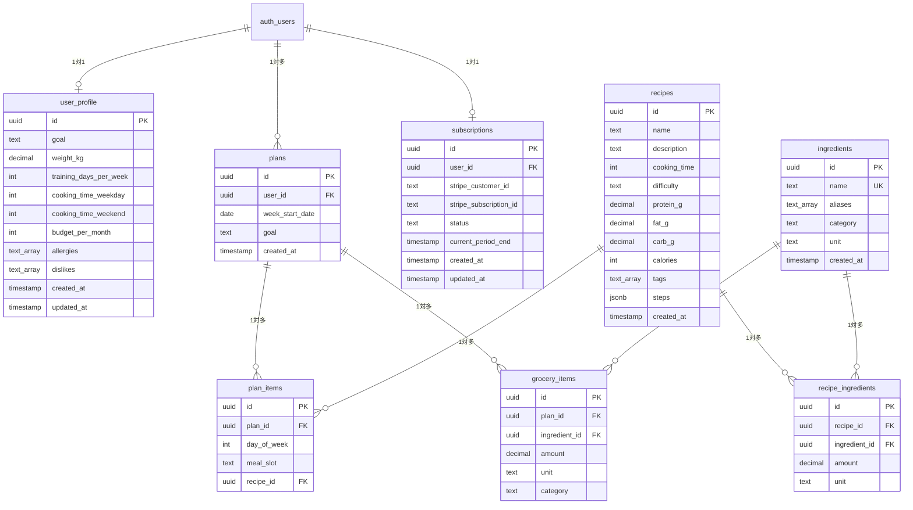

# BulkCart データベース設計書

**作成日**: 2026年2月18日  
**バージョン**: 1.0  
**DB**: PostgreSQL 15（Supabase）  
**ORM**: なし（Supabase Client使用）

---

## 目次

1. [ER図](#1-er図)
2. [テーブル定義](#2-テーブル定義)
3. [Row-Level Security（RLS）ポリシー](#3-row-level-securityrlsポリシー)
4. [インデックス戦略](#4-インデックス戦略)
5. [初期データ仕様](#5-初期データ仕様)
6. [マイグレーション戦略](#6-マイグレーション戦略)

---

## 1. ER図



**凡例**:
- `PK`: Primary Key
- `FK`: Foreign Key
- `UK`: Unique Key
- `auth_users`: Supabase Authが提供する標準テーブル（直接編集不可）

---

## 2. テーブル定義

### 2.1 user_profile（ユーザープロフィール）

**目的**: ユーザーの目的・制約を保存。献立生成のパラメータとして使用。

| カラム名 | 型 | NULL | デフォルト | 制約 | 説明 |
|---|---|---|---|---|---|
| `id` | `UUID` | NOT NULL | - | `PK`, `FK → auth.users(id)` | Supabase AuthのユーザーID |
| `goal` | `TEXT` | NOT NULL | - | `CHECK (goal IN ('bulk', 'cut', 'maintain'))` | 増量/減量/維持 |
| `weight_kg` | `DECIMAL(5,2)` | NULL | - | `CHECK (weight_kg > 0 AND weight_kg < 300)` | 体重（kg）。たんぱく質目標計算に使用 |
| `training_days_per_week` | `INT` | NOT NULL | 3 | `CHECK (training_days_per_week >= 0 AND training_days_per_week <= 7)` | 週のトレーニング日数 |
| `cooking_time_weekday` | `INT` | NOT NULL | 15 | `CHECK (cooking_time_weekday >= 5 AND cooking_time_weekday <= 120)` | 平日の調理時間（分） |
| `cooking_time_weekend` | `INT` | NOT NULL | 60 | `CHECK (cooking_time_weekend >= 5 AND cooking_time_weekend <= 240)` | 週末の調理時間（分） |
| `budget_per_month` | `INT` | NULL | 30000 | `CHECK (budget_per_month >= 5000 AND budget_per_month <= 100000)` | 月の食費予算（円） |
| `allergies` | `TEXT[]` | NULL | `'{}'::text[]` | - | アレルギー食材リスト（例：['卵', '乳製品']） |
| `dislikes` | `TEXT[]` | NULL | `'{}'::text[]` | - | 苦手食材リスト（例：['セロリ', 'パクチー']） |
| `created_at` | `TIMESTAMP` | NOT NULL | `NOW()` | - | 作成日時 |
| `updated_at` | `TIMESTAMP` | NOT NULL | `NOW()` | - | 更新日時 |

**インデックス**:
- `PRIMARY KEY (id)`: デフォルト
- **不要**: 1対1の関係でidで検索するため

**トリガー**:
```sql
-- updated_at自動更新トリガー
CREATE OR REPLACE FUNCTION update_updated_at_column()
RETURNS TRIGGER AS $$
BEGIN
   NEW.updated_at = NOW();
   RETURN NEW;
END;
$$ LANGUAGE plpgsql;

CREATE TRIGGER update_user_profile_updated_at
BEFORE UPDATE ON user_profile
FOR EACH ROW
EXECUTE FUNCTION update_updated_at_column();
```

---

### 2.2 recipes（レシピ）

**目的**: 献立生成エンジンが使用するレシピデータベース。全ユーザー共通の静的マスタデータ。

| カラム名 | 型 | NULL | デフォルト | 制約 | 説明 |
|---|---|---|---|---|---|
| `id` | `UUID` | NOT NULL | `gen_random_uuid()` | `PK` | レシピID |
| `name` | `TEXT` | NOT NULL | - | - | レシピ名（例：鶏むね塩麹焼き） |
| `description` | `TEXT` | NULL | - | - | 説明（例：作り置き可、冷蔵5日） |
| `cooking_time` | `INT` | NOT NULL | - | `CHECK (cooking_time > 0 AND cooking_time <= 240)` | 調理時間（分） |
| `difficulty` | `TEXT` | NOT NULL | `'easy'` | `CHECK (difficulty IN ('easy', 'medium', 'hard'))` | 難易度 |
| `protein_g` | `DECIMAL(5,1)` | NOT NULL | - | `CHECK (protein_g >= 0)` | たんぱく質（g） |
| `fat_g` | `DECIMAL(5,1)` | NOT NULL | - | `CHECK (fat_g >= 0)` | 脂質（g） |
| `carb_g` | `DECIMAL(5,1)` | NOT NULL | - | `CHECK (carb_g >= 0)` | 炭水化物（g） |
| `calories` | `INT` | NOT NULL | - | `CHECK (calories > 0)` | カロリー（kcal）。計算式：P×4 + F×9 + C×4 |
| `tags` | `TEXT[]` | NULL | `'{}'::text[]` | - | タグ（例：['high-protein', 'low-fat', 'batchable', 'freezable']） |
| `steps` | `JSONB` | NOT NULL | `'[]'::jsonb` | - | 調理手順（例：[{"step": 1, "text": "鶏むねを1cm厚にカット"}]） |
| `image_url` | `TEXT` | NULL | - | - | レシピ画像URL（Supabase Storage or Cloudinary） |
| `created_at` | `TIMESTAMP` | NOT NULL | `NOW()` | - | 作成日時 |

**インデックス**:
- `PRIMARY KEY (id)`: デフォルト
- `CREATE INDEX idx_recipes_tags ON recipes USING GIN (tags);`: タグでの検索高速化
- `CREATE INDEX idx_recipes_difficulty ON recipes (difficulty);`: 難易度フィルタリング
- `CREATE INDEX idx_recipes_cooking_time ON recipes (cooking_time);`: 調理時間フィルタリング

**タグの種類**:
- **目的タグ**: `high-protein`, `low-fat`, `high-carb`, `low-calorie`
- **調理タグ**: `batchable`（作り置き可）, `freezable`（冷凍可）, `quick`（15分以内）
- **食材タグ**: `chicken`, `beef`, `pork`, `fish`, `egg`, `tofu`, `rice`, `oatmeal`
- **ジャンルタグ**: `japanese`, `chinese`, `western`

---

### 2.3 ingredients（食材マスタ）

**目的**: 食材の正規化名とカテゴリを管理。買い物リスト生成時に使用。

| カラム名 | 型 | NULL | デフォルト | 制約 | 説明 |
|---|---|---|---|---|---|
| `id` | `UUID` | NOT NULL | `gen_random_uuid()` | `PK` | 食材ID |
| `name` | `TEXT` | NOT NULL | - | `UNIQUE` | 正規化名（例：鶏むね） |
| `aliases` | `TEXT[]` | NULL | `'{}'::text[]` | - | 表記ゆれ（例：['鶏胸', 'とりむね', '鶏ムネ']） |
| `category` | `TEXT` | NOT NULL | - | `CHECK (category IN ('meat', 'fish', 'egg_dairy', 'vegetable', 'grain', 'seasoning', 'other'))` | カテゴリ |
| `unit` | `TEXT` | NOT NULL | `'g'` | - | 単位（g, 個, ml） |
| `avg_price_per_unit` | `INT` | NULL | - | - | 平均単価（円/100g or 円/個）。予算計算に使用 |
| `created_at` | `TIMESTAMP` | NOT NULL | `NOW()` | - | 作成日時 |

**インデックス**:
- `PRIMARY KEY (id)`: デフォルト
- `UNIQUE (name)`: 重複防止
- `CREATE INDEX idx_ingredients_category ON ingredients (category);`: カテゴリ別表示

**カテゴリ分類**:
- `meat`: 肉類（鶏むね、豚ロース、牛ひき肉）
- `fish`: 魚介類（鮭、サバ、ツナ缶）
- `egg_dairy`: 卵・乳製品（卵、ヨーグルト、チーズ）
- `vegetable`: 野菜（ブロッコリー、ほうれん草、玉ねぎ）
- `grain`: 穀物（米、オートミール、パスタ）
- `seasoning`: 調味料（醤油、塩麹、オリーブオイル）
- `other`: その他（プロテイン、サプリメント）

---

### 2.4 recipe_ingredients（レシピ×食材）

**目的**: レシピに必要な食材と分量を中間テーブルで管理。

| カラム名 | 型 | NULL | デフォルト | 制約 | 説明 |
|---|---|---|---|---|---|
| `id` | `UUID` | NOT NULL | `gen_random_uuid()` | `PK` | - |
| `recipe_id` | `UUID` | NOT NULL | - | `FK → recipes(id) ON DELETE CASCADE` | レシピID |
| `ingredient_id` | `UUID` | NOT NULL | - | `FK → ingredients(id) ON DELETE CASCADE` | 食材ID |
| `amount` | `DECIMAL(7,2)` | NOT NULL | - | `CHECK (amount > 0)` | 分量（例：300.00） |
| `unit` | `TEXT` | NOT NULL | - | - | 単位（g, 個, ml） |
| `notes` | `TEXT` | NULL | - | - | 備考（例：お好みで, 代替可） |

**インデックス**:
- `PRIMARY KEY (id)`: デフォルト
- `UNIQUE (recipe_id, ingredient_id)`: 重複防止
- `CREATE INDEX idx_recipe_ingredients_recipe_id ON recipe_ingredients (recipe_id);`: レシピ詳細表示
- `CREATE INDEX idx_recipe_ingredients_ingredient_id ON recipe_ingredients (ingredient_id);`: 食材検索

---

### 2.5 plans（週次プラン）

**目的**: ユーザーごとの週次献立を保存。

| カラム名 | 型 | NULL | デフォルト | 制約 | 説明 |
|---|---|---|---|---|---|
| `id` | `UUID` | NOT NULL | `gen_random_uuid()` | `PK` | プランID |
| `user_id` | `UUID` | NOT NULL | - | `FK → auth.users(id) ON DELETE CASCADE` | ユーザーID |
| `week_start_date` | `DATE` | NOT NULL | - | - | 週の開始日（月曜日） |
| `goal` | `TEXT` | NOT NULL | - | `CHECK (goal IN ('bulk', 'cut', 'maintain'))` | 生成時の目的 |
| `total_protein_g` | `DECIMAL(6,1)` | NULL | - | - | 週合計たんぱく質（キャッシュ） |
| `total_calories` | `INT` | NULL | - | - | 週合計カロリー（キャッシュ） |
| `created_at` | `TIMESTAMP` | NOT NULL | `NOW()` | - | 生成日時 |

**インデックス**:
- `PRIMARY KEY (id)`: デフォルト
- `CREATE INDEX idx_plans_user_id_week ON plans (user_id, week_start_date DESC);`: ユーザーの献立履歴表示

---

### 2.6 plan_items（プラン×日×食×レシピ）

**目的**: 週次プランの各日・各食にどのレシピが割り当てられているかを記録。

| カラム名 | 型 | NULL | デフォルト | 制約 | 説明 |
|---|---|---|---|---|---|
| `id` | `UUID` | NOT NULL | `gen_random_uuid()` | `PK` | - |
| `plan_id` | `UUID` | NOT NULL | - | `FK → plans(id) ON DELETE CASCADE` | プランID |
| `day_of_week` | `INT` | NOT NULL | - | `CHECK (day_of_week >= 0 AND day_of_week <= 6)` | 曜日（0=月, 6=日） |
| `meal_slot` | `TEXT` | NOT NULL | - | `CHECK (meal_slot IN ('lunch', 'dinner', 'snack'))` | 食事スロット |
| `recipe_id` | `UUID` | NOT NULL | - | `FK → recipes(id) ON DELETE CASCADE` | レシピID |

**インデックス**:
- `PRIMARY KEY (id)`: デフォルト
- `UNIQUE (plan_id, day_of_week, meal_slot)`: 1日1食1レシピ
- `CREATE INDEX idx_plan_items_plan_id ON plan_items (plan_id);`: プラン詳細表示

---

### 2.7 grocery_items（買い物リスト）

**目的**: 週次プランから生成された買い物リストをキャッシュ。

| カラム名 | 型 | NULL | デフォルト | 制約 | 説明 |
|---|---|---|---|---|---|
| `id` | `UUID` | NOT NULL | `gen_random_uuid()` | `PK` | - |
| `plan_id` | `UUID` | NOT NULL | - | `FK → plans(id) ON DELETE CASCADE` | プランID |
| `ingredient_id` | `UUID` | NOT NULL | - | `FK → ingredients(id) ON DELETE CASCADE` | 食材ID |
| `amount` | `DECIMAL(7,2)` | NOT NULL | - | `CHECK (amount > 0)` | 合計分量 |
| `unit` | `TEXT` | NOT NULL | - | - | 単位 |
| `category` | `TEXT` | NOT NULL | - | - | カテゴリ（ingredients.categoryから取得） |
| `estimated_price` | `INT` | NULL | - | - | 推定価格（円） |

**インデックス**:
- `PRIMARY KEY (id)`: デフォルト
- `UNIQUE (plan_id, ingredient_id)`: 食材の重複防止
- `CREATE INDEX idx_grocery_items_plan_id_category ON grocery_items (plan_id, category);`: カテゴリ別表示

---

### 2.8 subscriptions（サブスクリプション）

**目的**: Stripe連携でのユーザーの課金状態を管理。

| カラム名 | 型 | NULL | デフォルト | 制約 | 説明 |
|---|---|---|---|---|---|
| `id` | `UUID` | NOT NULL | `gen_random_uuid()` | `PK` | - |
| `user_id` | `UUID` | NOT NULL | - | `FK → auth.users(id) ON DELETE CASCADE`, `UNIQUE` | ユーザーID（1ユーザー1サブスク） |
| `stripe_customer_id` | `TEXT` | NULL | - | `UNIQUE` | Stripe Customer ID |
| `stripe_subscription_id` | `TEXT` | NULL | - | `UNIQUE` | Stripe Subscription ID |
| `status` | `TEXT` | NOT NULL | `'free'` | `CHECK (status IN ('free', 'pro', 'cancelled'))` | プラン状態 |
| `current_period_end` | `TIMESTAMP` | NULL | - | - | 現在の課金期間終了日 |
| `plan_generation_count_this_month` | `INT` | NOT NULL | 0 | `CHECK (plan_generation_count_this_month >= 0)` | 今月の献立生成回数（Free=月1回制限） |
| `created_at` | `TIMESTAMP` | NOT NULL | `NOW()` | - | 作成日時 |
| `updated_at` | `TIMESTAMP` | NOT NULL | `NOW()` | - | 更新日時 |

**インデックス**:
- `PRIMARY KEY (id)`: デフォルト
- `UNIQUE (user_id)`: 1ユーザー1レコード
- `UNIQUE (stripe_customer_id)`, `UNIQUE (stripe_subscription_id)`: Stripe連携

**トリガー**:
```sql
CREATE TRIGGER update_subscriptions_updated_at
BEFORE UPDATE ON subscriptions
FOR EACH ROW
EXECUTE FUNCTION update_updated_at_column();
```

---

## 3. Row-Level Security（RLS）ポリシー

### 3.1 user_profile

**セキュリティ要件**: ユーザーは自分自身のプロフィールのみ読み書き可能。

```sql
-- RLS有効化
ALTER TABLE user_profile ENABLE ROW LEVEL SECURITY;

-- 読み取り（SELECT）ポリシー
CREATE POLICY "Users can view their own profile"
ON user_profile
FOR SELECT
USING (auth.uid() = id);

-- 挿入（INSERT）ポリシー
CREATE POLICY "Users can insert their own profile"
ON user_profile
FOR INSERT
WITH CHECK (auth.uid() = id);

-- 更新（UPDATE）ポリシー
CREATE POLICY "Users can update their own profile"
ON user_profile
FOR UPDATE
USING (auth.uid() = id)
WITH CHECK (auth.uid() = id);

-- 削除（DELETE）ポリシー（通常は不要だが念のため）
CREATE POLICY "Users can delete their own profile"
ON user_profile
FOR DELETE
USING (auth.uid() = id);
```

---

### 3.2 recipes, ingredients, recipe_ingredients

**セキュリティ要件**: 全ユーザー読み取り可能。管理者のみ書き込み可能。

```sql
-- recipes
ALTER TABLE recipes ENABLE ROW LEVEL SECURITY;

-- 全ユーザー読み取り可能
CREATE POLICY "Anyone can view recipes"
ON recipes
FOR SELECT
USING (true);

-- 管理者のみ書き込み可能（is_adminはauth.usersのメタデータで管理）
CREATE POLICY "Only admins can insert recipes"
ON recipes
FOR INSERT
WITH CHECK (
  (auth.jwt() -> 'user_metadata' ->> 'is_admin')::boolean = true
);

CREATE POLICY "Only admins can update recipes"
ON recipes
FOR UPDATE
USING (
  (auth.jwt() -> 'user_metadata' ->> 'is_admin')::boolean = true
);

CREATE POLICY "Only admins can delete recipes"
ON recipes
FOR DELETE
USING (
  (auth.jwt() -> 'user_metadata' ->> 'is_admin')::boolean = true
);

-- ingredients（同様）
ALTER TABLE ingredients ENABLE ROW LEVEL SECURITY;

CREATE POLICY "Anyone can view ingredients"
ON ingredients FOR SELECT USING (true);

CREATE POLICY "Only admins can insert ingredients"
ON ingredients FOR INSERT
WITH CHECK ((auth.jwt() -> 'user_metadata' ->> 'is_admin')::boolean = true);

CREATE POLICY "Only admins can update ingredients"
ON ingredients FOR UPDATE
USING ((auth.jwt() -> 'user_metadata' ->> 'is_admin')::boolean = true);

CREATE POLICY "Only admins can delete ingredients"
ON ingredients FOR DELETE
USING ((auth.jwt() -> 'user_metadata' ->> 'is_admin')::boolean = true);

-- recipe_ingredients（同様）
ALTER TABLE recipe_ingredients ENABLE ROW LEVEL SECURITY;

CREATE POLICY "Anyone can view recipe_ingredients"
ON recipe_ingredients FOR SELECT USING (true);

CREATE POLICY "Only admins can insert recipe_ingredients"
ON recipe_ingredients FOR INSERT
WITH CHECK ((auth.jwt() -> 'user_metadata' ->> 'is_admin')::boolean = true);

CREATE POLICY "Only admins can update recipe_ingredients"
ON recipe_ingredients FOR UPDATE
USING ((auth.jwt() -> 'user_metadata' ->> 'is_admin')::boolean = true);

CREATE POLICY "Only admins can delete recipe_ingredients"
ON recipe_ingredients FOR DELETE
USING ((auth.jwt() -> 'user_metadata' ->> 'is_admin')::boolean = true);
```

---

### 3.3 plans, plan_items, grocery_items

**セキュリティ要件**: ユーザーは自分自身のプランのみ読み書き可能。

```sql
-- plans
ALTER TABLE plans ENABLE ROW LEVEL SECURITY;

CREATE POLICY "Users can view their own plans"
ON plans FOR SELECT
USING (auth.uid() = user_id);

CREATE POLICY "Users can insert their own plans"
ON plans FOR INSERT
WITH CHECK (auth.uid() = user_id);

CREATE POLICY "Users can update their own plans"
ON plans FOR UPDATE
USING (auth.uid() = user_id)
WITH CHECK (auth.uid() = user_id);

CREATE POLICY "Users can delete their own plans"
ON plans FOR DELETE
USING (auth.uid() = user_id);

-- plan_items
ALTER TABLE plan_items ENABLE ROW LEVEL SECURITY;

CREATE POLICY "Users can view their own plan_items"
ON plan_items FOR SELECT
USING (
  EXISTS (
    SELECT 1 FROM plans
    WHERE plans.id = plan_items.plan_id
    AND plans.user_id = auth.uid()
  )
);

CREATE POLICY "Users can insert their own plan_items"
ON plan_items FOR INSERT
WITH CHECK (
  EXISTS (
    SELECT 1 FROM plans
    WHERE plans.id = plan_items.plan_id
    AND plans.user_id = auth.uid()
  )
);

CREATE POLICY "Users can update their own plan_items"
ON plan_items FOR UPDATE
USING (
  EXISTS (
    SELECT 1 FROM plans
    WHERE plans.id = plan_items.plan_id
    AND plans.user_id = auth.uid()
  )
);

CREATE POLICY "Users can delete their own plan_items"
ON plan_items FOR DELETE
USING (
  EXISTS (
    SELECT 1 FROM plans
    WHERE plans.id = plan_items.plan_id
    AND plans.user_id = auth.uid()
  )
);

-- grocery_items（同様）
ALTER TABLE grocery_items ENABLE ROW LEVEL SECURITY;

CREATE POLICY "Users can view their own grocery_items"
ON grocery_items FOR SELECT
USING (
  EXISTS (
    SELECT 1 FROM plans
    WHERE plans.id = grocery_items.plan_id
    AND plans.user_id = auth.uid()
  )
);

CREATE POLICY "Users can insert their own grocery_items"
ON grocery_items FOR INSERT
WITH CHECK (
  EXISTS (
    SELECT 1 FROM plans
    WHERE plans.id = grocery_items.plan_id
    AND plans.user_id = auth.uid()
  )
);

CREATE POLICY "Users can update their own grocery_items"
ON grocery_items FOR UPDATE
USING (
  EXISTS (
    SELECT 1 FROM plans
    WHERE plans.id = grocery_items.plan_id
    AND plans.user_id = auth.uid()
  )
);

CREATE POLICY "Users can delete their own grocery_items"
ON grocery_items FOR DELETE
USING (
  EXISTS (
    SELECT 1 FROM plans
    WHERE plans.id = grocery_items.plan_id
    AND plans.user_id = auth.uid()
  )
);
```

---

### 3.4 subscriptions

**セキュリティ要件**: ユーザーは自分自身のサブスク状態のみ読み取り可能。書き込みはStripe Webhookのみ。

```sql
ALTER TABLE subscriptions ENABLE ROW LEVEL SECURITY;

-- 読み取りは本人のみ
CREATE POLICY "Users can view their own subscription"
ON subscriptions FOR SELECT
USING (auth.uid() = user_id);

-- 挿入はStripe Webhookのみ（service_roleキーで実行）
-- 通常のユーザーは挿入不可
CREATE POLICY "Only service_role can insert subscriptions"
ON subscriptions FOR INSERT
WITH CHECK (false); -- ユーザーからの挿入を禁止

-- 更新もStripe Webhookのみ
CREATE POLICY "Only service_role can update subscriptions"
ON subscriptions FOR UPDATE
USING (false);

-- 削除も同様
CREATE POLICY "Only service_role can delete subscriptions"
ON subscriptions FOR DELETE
USING (false);
```

**注**: Stripe Webhookは`service_role`キーを使用してRLSをバイパスします。

---

## 4. インデックス戦略

### 4.1 パフォーマンス最適化

```sql
-- recipes: タグ検索（高頻度）
CREATE INDEX idx_recipes_tags ON recipes USING GIN (tags);
CREATE INDEX idx_recipes_difficulty ON recipes (difficulty);
CREATE INDEX idx_recipes_cooking_time ON recipes (cooking_time);

-- ingredients: カテゴリ別表示（買い物リスト）
CREATE INDEX idx_ingredients_category ON ingredients (category);

-- recipe_ingredients: レシピ詳細表示、食材検索
CREATE INDEX idx_recipe_ingredients_recipe_id ON recipe_ingredients (recipe_id);
CREATE INDEX idx_recipe_ingredients_ingredient_id ON recipe_ingredients (ingredient_id);

-- plans: ユーザーの献立履歴（降順）
CREATE INDEX idx_plans_user_id_week ON plans (user_id, week_start_date DESC);

-- plan_items: プラン詳細表示
CREATE INDEX idx_plan_items_plan_id ON plan_items (plan_id);

-- grocery_items: カテゴリ別表示
CREATE INDEX idx_grocery_items_plan_id_category ON grocery_items (plan_id, category);

-- subscriptions: ユーザーID検索（UNIQUE制約があるので不要）
```

### 4.2 クエリパフォーマンス目標

| クエリ | 目標レスポンスタイム | インデックス使用 |
|---|---|---|
| ユーザープロフィール取得 | < 10ms | PK |
| レシピ一覧取得（フィルタ付き） | < 50ms | `idx_recipes_tags`, `idx_recipes_difficulty` |
| 週次プラン詳細取得 | < 100ms | `idx_plan_items_plan_id` |
| 買い物リスト取得 | < 50ms | `idx_grocery_items_plan_id_category` |
| レシピ詳細表示（食材含む） | < 30ms | `idx_recipe_ingredients_recipe_id` |

---

## 5. 初期データ仕様

### 5.1 初期レシピデータ（30-50件）

**初期データの要件**:
- **増量向け**: 高たんぱく質 + 高炭水化物（P: 30-50g, C: 60-100g）
- **減量向け**: 高たんぱく質 + 低脂質（P: 30-50g, F: 5-15g）
- **維持向け**: バランス型（P: 20-35g, F: 10-20g, C: 40-70g）

**レシピカテゴリ**:
1. **鶏むね系**（15件）：塩麹焼き、照り焼き、チキンカレー、サラダチキン、親子丼
2. **卵系**（8件）：ゆで卵、卵焼き、オムレツ、目玉焼き、卵スープ
3. **魚系**（8件）：鮭塩焼き、サバ味噌煮、ツナサラダ、刺身、鮭ホイル焼き
4. **豆腐系**（5件）：豆腐ステーキ、麻婆豆腐、湯豆腐、納豆豆腐丼
5. **主食系**（7件）：白米、玄米、オートミール、パスタ、そば
6. **スープ系**（5件）：鶏肉スープ、卵スープ、味噌汁、ミネストローネ

**CSV形式サンプル**: 別ファイル `docs/seed-data/recipes.csv` を参照

### 5.2 初期食材データ（100件）

**カテゴリ別内訳**:
- `meat`: 20件（鶏むね、豚ロース、牛ひき肉、ささみ等）
- `fish`: 15件（鮭、サバ、ツナ、イワシ、タラ等）
- `egg_dairy`: 10件（卵、ヨーグルト、牛乳、チーズ等）
- `vegetable`: 30件（ブロッコリー、ほうれん草、玉ねぎ、トマト等）
- `grain`: 10件（米、オートミール、パスタ、そば、パン等）
- `seasoning`: 15件（醤油、塩麹、オリーブオイル、みりん等）

**CSV形式サンプル**: 別ファイル `docs/seed-data/ingredients.csv` を参照

---

## 6. マイグレーション戦略

### 6.1 初回セットアップ

```bash
# Supabaseプロジェクト作成後
supabase init

# マイグレーションファイル作成
supabase migration new initial_schema

# supabase/migrations/YYYYMMDDHHMMSS_initial_schema.sql に
# 上記のCREATE TABLE文を記述
```

### 6.2 RLS有効化

```bash
# RLS有効化とポリシー作成
supabase migration new enable_rls_policies

# 上記のALTER TABLE / CREATE POLICY文を記述
```

### 6.3 初期データ投入

```bash
# シードデータ作成
supabase seed new seed_recipes_ingredients

# supabase/seed.sql に INSERT文を記述
# または supabase/seeds/ フォルダにCSVを配置してCSV Importを使用
```

### 6.4 マイグレーション実行

```bash
# ローカルDBにマイグレーション実行
supabase db reset

# リモート（Production）へデプロイ
supabase db push
```

---

## 7. データ整合性チェックリスト

### 7.1 外部キー制約

- [x] `user_profile.id` → `auth.users(id)`: ユーザー削除時にプロフィールも削除
- [x] `plans.user_id` → `auth.users(id) ON DELETE CASCADE`: ユーザー削除時にプランも削除
- [x] `plan_items.plan_id` → `plans(id) ON DELETE CASCADE`: プラン削除時にアイテムも削除
- [x] `grocery_items.plan_id` → `plans(id) ON DELETE CASCADE`: プラン削除時に買い物リストも削除
- [x] `subscriptions.user_id` → `auth.users(id) ON DELETE CASCADE`: ユーザー削除時にサブスクも削除

### 7.2 UNIQUE制約

- [x] `ingredients.name`: 食材名の重複防止
- [x] `recipe_ingredients(recipe_id, ingredient_id)`: 同じレシピに同じ食材を複数回追加防止
- [x] `plan_items(plan_id, day_of_week, meal_slot)`: 1日1食1レシピ
- [x] `grocery_items(plan_id, ingredient_id)`: 買い物リストでの食材重複防止
- [x] `subscriptions.user_id`: 1ユーザー1サブスク

### 7.3 CHECK制約

- [x] `user_profile.goal IN ('bulk', 'cut', 'maintain')`
- [x] `user_profile.training_days_per_week >= 0 AND <= 7`
- [x] `recipes.difficulty IN ('easy', 'medium', 'hard')`
- [x] `recipes.cooking_time > 0 AND <= 240`
- [x] `plan_items.day_of_week >= 0 AND <= 6`
- [x] `plan_items.meal_slot IN ('lunch', 'dinner', 'snack')`
- [x] `subscriptions.status IN ('free', 'pro', 'cancelled')`

---

## 8. バックアップ・リカバリ

### 8.1 日次バックアップ

**Supabaseの自動バックアップ**: 
- 無料プラン: 7日間保持
- Proプラン: 30日間保持

**手動バックアップ**:
```bash
# 全テーブルのダンプ
supabase db dump -f backup_$(date +%Y%m%d).sql

# 特定テーブルのみ
supabase db dump -t recipes -t ingredients -f backup_master_data.sql
```

### 8.2 リカバリ手順

```bash
# SQLファイルからリストア
psql -h db.xxxxxx.supabase.co -U postgres -d postgres -f backup.sql
```

---

## 9. パフォーマンス監視

### 9.1 Slow Query監視

```sql
-- Supabase Dashboardの「Database」→「Query Performance」で確認
-- 100ms超のクエリを分析
-- 必要に応じてINDEXを追加
```

### 9.2 テーブルサイズ監視

```sql
-- テーブルサイズ確認
SELECT
  schemaname,
  tablename,
  pg_size_pretty(pg_total_relation_size(schemaname||'.'||tablename)) AS size
FROM pg_tables
WHERE schemaname = 'public'
ORDER BY pg_total_relation_size(schemaname||'.'||tablename) DESC;
```

---

## 10. セキュリティチェックリスト

- [x] **RLS有効化**: すべてのテーブルでRLSを有効化
- [x] **ポリシー設定**: user_id による行レベルフィルタリング
- [x] **管理者権限**: is_admin フラグでマスタデータの編集を制限
- [x] **Stripe Webhook**: service_role キーでRLSをバイパス
- [x] **環境変数**: Supabase URLとanonキーを.env.localで管理（Gitにコミットしない）
- [x] **SQL Injection対策**: Supabase Clientのパラメータ化クエリを使用

---

## 11. 今後の拡張計画

### Phase 2（MVP後）
- [ ] `user_favorites` テーブル: お気に入りレシピ
- [ ] `recipe_reviews` テーブル: レシピレビュー・評価
- [ ] `daily_logs` テーブル: 実際に食べた記録（オプション機能）

### Phase 3（スケール時）
- [ ] テーブルパーティショニング（plans/plan_items を月別に分割）
- [ ] レプリケーション（読み取りクエリの負荷分散）
- [ ] キャッシュ戦略（Redis for 献立生成結果）

---

**ドキュメント完**  
**次のステップ**: `supabase/migrations/` フォルダに実際のSQLファイルを作成し、`supabase db reset` でローカルDBに適用してください。
