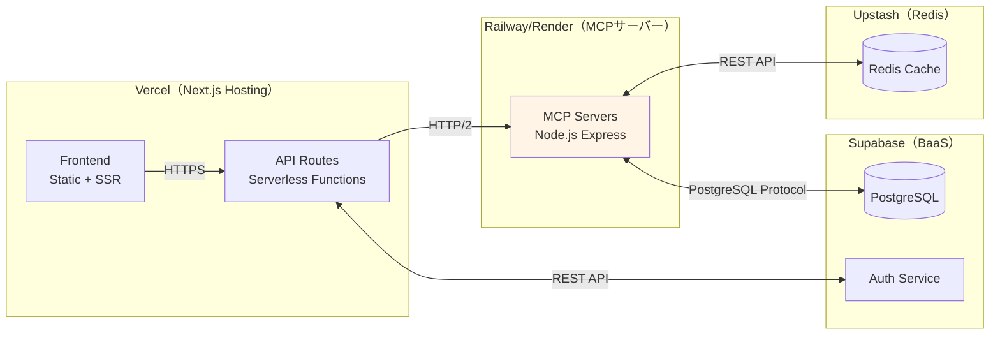
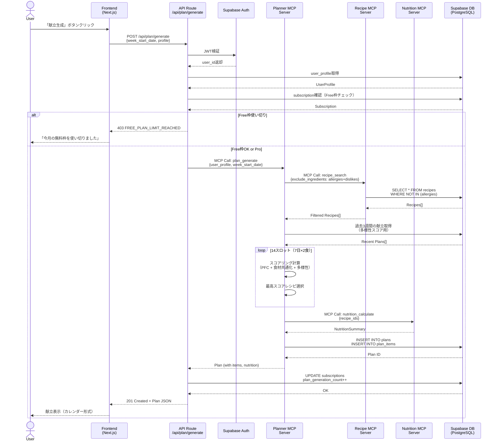
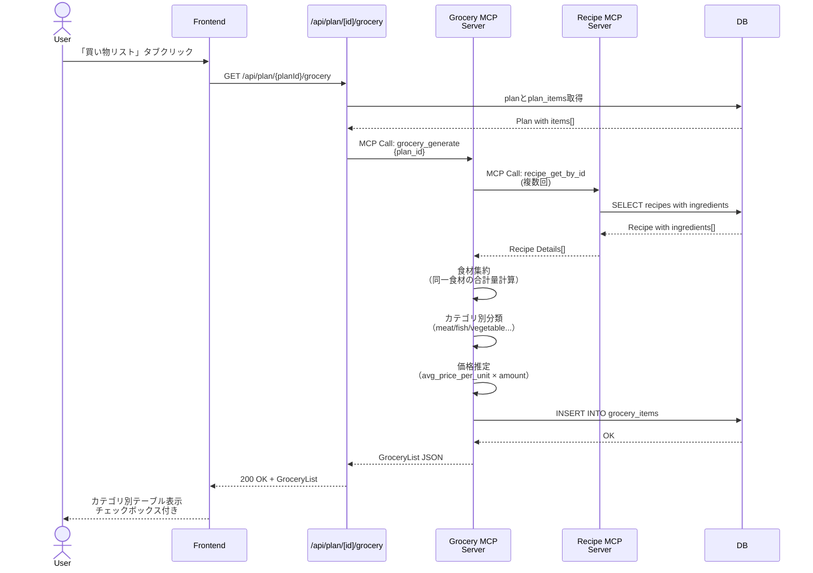
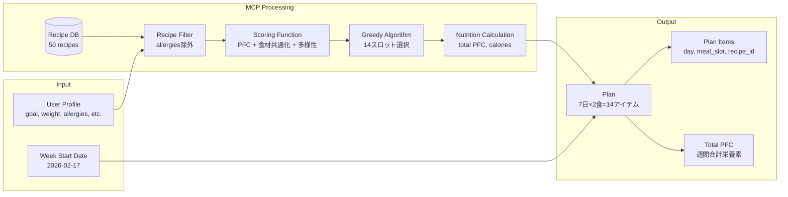

# BulkCart MCP 統合設計書（将来の拡張案）

> ⚠️ **注意**: このドキュメントは**将来の拡張案**です。MVP期（Phase 3-8）では、コストゼロのシンプルアーキテクチャ（[architecture-simple.md](architecture-simple.md)）を採用します。MCP Serverは実装せず、全てのロジックをNext.js API Routes + lib/関数で実装します。

**作成日**: 2026年2月20日  
**バージョン**: 1.0（参考資料）  
**目的**: Pro版でのClaude統合や高度な機能追加時の参考アーキテクチャ

---

## 目次

1. [概要](#1-概要)
2. [システムアーキテクチャ](#2-システムアーキテクチャ)
3. [MCP サーバー設計](#3-mcp-サーバー設計)
4. [シーケンス図](#4-シーケンス図)
5. [データフロー](#5-データフロー)
6. [API統合](#6-api統合)
7. [実装計画](#7-実装計画)
8. [セキュリティ](#8-セキュリティ)

---

## 1. 概要

### 1.1 Model Context Protocol とは

**Model Context Protocol (MCP)** は、AIアシスタント（Claude等）と外部ツール・データソースを統合するための標準プロトコルです。

**BulkCartでのMCP活用メリット**:
- **AI駆動の献立生成**: LLMの推論能力を活用した柔軟な献立最適化
- **自然言語クエリ**: 「高たんぱくで30分以内のレシピを探して」などの直感的な検索
- **拡張性**: 新しい機能（栄養アドバイス、レシピ提案等）を容易に追加
- **保守性**: ビジネスロジックとAI統合を分離

### 1.2 統合スコープ（MVP）

| 機能 | MCPサーバー | 優先度 | Phase |
|---|---|---|---|
| **レシピ検索・フィルタリング** | Recipe MCP Server | 🔴 高 | Phase 5.1 |
| **献立生成エンジン** | Planner MCP Server | 🔴 高 | Phase 5.2 |
| **買い物リスト生成** | Grocery MCP Server | 🟡 中 | Phase 5.3 |
| **栄養計算・分析** | Nutrition MCP Server | 🟢 低 | Phase 6+ |
| **レシピ提案（自然言語）** | Recipe MCP Server | 🟢 低 | Phase 10+ |

---

## 2. システムアーキテクチャ

### 2.1 全体アーキテクチャ図

```mermaid
graph TB
    subgraph "クライアント層"
        WebApp[Web App<br/>Next.js 14 App Router]
        Mobile[Mobile<br/>Future: React Native]
    end

    subgraph "API層（Next.js API Routes）"
        AuthAPI[/api/auth<br/>Supabase Auth]
        ProfileAPI[/api/profile<br/>User Profile CRUD]
        PlanAPI[/api/plan/generate<br/>献立生成]
        RecipeAPI[/api/recipes<br/>レシピ検索]
        GroceryAPI[/api/plan/[id]/grocery<br/>買い物リスト]
    end

    subgraph "MCP層（BulkCart MCPサーバー群）"
        RecipeMCP[Recipe MCP Server<br/>レシピ検索・フィルタ]
        PlannerMCP[Planner MCP Server<br/>献立生成ロジック]
        GroceryMCP[Grocery MCP Server<br/>買い物リスト集約]
        NutritionMCP[Nutrition MCP Server<br/>PFC計算]
    end

    subgraph "データ層"
        SupabaseDB[(Supabase PostgreSQL<br/>RLS有効)]
        Redis[(Redis Cache<br/>Upstash)]
    end

    subgraph "外部サービス"
        SupabaseAuth[Supabase Auth<br/>JWT発行]
        Stripe[Stripe<br/>課金管理]
        OpenAI[OpenAI API<br/>Optional: GPT-4]
    end

    WebApp -->|HTTPS| AuthAPI
    WebApp -->|HTTPS| ProfileAPI
    WebApp -->|HTTPS| PlanAPI
    WebApp -->|HTTPS| RecipeAPI
    WebApp -->|HTTPS| GroceryAPI

    AuthAPI <-->|JWT検証| SupabaseAuth
    ProfileAPI <-->|RLS Query| SupabaseDB
    
    PlanAPI -->|MCP Protocol| PlannerMCP
    RecipeAPI -->|MCP Protocol| RecipeMCP
    GroceryAPI -->|MCP Protocol| GroceryMCP

    PlannerMCP <-->|SELECT| SupabaseDB
    PlannerMCP -->|Cache| Redis
    PlannerMCP -->|Call| RecipeMCP
    PlannerMCP -->|Call| NutritionMCP

    RecipeMCP <-->|SELECT| SupabaseDB
    RecipeMCP -->|Cache| Redis

    GroceryMCP <-->|SELECT| SupabaseDB
    GroceryMCP -->|Call| RecipeMCP

    NutritionMCP -->|PFC計算| PlannerMCP

    PlanAPI <-->|Subscription確認| Stripe
    
    style RecipeMCP fill:#e1f5ff
    style PlannerMCP fill:#e1f5ff
    style GroceryMCP fill:#e1f5ff
    style NutritionMCP fill:#e1f5ff
```

### 2.2 デプロイメント構成



**デプロイメント戦略**:
- **Vercel**: Next.jsアプリ全体（Frontend + API Routes）→ 無料枠で開始
- **Railway/Render**: MCPサーバー群 → 1コンテナ（複数MCPサーバーを統合）、月$5-10
- **Supabase**: DB + Auth → 無料枠（500MB DB、50,000 Monthly Active Users）
- **Upstash**: Redis → 無料枠（10GB/月）

---

## 3. MCP サーバー設計

### 3.1 Recipe MCP Server（レシピ検索）

**責務**: レシピのCRUD、検索、フィルタリング

**MCPツール定義**:

```typescript
// tools/recipe-search.ts
export const recipeSearchTool = {
  name: "recipe_search",
  description: "レシピをタグ、難易度、調理時間、栄養素でフィルタリング検索",
  inputSchema: {
    type: "object",
    properties: {
      tags: {
        type: "array",
        items: { type: "string" },
        description: "例: ['high-protein', 'low-fat', 'chicken']"
      },
      difficulty: {
        type: "string",
        enum: ["easy", "medium", "hard"],
        description: "難易度"
      },
      max_cooking_time: {
        type: "number",
        description: "最大調理時間（分）"
      },
      min_protein_g: {
        type: "number",
        description: "最低たんぱく質量（g）"
      },
      exclude_ingredients: {
        type: "array",
        items: { type: "string" },
        description: "除外する食材名（アレルギー・苦手食材）"
      },
      limit: {
        type: "number",
        default: 20,
        description: "取得件数"
      }
    },
    required: []
  }
};

// Handler
export async function handleRecipeSearch(args: RecipeSearchArgs): Promise<Recipe[]> {
  const { tags, difficulty, max_cooking_time, min_protein_g, exclude_ingredients, limit } = args;

  let query = supabase
    .from('recipes')
    .select(`
      *,
      ingredients:recipe_ingredients(
        ingredient_id,
        amount,
        unit,
        ingredient:ingredients(*)
      )
    `);

  // タグフィルタ（GINインデックス使用）
  if (tags && tags.length > 0) {
    query = query.contains('tags', tags);
  }

  // 難易度フィルタ
  if (difficulty) {
    query = query.eq('difficulty', difficulty);
  }

  // 調理時間フィルタ
  if (max_cooking_time) {
    query = query.lte('cooking_time', max_cooking_time);
  }

  // たんぱく質フィルタ
  if (min_protein_g) {
    query = query.gte('protein_g', min_protein_g);
  }

  // 除外食材フィルタ（サブクエリ）
  if (exclude_ingredients && exclude_ingredients.length > 0) {
    const { data: ingredientIds } = await supabase
      .from('ingredients')
      .select('id')
      .in('name', exclude_ingredients);

    if (ingredientIds && ingredientIds.length > 0) {
      const excludeIds = ingredientIds.map(i => i.id);
      
      // レシピIDのリストを取得して除外
      const { data: recipeIdsToExclude } = await supabase
        .from('recipe_ingredients')
        .select('recipe_id')
        .in('ingredient_id', excludeIds);

      if (recipeIdsToExclude && recipeIdsToExclude.length > 0) {
        const excludeRecipeIds = recipeIdsToExclude.map(r => r.recipe_id);
        query = query.not('id', 'in', `(${excludeRecipeIds.join(',')})`);
      }
    }
  }

  query = query.limit(limit || 20);

  const { data, error } = await query;

  if (error) throw new Error(`Recipe search failed: ${error.message}`);

  return data as Recipe[];
}
```

**その他のツール**:
- `recipe_get_by_id`: レシピ詳細取得
- `recipe_list_tags`: 利用可能なタグ一覧
- `recipe_list_ingredients`: 食材マスタ一覧

---

### 3.2 Planner MCP Server（献立生成）

**責務**: スコアリング、Greedyアルゴリズム、制約条件処理

**MCPツール定義**:

```typescript
// tools/plan-generate.ts
export const planGenerateTool = {
  name: "plan_generate",
  description: "ユーザープロフィールに基づいて週次献立（7日×2食=14食）を生成",
  inputSchema: {
    type: "object",
    properties: {
      user_profile: {
        type: "object",
        properties: {
          goal: { 
            type: "string", 
            enum: ["bulk", "cut", "maintain"],
            description: "増量/減量/維持"
          },
          weight_kg: { 
            type: "number",
            description: "体重（kg）。PFC計算に使用"
          },
          training_days_per_week: { 
            type: "number",
            minimum: 0,
            maximum: 7
          },
          cooking_time_weekday: { 
            type: "number",
            description: "平日の調理時間上限（分）"
          },
          cooking_time_weekend: { 
            type: "number",
            description: "週末の調理時間上限（分）"
          },
          budget_per_month: { 
            type: "number",
            description: "月間食費予算（円）"
          },
          allergies: { 
            type: "array",
            items: { type: "string" },
            description: "アレルギー食材"
          },
          dislikes: { 
            type: "array",
            items: { type: "string" },
            description: "苦手食材"
          }
        },
        required: ["goal"]
      },
      week_start_date: {
        type: "string",
        pattern: "^\\d{4}-\\d{2}-\\d{2}$",
        description: "週の開始日（YYYY-MM-DD形式、月曜日）"
      },
      user_id: {
        type: "string",
        description: "ユーザーID（過去の献立履歴取得用）"
      }
    },
    required: ["user_profile", "week_start_date", "user_id"]
  }
};

// Handler（meal-planner-algorithm.mdのロジック実装）
export async function handlePlanGenerate(args: PlanGenerateArgs): Promise<Plan> {
  const { user_profile, week_start_date, user_id } = args;

  // 1. 目標PFC計算
  const dailyTarget = calculateDailyTarget(user_profile);
  const perMealTarget = {
    protein_g: dailyTarget.protein_g / 2,
    fat_g: dailyTarget.fat_g / 2,
    carb_g: dailyTarget.carb_g / 2,
    calories: dailyTarget.calories / 2
  };

  // 2. Recipe MCP Serverから候補レシピ取得（アレルギー・苦手食材を除外）
  const candidateRecipes = await callMCP('recipe_search', {
    exclude_ingredients: [...user_profile.allergies, ...user_profile.dislikes],
    limit: 100
  });

  // 3. 過去3週間の献立取得（多様性スコア用）
  const recentPlans = await getRecentPlans(user_id, 3);

  // 4. Greedyアルゴリズム実行
  const selectedRecipes: Recipe[] = [];
  const planItems: PlanItem[] = [];

  for (let day = 0; day < 7; day++) {
    for (const mealSlot of ['lunch', 'dinner'] as const) {
      const maxTime = mealSlot === 'lunch' 
        ? user_profile.cooking_time_weekday 
        : user_profile.cooking_time_weekend;

      // スコア計算
      const scoredRecipes = candidateRecipes
        .filter(r => r.cooking_time <= maxTime) // 調理時間フィルタ
        .map(recipe => ({
          recipe,
          score: calculateTotalScore(recipe, {
            target: perMealTarget,
            goal: user_profile.goal,
            selectedRecipes,
            maxTime,
            recentPlans
          })
        }))
        .sort((a, b) => b.score - a.score);

      if (scoredRecipes.length === 0) {
        throw new Error('PLAN_GENERATION_FAILED: 制約条件を満たすレシピがありません');
      }

      const bestRecipe = scoredRecipes[0].recipe;
      selectedRecipes.push(bestRecipe);
      planItems.push({
        day_of_week: day,
        meal_slot: mealSlot,
        recipe_id: bestRecipe.id
      });
    }
  }

  // 5. DBに保存
  const plan = await savePlan(user_id, week_start_date, user_profile.goal, planItems, selectedRecipes);

  return plan;
}
```

**スコアリング関数**: `meal-planner-algorithm.md` のセクション2を参照

---

### 3.3 Grocery MCP Server（買い物リスト）

**責務**: 献立から食材を集約、カテゴリ分類、重複排除

**MCPツール定義**:

```typescript
// tools/grocery-generate.ts
export const groceryGenerateTool = {
  name: "grocery_generate",
  description: "献立IDから買い物リストを生成（食材集約・カテゴリ分類）",
  inputSchema: {
    type: "object",
    properties: {
      plan_id: {
        type: "string",
        description: "献立ID"
      }
    },
    required: ["plan_id"]
  }
};

// Handler
export async function handleGroceryGenerate(args: { plan_id: string }): Promise<GroceryList> {
  const { plan_id } = args;

  // 1. 献立とレシピ詳細を取得
  const { data: plan } = await supabase
    .from('plans')
    .select(`
      *,
      items:plan_items(
        *,
        recipe:recipes(
          *,
          ingredients:recipe_ingredients(
            ingredient_id,
            amount,
            unit,
            ingredient:ingredients(*)
          )
        )
      )
    `)
    .eq('id', plan_id)
    .single();

  if (!plan) throw new Error('Plan not found');

  // 2. 食材を集約（同一食材の合計量計算）
  const ingredientMap = new Map<string, {
    ingredient: Ingredient;
    amount: number;
    unit: string;
  }>();

  plan.items.forEach((item: PlanItem) => {
    item.recipe.ingredients.forEach((ri: RecipeIngredient) => {
      const ingredientId = ri.ingredient_id;
      const existing = ingredientMap.get(ingredientId);

      if (existing) {
        // 単位が同じなら合計
        if (existing.unit === ri.unit) {
          existing.amount += ri.amount;
        }
      } else {
        ingredientMap.set(ingredientId, {
          ingredient: ri.ingredient,
          amount: ri.amount,
          unit: ri.unit
        });
      }
    });
  });

  // 3. カテゴリ別に分類
  const categories = ['meat', 'fish', 'egg_dairy', 'vegetable', 'grain', 'seasoning'];
  const groceryList: GroceryList = {
    plan_id,
    week_start_date: plan.week_start_date,
    categories: [],
    total_estimated_price: 0
  };

  categories.forEach(category => {
    const items = Array.from(ingredientMap.values())
      .filter(item => item.ingredient.category === category)
      .map(item => ({
        ingredient_id: item.ingredient.id,
        name: item.ingredient.name,
        amount: Math.ceil(item.amount), // 切り上げ
        unit: item.unit,
        estimated_price: Math.ceil(item.amount / 100 * item.ingredient.avg_price_per_unit)
      }));

    if (items.length > 0) {
      const categoryTotal = items.reduce((sum, item) => sum + item.estimated_price, 0);
      groceryList.categories.push({
        category,
        category_name: getCategoryName(category),
        items
      });
      groceryList.total_estimated_price += categoryTotal;
    }
  });

  // 4. DBに保存（grocery_itemsテーブル）
  await saveGroceryList(plan_id, groceryList);

  return groceryList;
}
```

---

### 3.4 Nutrition MCP Server（栄養計算）

**責務**: PFC計算、カロリー計算、栄養素データベース

**MCPツール定義**:

```typescript
// tools/nutrition-calculate.ts
export const nutritionCalculateTool = {
  name: "nutrition_calculate",
  description: "レシピまたは献立の栄養素（PFC、カロリー）を計算",
  inputSchema: {
    type: "object",
    properties: {
      recipe_ids: {
        type: "array",
        items: { type: "string" },
        description: "計算対象のレシピID配列"
      }
    },
    required: ["recipe_ids"]
  }
};

// Handler
export async function handleNutritionCalculate(args: { recipe_ids: string[] }): Promise<NutritionSummary> {
  const { recipe_ids } = args;

  const { data: recipes } = await supabase
    .from('recipes')
    .select('protein_g, fat_g, carb_g, calories')
    .in('id', recipe_ids);

  if (!recipes) throw new Error('Recipes not found');

  const summary: NutritionSummary = {
    total_protein_g: 0,
    total_fat_g: 0,
    total_carb_g: 0,
    total_calories: 0,
    avg_per_meal: {
      protein_g: 0,
      fat_g: 0,
      carb_g: 0,
      calories: 0
    }
  };

  recipes.forEach(r => {
    summary.total_protein_g += r.protein_g;
    summary.total_fat_g += r.fat_g;
    summary.total_carb_g += r.carb_g;
    summary.total_calories += r.calories;
  });

  const mealCount = recipes.length;
  summary.avg_per_meal = {
    protein_g: Math.round((summary.total_protein_g / mealCount) * 10) / 10,
    fat_g: Math.round((summary.total_fat_g / mealCount) * 10) / 10,
    carb_g: Math.round((summary.total_carb_g / mealCount) * 10) / 10,
    calories: Math.round(summary.total_calories / mealCount)
  };

  return summary;
}
```

---

## 4. シーケンス図

### 4.1 献立生成フロー（MCP統合版）



### 4.2 買い物リスト生成フロー



---

## 5. データフロー

### 5.1 データフロー図（献立生成）



### 5.2 データフロー図（買い物リスト）

```mermaid
flowchart TD
    Plan[Plan<br/>14 meal items] --> ExtractRecipes[Extract Recipes<br/>14 recipes]
    ExtractRecipes --> GetIngredients[Get Ingredients<br/>recipe_ingredients]
    
    GetIngredients --> Aggregate[Aggregate Same Ingredients<br/>鶏むね: 300g + 400g + 500g = 1200g]
    
    Aggregate --> Categorize[Categorize<br/>meat/fish/vegetable/etc.]
    
    Categorize --> EstimatePrice[Estimate Price<br/>amount × avg_price_per_unit]
    
    EstimatePrice --> GroceryList[Grocery List<br/>categories[], total_price]
    
    GroceryList --> DB[(DB: grocery_items)]
    GroceryList --> Frontend[Frontend Display<br/>カテゴリ別テーブル]
```

---

## 6. API統合

### 6.1 Next.js API Route → MCP Server 通信

**MCP Client実装** (`lib/mcp/client.ts`):

```typescript
import axios from 'axios';

const MCP_SERVER_URL = process.env.MCP_SERVER_URL || 'http://localhost:3001';

interface MCPRequest {
  tool: string;
  arguments: Record<string, unknown>;
}

interface MCPResponse<T> {
  result: T;
  error?: string;
}

export async function callMCP<T>(tool: string, args: Record<string, unknown>): Promise<T> {
  try {
    const response = await axios.post<MCPResponse<T>>(
      `${MCP_SERVER_URL}/mcp`,
      {
        jsonrpc: '2.0',
        method: 'tools/call',
        params: {
          name: tool,
          arguments: args
        },
        id: `req-${Date.now()}`
      },
      {
        headers: {
          'Content-Type': 'application/json',
          'Authorization': `Bearer ${process.env.MCP_SERVER_API_KEY}`
        },
        timeout: 30000 // 30秒
      }
    );

    if (response.data.error) {
      throw new Error(`MCP Error: ${response.data.error}`);
    }

    return response.data.result;
  } catch (error) {
    console.error('MCP call failed', { tool, args, error });
    throw new Error(`MCP call failed: ${tool}`);
  }
}
```

**使用例** (`app/api/plan/generate/route.ts`):

```typescript
import { NextRequest, NextResponse } from 'next/server';
import { getAuthenticatedUser } from '@/lib/auth';
import { callMCP } from '@/lib/mcp/client';

export async function POST(req: NextRequest) {
  try {
    const { user } = await getAuthenticatedUser();
    const { week_start_date } = await req.json();

    // Planner MCP Serverを呼び出し
    const plan = await callMCP<Plan>('plan_generate', {
      user_profile: user.profile,
      week_start_date,
      user_id: user.id
    });

    return NextResponse.json(plan, { status: 201 });
  } catch (error) {
    return NextResponse.json(
      { error: 'PLAN_GENERATION_FAILED' },
      { status: 422 }
    );
  }
}
```

### 6.2 MCP Server構成（Express.js）

**ディレクトリ構造**:
```
mcp-server/
├── src/
│   ├── index.ts                # Express app entry point
│   ├── tools/
│   │   ├── recipe-search.ts    # Recipe MCP tools
│   │   ├── plan-generate.ts    # Planner MCP tools
│   │   ├── grocery-generate.ts # Grocery MCP tools
│   │   └── nutrition-calculate.ts # Nutrition MCP tools
│   ├── lib/
│   │   ├── supabase.ts         # Supabase client
│   │   ├── scoring.ts          # Scoring functions
│   │   └── targets.ts          # PFC target calculation
│   └── types/
│       └── index.ts            # TypeScript types
├── package.json
├── tsconfig.json
└── Dockerfile                  # Railway/Render deployment
```

**Express.js エントリーポイント** (`src/index.ts`):

```typescript
import express from 'express';
import { handleRecipeSearch } from './tools/recipe-search';
import { handlePlanGenerate } from './tools/plan-generate';
import { handleGroceryGenerate } from './tools/grocery-generate';
import { handleNutritionCalculate } from './tools/nutrition-calculate';

const app = express();
app.use(express.json());

// MCP Protocol endpoint
app.post('/mcp', async (req, res) => {
  const { method, params, id } = req.body;

  // 認証チェック
  const apiKey = req.headers.authorization?.replace('Bearer ', '');
  if (apiKey !== process.env.MCP_SERVER_API_KEY) {
    return res.status(401).json({
      jsonrpc: '2.0',
      error: { code: -32600, message: 'Unauthorized' },
      id
    });
  }

  if (method !== 'tools/call') {
    return res.status(400).json({
      jsonrpc: '2.0',
      error: { code: -32601, message: 'Method not found' },
      id
    });
  }

  const { name, arguments: args } = params;

  try {
    let result;

    switch (name) {
      case 'recipe_search':
        result = await handleRecipeSearch(args);
        break;
      case 'plan_generate':
        result = await handlePlanGenerate(args);
        break;
      case 'grocery_generate':
        result = await handleGroceryGenerate(args);
        break;
      case 'nutrition_calculate':
        result = await handleNutritionCalculate(args);
        break;
      default:
        return res.status(404).json({
          jsonrpc: '2.0',
          error: { code: -32601, message: `Tool not found: ${name}` },
          id
        });
    }

    res.json({
      jsonrpc: '2.0',
      result,
      id
    });
  } catch (error) {
    console.error('MCP tool execution failed', { name, args, error });
    res.status(500).json({
      jsonrpc: '2.0',
      error: { code: -32603, message: error.message },
      id
    });
  }
});

// Health check
app.get('/health', (req, res) => {
  res.json({ status: 'ok', timestamp: new Date().toISOString() });
});

const PORT = process.env.PORT || 3001;
app.listen(PORT, () => {
  console.log(`MCP Server running on port ${PORT}`);
});
```

---

## 7. 実装計画

### 7.1 Phase別実装

| Phase | 内容 | 期間 | 優先度 |
|---|---|---|---|
| **Phase 3.6** | MCP Server雛形作成（Express.js + TypeScript） | 2日 | 🔴 高 |
| **Phase 5.1** | Recipe MCP Server実装 | 3日 | 🔴 高 |
| **Phase 5.2** | Planner MCP Server実装 | 5日 | 🔴 高 |
| **Phase 5.3** | Grocery MCP Server実装 | 2日 | 🟡 中 |
| **Phase 6.0** | Nutrition MCP Server実装 | 2日 | 🟢 低 |
| **Phase 7.3** | MCP Server監視・ログ設定 | 1日 | 🟡 中 |

### 7.2 デプロイメント計画

**開発環境**:
- Next.js: `localhost:3000`
- MCP Server: `localhost:3001`
- Supabase: ローカルDocker

**Staging環境**:
- Next.js: Vercel Preview
- MCP Server: Railway/Render Preview
- Supabase: Staging project

**本番環境**:
- Next.js: Vercel Production (`bulkcart.jp`)
- MCP Server: Railway/Render Production
- Supabase: Production project

---

## 8. セキュリティ

### 8.1 認証・認可

**API Route → MCP Server**:
- **API Key認証**: `Authorization: Bearer {MCP_SERVER_API_KEY}`
- 環境変数で管理、Vercel Secrets + Railway/Render環境変数

**MCP Server → Supabase**:
- **Service Role Key**: RLSをバイパスして全データにアクセス
- MCP ServerはAPI RouteからのリクエストをそのままDBに流すため、API Route側でRLS相当の認可を実施

### 8.2 入力検証

**Zodスキーマ** (`lib/mcp/validation.ts`):

```typescript
import { z } from 'zod';

export const RecipeSearchSchema = z.object({
  tags: z.array(z.string()).optional(),
  difficulty: z.enum(['easy', 'medium', 'hard']).optional(),
  max_cooking_time: z.number().min(5).max(240).optional(),
  min_protein_g: z.number().min(0).max(200).optional(),
  exclude_ingredients: z.array(z.string()).optional(),
  limit: z.number().min(1).max(100).default(20)
});

export const PlanGenerateSchema = z.object({
  user_profile: z.object({
    goal: z.enum(['bulk', 'cut', 'maintain']),
    weight_kg: z.number().min(30).max(200).optional(),
    training_days_per_week: z.number().min(0).max(7),
    cooking_time_weekday: z.number().min(5).max(120),
    cooking_time_weekend: z.number().min(5).max(240),
    budget_per_month: z.number().min(5000).max(100000).optional(),
    allergies: z.array(z.string()).default([]),
    dislikes: z.array(z.string()).default([])
  }),
  week_start_date: z.string().regex(/^\d{4}-\d{2}-\d{2}$/),
  user_id: z.string().uuid()
});
```

### 8.3 レート制限

**MCP Server側でのレート制限** (Upstash Redis):

```typescript
import { Ratelimit } from '@upstash/ratelimit';
import { Redis } from '@upstash/redis';

const redis = Redis.fromEnv();

const ratelimit = new Ratelimit({
  redis,
  limiter: Ratelimit.slidingWindow(10, '1 h'), // 10リクエスト/時間
  prefix: 'mcp:plan_generate'
});

// Middleware
app.use('/mcp', async (req, res, next) => {
  const { name } = req.body.params;

  if (name === 'plan_generate') {
    const userId = req.body.params.arguments.user_id;
    const { success, remaining } = await ratelimit.limit(userId);

    if (!success) {
      return res.status(429).json({
        jsonrpc: '2.0',
        error: { code: -32000, message: 'Too many requests' },
        id: req.body.id
      });
    }

    res.setHeader('X-RateLimit-Remaining', remaining);
  }

  next();
});
```

---

## 9. 監視・ログ

### 9.1 ログ設計

**ログレベル**:
- `INFO`: 正常な処理（献立生成開始、完了）
- `WARN`: 制約条件緩和、リトライ実行
- `ERROR`: 献立生成失敗、DB接続エラー

**ログ出力** (Pino):

```typescript
import pino from 'pino';

const logger = pino({
  level: process.env.LOG_LEVEL || 'info',
  transport: {
    target: 'pino-pretty',
    options: { colorize: true }
  }
});

// 使用例
logger.info({ tool: 'plan_generate', userId, weekStartDate }, 'Plan generation started');
logger.error({ tool: 'recipe_search', error: error.message }, 'Recipe search failed');
```

### 9.2 メトリクス

**計測項目**:
- 献立生成成功率（`plan_generate_success` / `plan_generate_total`）
- 平均生成時間（`plan_generate_duration_ms`）
- レシピ検索クエリ数（`recipe_search_count`）
- エラー率（`error_count` / `total_requests`）

**Prometheus exporterを追加** (Optional):

```typescript
import promClient from 'prom-client';

const register = new promClient.Registry();

const planGenerateCounter = new promClient.Counter({
  name: 'plan_generate_total',
  help: 'Total plan generation requests',
  labelNames: ['status']
});

const planGenerateDuration = new promClient.Histogram({
  name: 'plan_generate_duration_ms',
  help: 'Plan generation duration in milliseconds',
  buckets: [100, 500, 1000, 2000, 5000]
});

register.registerMetric(planGenerateCounter);
register.registerMetric(planGenerateDuration);

// Metrics endpoint
app.get('/metrics', async (req, res) => {
  res.set('Content-Type', register.contentType);
  res.end(await register.metrics());
});
```

---

## 10. まとめ

### 10.1 MCP統合の利点

✅ **AI駆動の献立生成**: LLMの推論能力を活用した柔軟な最適化  
✅ **拡張性**: 新しいツール（栄養アドバイス、レシピ提案等）を容易に追加  
✅ **保守性**: ビジネスロジックとAI統合を分離、テスト容易  
✅ **スケーラビリティ**: MCP ServerをHorizontal Scalingで負荷分散

### 10.2 MVPスコープ

**Phase 5完了時点で実装**:
- ✅ Recipe MCP Server（レシピ検索・フィルタリング）
- ✅ Planner MCP Server（献立生成エンジン）
- ✅ Grocery MCP Server（買い物リスト生成）

**Phase 6以降で追加**:
- 🔄 Nutrition MCP Server（栄養計算・分析）
- 🔄 自然言語クエリ（「高たんぱくで30分以内のレシピを探して」）
- 🔄 レシピ提案（GPT-4連携）

### 10.3 次のアクション

Phase 3.6として以下を追加:
```markdown
### 3.6 🤖 MCP Server 雛形作成
- [ ] Express.js + TypeScript プロジェクト初期化
- [ ] MCP Protocol エンドポイント実装 (`/mcp`)
- [ ] Health check エンドポイント (`/health`)
- [ ] Supabase クライアント設定
- [ ] ツールハンドラー雛形作成（recipe_search, plan_generate）
- [ ] Dockerfile 作成（Railway/Render デプロイ用）
- [ ] mcp-server/ ディレクトリに保存

**AI実行プロンプト例**: 「Phase 3.6のMCP Server雛形を作成して」
```

---

**ドキュメント完**  
**次のステップ**: Phase 3.1-3.6の開発環境構築を実行してください。
