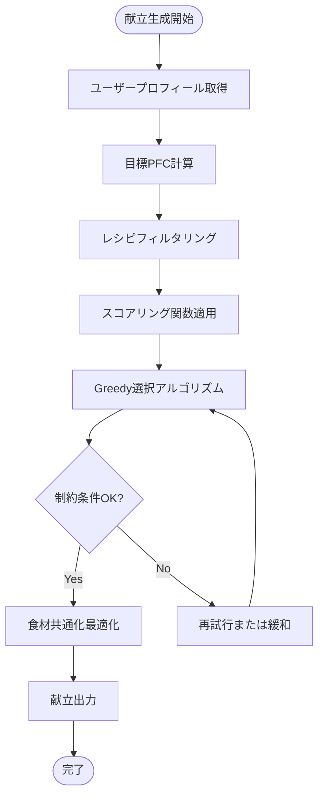

# BulkCart 献立生成アルゴリズム設計書

**作成日**: 2026年2月18日  
**バージョン**: 1.0  
**言語**: TypeScript  
**計算量目標**: O(n log n)（n = レシピ数）

---

## 目次

1. [概要](#1-概要)
2. [スコアリング関数](#2-スコアリング関数)
3. [食材共通化アルゴリズム](#3-食材共通化アルゴリズム)
4. [制約条件処理](#4-制約条件処理)
5. [献立生成フロー](#5-献立生成フロー)
6. [疑似コード](#6-疑似コード)
7. [パフォーマンス最適化](#7-パフォーマンス最適化)
8. [エッジケース](#8-エッジケース)
9. [テストケース](#9-テストケース)

---

## 1. 概要

### 1.1 献立生成の目的

BulkCartの献立生成エンジンは、以下の**3つの目標**を同時に達成します:

1. **栄養目標達成**: 増量/減量/維持のPFC（たんぱく質・脂質・炭水化物）目標
2. **食材共通化**: 買い物リストを最小化（食材ロス削減、買い物の手間削減）
3. **制約条件遵守**: アレルギー、苦手食材、調理時間、予算

### 1.2 入力と出力

**入力**:
```typescript
interface UserProfile {
  goal: 'bulk' | 'cut' | 'maintain';
  weight_kg: number | null;
  training_days_per_week: number;
  cooking_time_weekday: number;
  cooking_time_weekend: number;
  budget_per_month: number | null;
  allergies: string[];
  dislikes: string[];
}

interface GeneratePlanInput {
  user_profile: UserProfile;
  week_start_date: string;
}
```

**出力**:
```typescript
interface Plan {
  id: string;
  week_start_date: string;
  goal: Goal;
  items: PlanItem[]; // 7日 × 2食（昼・夜）= 14アイテム
  total_protein_g: number;
  total_calories: number;
}

interface PlanItem {
  day_of_week: number; // 0=月, 6=日
  meal_slot: 'lunch' | 'dinner';
  recipe: Recipe;
}
```

### 1.3 アルゴリズム全体像



**アルゴリズムの特徴**:
- **Greedy Algorithm**: 各食事スロットで最高スコアのレシピを選択
- **食材共通化**: 既に選択されたレシピと共通食材を持つレシピにボーナス加点
- **制約条件**: アレルギー、苦手食材、調理時間、予算でフィルタリング
- **再試行メカニズム**: 制約を満たせない場合は難易度を緩和して再試行

---

## 2. スコアリング関数

### 2.1 スコアリングの基本方針

各レシピに対して**0〜100点**のスコアを計算します。スコアは以下の要素で構成されます:

| 要素 | 重み | 説明 |
|---|---|---|
| **PFC適合度** | 40% | 目標PFCとのマッチング度 |
| **食材共通化** | 30% | 既選択レシピとの食材重複度 |
| **難易度・時間** | 20% | 調理時間の短さ、難易度の低さ |
| **多様性** | 10% | 過去の献立との重複回避 |

### 2.2 目標別のPFC目標値

**体重ベース**（体重不明時はデフォルト値）:

| 目標 | たんぱく質（g/日） | 脂質（g/日） | 炭水化物（g/日） | カロリー（kcal/日） |
|---|---|---|---|---|
| **増量（bulk）** | 体重×2.0 | 体重×0.8 | 体重×5.0 | 高カロリー |
| **減量（cut）** | 体重×2.2 | 体重×0.5 | 体重×2.5 | 低カロリー |
| **維持（maintain）** | 体重×1.8 | 体重×0.7 | 体重×3.5 | 中カロリー |

**体重不明時のデフォルト（70kg想定）**:

| 目標 | たんぱく質 | 脂質 | 炭水化物 | カロリー |
|---|---|---|---|---|
| **増量** | 140g/日 | 56g/日 | 350g/日 | 2,500kcal/日 |
| **減量** | 154g/日 | 35g/日 | 175g/日 | 1,700kcal/日 |
| **維持** | 126g/日 | 49g/日 | 245g/日 | 2,000kcal/日 |

**1食あたりの目標**（昼・夜で均等分割）:
```typescript
const dailyTarget = calculateDailyTarget(profile);
const perMealTarget = {
  protein_g: dailyTarget.protein_g / 2,
  fat_g: dailyTarget.fat_g / 2,
  carb_g: dailyTarget.carb_g / 2,
  calories: dailyTarget.calories / 2
};
```

### 2.3 PFC適合度スコア（40点満点）

```typescript
function calculatePFCScore(recipe: Recipe, target: PFCTarget, goal: Goal): number {
  // 目標別の重み設定
  const weights = {
    bulk: { protein: 0.4, fat: 0.1, carb: 0.5 },      // 増量：たんぱく質＋炭水化物重視
    cut: { protein: 0.6, fat: 0.2, carb: 0.2 },       // 減量：たんぱく質重視、脂質制限
    maintain: { protein: 0.4, fat: 0.3, carb: 0.3 }   // 維持：バランス
  };

  const w = weights[goal];

  // 各栄養素の適合度（0〜1）。目標に近いほど1に近づく
  const proteinFit = 1 - Math.abs(recipe.protein_g - target.protein_g) / target.protein_g;
  const fatFit = 1 - Math.abs(recipe.fat_g - target.fat_g) / target.fat_g;
  const carbFit = 1 - Math.abs(recipe.carb_g - target.carb_g) / target.carb_g;

  // 負値を0にクリップ
  const clamp = (val: number) => Math.max(0, Math.min(1, val));

  const pfcScore = 
    w.protein * clamp(proteinFit) +
    w.fat * clamp(fatFit) +
    w.carb * clamp(carbFit);

  return pfcScore * 40; // 40点満点
}
```

**例**:
- **増量**: 鶏むね（P:38g F:5g C:1.5g）+ 白米（P:5g F:0.6g C:74g）= P:43g F:5.6g C:75.5g
  - 目標: P:70g F:28g C:175g
  - 高たんぱく＋高炭水化物 → 高スコア
  
- **減量**: サラダチキン（P:35g F:2g C:0.5g）+ ブロッコリー（P:4g F:0.5g C:6g）= P:39g F:2.5g C:6.5g
  - 目標: P:77g F:17.5g C:87.5g
  - 高たんぱく＋低脂質 → 高スコア

### 2.4 食材共通化スコア（30点満点）

**目的**: 既に選択されたレシピと食材を共有するレシピにボーナス加点。

```typescript
function calculateIngredientOverlapScore(
  recipe: Recipe,
  selectedRecipes: Recipe[],
  allIngredients: Map<string, Ingredient>
): number {
  if (selectedRecipes.length === 0) return 0;

  // 既選択レシピの食材集合
  const selectedIngredientIds = new Set<string>();
  selectedRecipes.forEach(r => {
    r.ingredients.forEach(ri => selectedIngredientIds.add(ri.ingredient_id));
  });

  // 現在のレシピの食材との重複数
  const recipeIngredientIds = recipe.ingredients.map(ri => ri.ingredient_id);
  const overlapCount = recipeIngredientIds.filter(id => 
    selectedIngredientIds.has(id)
  ).length;

  // 重複率（0〜1）
  const overlapRatio = overlapCount / recipeIngredientIds.length;

  return overlapRatio * 30; // 30点満点
}
```

**例**:
- 既選択: 鶏むね塩麹焼き（鶏むね、塩麹）
- 候補A: 鶏むね照り焼き（鶏むね、醤油、みりん） → 重複1/3 = 10点
- 候補B: 卵焼き（卵、醤油） → 重複0/2 = 0点

→ 候補Aが優先される（鶏むねの買い物リスト集約）

### 2.5 調理時間・難易度スコア（20点満点）

```typescript
function calculateConvenienceScore(
  recipe: Recipe,
  maxTime: number // cooking_time_weekday or weekend
): number {
  // 調理時間スコア（15点満点）
  const timeScore = Math.max(0, 1 - recipe.cooking_time / maxTime) * 15;

  // 難易度スコア（5点満点）
  const difficultyScore = {
    easy: 5,
    medium: 3,
    hard: 0
  }[recipe.difficulty];

  return timeScore + difficultyScore;
}
```

**例**:
- 平日（maxTime=15分）:
  - ゆで卵（12分、easy） → 3点 + 5点 = 8点
  - 鶏むね照り焼き（35分、easy） → 0点 + 5点 = 5点（時間超過でペナルティ）

### 2.6 多様性スコア（10点満点）

```typescript
function calculateDiversityScore(
  recipe: Recipe,
  recentPlans: Plan[]
): number {
  // 過去3週間の献立から重複チェック
  const recentRecipeIds = new Set<string>();
  recentPlans.forEach(plan => {
    plan.items.forEach(item => recentRecipeIds.add(item.recipe.id));
  });

  // 既出レシピはペナルティ
  if (recentRecipeIds.has(recipe.id)) {
    return 0; // マンネリ回避
  }

  // 同じタグのレシピ数をカウント
  const tagOverlap = recipe.tags.filter(tag => {
    return recentPlans.some(plan => 
      plan.items.some(item => item.recipe.tags.includes(tag))
    );
  }).length;

  // タグ重複が少ないほど高スコア
  const diversityRatio = 1 - (tagOverlap / recipe.tags.length);
  return diversityRatio * 10;
}
```

### 2.7 総合スコア計算

```typescript
function calculateTotalScore(
  recipe: Recipe,
  context: {
    target: PFCTarget;
    goal: Goal;
    selectedRecipes: Recipe[];
    maxTime: number;
    recentPlans: Plan[];
  }
): number {
  const pfcScore = calculatePFCScore(recipe, context.target, context.goal);
  const overlapScore = calculateIngredientOverlapScore(recipe, context.selectedRecipes, allIngredients);
  const convenienceScore = calculateConvenienceScore(recipe, context.maxTime);
  const diversityScore = calculateDiversityScore(recipe, context.recentPlans);

  return pfcScore + overlapScore + convenienceScore + diversityScore; // 0〜100点
}
```

---

## 3. 食材共通化アルゴリズム

### 3.1 Greedy Algorithm の流れ

**基本方針**: 各食事スロットで、**スコアが最も高いレシピを貪欲に選択**。

```mermaid
flowchart TD
    Start([開始]) --> Init[選択済みレシピ初期化: selectedRecipes = []]
    Init --> Loop{全14スロット処理完了?}
    Loop -->|No| GetSlot[次のスロット取得<br/>day_of_week, meal_slot]
    GetSlot --> FilterCandidates[候補レシピフィルタリング<br/>制約条件チェック]
    FilterCandidates --> ScoreAll[全候補にスコア計算<br/>食材共通化ボーナス含む]
    ScoreAll --> SelectBest[最高スコアレシピ選択]
    SelectBest --> AddToSelected[selectedRecipes に追加]
    AddToSelected --> Loop
    Loop -->|Yes| Return[献立完成]
    Return --> End([終了])
```

### 3.2 疑似コード（Greedy Algorithm）

```typescript
function generateWeeklyPlan(profile: UserProfile, allRecipes: Recipe[]): Plan {
  const target = calculateDailyTarget(profile);
  const selectedRecipes: Recipe[] = [];
  const planItems: PlanItem[] = [];
  const recentPlans = getRecentPlans(profile.id, 3); // 過去3週間

  // 14スロット（7日 × 2食）をループ
  for (let day = 0; day < 7; day++) {
    for (const mealSlot of ['lunch', 'dinner']) {
      // 制約条件でフィルタリング
      const candidates = filterRecipesByConstraints(allRecipes, {
        allergies: profile.allergies,
        dislikes: profile.dislikes,
        maxTime: mealSlot === 'lunch' ? profile.cooking_time_weekday : profile.cooking_time_weekend,
        budget: profile.budget_per_month
      });

      // スコア計算
      const scoredRecipes = candidates.map(recipe => ({
        recipe,
        score: calculateTotalScore(recipe, {
          target: { ...target, protein_g: target.protein_g / 2, ... }, // 1食分
          goal: profile.goal,
          selectedRecipes,
          maxTime: mealSlot === 'lunch' ? profile.cooking_time_weekday : profile.cooking_time_weekend,
          recentPlans
        })
      }));

      // 最高スコアのレシピを選択
      scoredRecipes.sort((a, b) => b.score - a.score);
      const bestRecipe = scoredRecipes[0]?.recipe;

      if (!bestRecipe) {
        throw new Error('PLAN_GENERATION_FAILED: 制約条件を満たすレシピが見つかりません');
      }

      selectedRecipes.push(bestRecipe);
      planItems.push({
        day_of_week: day,
        meal_slot: mealSlot,
        recipe: bestRecipe
      });
    }
  }

  return {
    id: generateUUID(),
    week_start_date: weekStartDate,
    goal: profile.goal,
    items: planItems,
    total_protein_g: sumProtein(selectedRecipes),
    total_calories: sumCalories(selectedRecipes)
  };
}
```

### 3.3 食材共通化の効果

**例**: 7日間の献立生成

| 日 | 昼 | 夜 |
|---|---|---|
| 月 | 鶏むね塩麹焼き | 白米 + ブロッコリー |
| 火 | ゆで卵 | 鶏むね照り焼き + 白米 |
| 水 | 豆腐ステーキ | 鮭塩焼き + 白米 |
| 木 | 卵焼き | 鶏むねねぎ塩 + 白米 |
| 金 | サラダチキン | オムレツ + 白米 |
| 土 | 鶏むねカレー | 白米 |
| 日 | ゆで卵サラダ | 鶏むねガーリック炒め + 白米 |

**共通食材**:
- 鶏むね: 1200g（月・火・木・土・日）
- 卵: 12個（火・木・金・日）
- 白米: 2100g（全日）
- ブロッコリー: 400g（月・日）

**食材共通化のメリット**:
- 買い物リストが**5カテゴリ × 平均5品目 = 25品目**程度に集約
- 食材ロス削減（鶏むねを週5回使用 → 1.2kgパックを使い切り）
- 買い物時間短縮（スーパーでの滞在時間↓）

---

## 4. 制約条件処理

### 4.1 制約条件の種類

| 制約 | 種類 | 処理方法 |
|---|---|---|
| **アレルギー** | 必須制約 | フィルタリング（除外） |
| **苦手食材** | 必須制約 | フィルタリング（除外） |
| **調理時間** | 優先制約 | スコアリングでペナルティ |
| **予算** | 優先制約 | スコアリングでペナルティ |

### 4.2 フィルタリング関数

```typescript
function filterRecipesByConstraints(
  recipes: Recipe[],
  constraints: {
    allergies: string[];
    dislikes: string[];
    maxTime: number;
    budget: number | null;
  }
): Recipe[] {
  return recipes.filter(recipe => {
    // アレルギー食材を含むレシピを除外
    const hasAllergy = recipe.ingredients.some(ri => {
      const ingredient = getIngredient(ri.ingredient_id);
      return constraints.allergies.some(allergy => 
        ingredient.name === allergy || ingredient.aliases.includes(allergy)
      );
    });

    if (hasAllergy) return false;

    // 苦手食材を含むレシピを除外
    const hasDislike = recipe.ingredients.some(ri => {
      const ingredient = getIngredient(ri.ingredient_id);
      return constraints.dislikes.some(dislike => 
        ingredient.name === dislike || ingredient.aliases.includes(dislike)
      );
    });

    if (hasDislike) return false;

    // 調理時間は優先制約（超過してもペナルティのみ）
    // 予算も優先制約（スコアリングで考慮）

    return true;
  });
}
```

### 4.3 制約緩和（Constraint Relaxation）

制約を全て満たすレシピが見つからない場合、段階的に制約を緩和します。

```typescript
function generatePlanWithRetry(profile: UserProfile, allRecipes: Recipe[]): Plan {
  const constraints = {
    allergies: profile.allergies,
    dislikes: profile.dislikes,
    maxTime: profile.cooking_time_weekday,
    budget: profile.budget_per_month
  };

  // 試行1: 全制約を満たす
  try {
    return generateWeeklyPlan(profile, allRecipes);
  } catch (error) {
    console.warn('Trial 1 failed: 全制約を満たせませんでした');
  }

  // 試行2: 苦手食材を一部許容（最も使用頻度が低いもの）
  if (constraints.dislikes.length > 0) {
    constraints.dislikes = constraints.dislikes.slice(0, Math.floor(constraints.dislikes.length / 2));
    try {
      return generateWeeklyPlan(profile, allRecipes);
    } catch (error) {
      console.warn('Trial 2 failed: 苦手食材を一部許容しました');
    }
  }

  // 試行3: 調理時間を1.5倍に緩和
  constraints.maxTime = Math.floor(constraints.maxTime * 1.5);
  try {
    return generateWeeklyPlan(profile, allRecipes);
  } catch (error) {
    console.warn('Trial 3 failed: 調理時間を緩和しました');
  }

  // 試行4: 全ての優先制約を無視
  throw new Error('PLAN_GENERATION_FAILED: 制約条件を満たす献立を生成できませんでした');
}
```

---

## 5. 献立生成フロー

### 5.1 完全フローチャート

```mermaid
flowchart TD
    Start([POST /api/plan/generate]) --> Auth{認証OK?}
    Auth -->|No| Error401[401 Unauthorized]
    Auth -->|Yes| GetProfile[user_profile取得]
    GetProfile --> CheckProfile{プロフィール存在?}
    CheckProfile -->|No| Error404[404 Profile Not Found]
    CheckProfile -->|Yes| CheckQuota{Free枠チェック}
    CheckQuota -->|使い切り| Error403[403 Free Limit Reached]
    CheckQuota -->|OK| CalcTargets[目標PFC計算<br/>calculateDailyTarget]
    
    CalcTargets --> LoadRecipes[全レシピ読み込み<br/>DB: recipes + ingredients]
    LoadRecipes --> LoadRecentPlans[過去3週間の献立取得<br/>多様性スコア用]
    LoadRecentPlans --> InitSelected[selectedRecipes = []]
    
    InitSelected --> LoopStart{14スロット処理完了?}
    LoopStart -->|No| GetSlot[次のスロット取得<br/>day, meal_slot]
    GetSlot --> FilterConstraints[制約フィルタリング<br/>allergies, dislikes]
    FilterConstraints --> CheckCandidates{候補レシピ存在?}
    
    CheckCandidates -->|No| Retry{再試行可能?}
    Retry -->|Yes| RelaxConstraints[制約緩和<br/>dislikes削減 or maxTime緩和]
    RelaxConstraints --> FilterConstraints
    Retry -->|No| Error422[422 Plan Generation Failed]
    
    CheckCandidates -->|Yes| ScoreAll[全候補にスコア計算<br/>PFC + 食材共通化 + 調理時間 + 多様性]
    ScoreAll --> SortScore[スコア降順ソート]
    SortScore --> SelectBest[最高スコアレシピ選択]
    SelectBest --> AddToSelected[selectedRecipes追加]
    AddToSelected --> AddToPlanItems[planItems追加]
    AddToPlanItems --> LoopStart
    
    LoopStart -->|Yes| CalcTotals[total_protein_g<br/>total_calories計算]
    CalcTotals --> SavePlan[plansテーブルに保存]
    SavePlan --> SaveItems[plan_itemsテーブルに保存]
    SaveItems --> GenerateGrocery[買い物リスト生成<br/>grocery_itemsテーブル]
    GenerateGrocery --> GeneratePrep[作り置き段取り生成<br/>PrepTimeline]
    GeneratePrep --> UpdateQuota[献立生成回数カウント更新]
    UpdateQuota --> Return200[200 OK + Plan JSON]
    
    Error401 --> End([終了])
    Error403 --> End
    Error404 --> End
    Error422 --> End
    Return200 --> End
```

### 5.2 処理時間目標

| ステップ | 目標時間 | 備考 |
|---|---|---|
| プロフィール取得 | < 10ms | RLSポリシーで自動フィルタ |
| レシピ読み込み（50件） | < 50ms | ingredientsもJOIN |
| スコア計算（50件 × 14スロット） | < 200ms | 700回のスコア計算 |
| DB保存（plans + items） | < 100ms | トランザクションで一括 |
| **合計** | **< 500ms** | ユーザー体感で遅延なし |

---

## 6. 疑似コード

### 6.1 メイン関数

```typescript
// app/api/plan/generate/route.ts
import { NextRequest, NextResponse } from 'next/server';
import { generateWeeklyPlan } from '@/lib/planner/generate';
import { getAuthenticatedUser } from '@/lib/auth';

export async function POST(req: NextRequest) {
  try {
    const { user, supabase } = await getAuthenticatedUser();
    const { week_start_date } = await req.json();

    // プロフィール取得
    const { data: profile, error: profileError } = await supabase
      .from('user_profile')
      .select('*')
      .eq('id', user.id)
      .single();

    if (profileError) {
      return NextResponse.json(
        { error: 'PROFILE_NOT_FOUND' },
        { status: 404 }
      );
    }

    // Free枠チェック
    const { data: subscription } = await supabase
      .from('subscriptions')
      .select('*')
      .eq('user_id', user.id)
      .single();

    if (subscription?.status === 'free' && 
        subscription.plan_generation_count_this_month >= 1) {
      return NextResponse.json(
        { 
          error: 'FREE_PLAN_LIMIT_REACHED',
          message: '今月の無料枠を使い切りました',
          upgrade_url: '/pricing'
        },
        { status: 403 }
      );
    }

    // 献立生成
    const plan = await generateWeeklyPlan(profile, week_start_date, supabase);

    // 献立生成回数カウント更新
    await supabase
      .from('subscriptions')
      .update({
        plan_generation_count_this_month: 
          (subscription?.plan_generation_count_this_month || 0) + 1
      })
      .eq('user_id', user.id);

    return NextResponse.json(plan, { status: 201 });
  } catch (error) {
    if (error instanceof Error && error.message === 'PLAN_GENERATION_FAILED') {
      return NextResponse.json(
        { error: 'PLAN_GENERATION_FAILED', message: '献立生成に失敗しました' },
        { status: 422 }
      );
    }

    return NextResponse.json(
      { error: 'INTERNAL_SERVER_ERROR' },
      { status: 500 }
    );
  }
}
```

### 6.2 献立生成コア

```typescript
// lib/planner/generate.ts
import { calculateDailyTarget } from './targets';
import { filterRecipesByConstraints } from './filters';
import { calculateTotalScore } from './scoring';
import { generateGroceryList } from './grocery';

export async function generateWeeklyPlan(
  profile: UserProfile,
  week_start_date: string,
  supabase: SupabaseClient
): Promise<Plan> {
  // 目標PFC計算
  const dailyTarget = calculateDailyTarget(profile);
  const perMealTarget = {
    protein_g: dailyTarget.protein_g / 2,
    fat_g: dailyTarget.fat_g / 2,
    carb_g: dailyTarget.carb_g / 2,
    calories: dailyTarget.calories / 2
  };

  // レシピ読み込み（ingredients含む）
  const { data: recipes, error } = await supabase
    .from('recipes')
    .select(`
      *,
      ingredients:recipe_ingredients(
        ingredient_id,
        amount,
        unit,
        ingredient:ingredients(*)
      )
    `);

  if (error || !recipes) {
    throw new Error('Failed to load recipes');
  }

  // 過去3週間の献立取得
  const threeWeeksAgo = new Date(week_start_date);
  threeWeeksAgo.setDate(threeWeeksAgo.getDate() - 21);
  
  const { data: recentPlans } = await supabase
    .from('plans')
    .select(`
      *,
      items:plan_items(
        *,
        recipe:recipes(*)
      )
    `)
    .eq('user_id', profile.id)
    .gte('week_start_date', threeWeeksAgo.toISOString().split('T')[0]);

  // Greedyアルゴリズム実行
  const selectedRecipes: Recipe[] = [];
  const planItems: PlanItem[] = [];

  for (let day = 0; day < 7; day++) {
    for (const mealSlot of ['lunch', 'dinner'] as const) {
      const maxTime = mealSlot === 'lunch' 
        ? profile.cooking_time_weekday 
        : profile.cooking_time_weekend;

      // フィルタリング
      const candidates = filterRecipesByConstraints(recipes, {
        allergies: profile.allergies,
        dislikes: profile.dislikes,
        maxTime,
        budget: profile.budget_per_month
      });

      if (candidates.length === 0) {
        throw new Error('PLAN_GENERATION_FAILED');
      }

      // スコア計算
      const scoredRecipes = candidates.map(recipe => ({
        recipe,
        score: calculateTotalScore(recipe, {
          target: perMealTarget,
          goal: profile.goal,
          selectedRecipes,
          maxTime,
          recentPlans: recentPlans || []
        })
      }));

      // 最高スコア選択
      scoredRecipes.sort((a, b) => b.score - a.score);
      const bestRecipe = scoredRecipes[0].recipe;

      selectedRecipes.push(bestRecipe);
      planItems.push({
        day_of_week: day,
        meal_slot: mealSlot,
        recipe_id: bestRecipe.id
      });
    }
  }

  // プラン保存
  const { data: plan, error: planError } = await supabase
    .from('plans')
    .insert({
      user_id: profile.id,
      week_start_date,
      goal: profile.goal,
      total_protein_g: selectedRecipes.reduce((sum, r) => sum + r.protein_g, 0),
      total_calories: selectedRecipes.reduce((sum, r) => sum + r.calories, 0)
    })
    .select()
    .single();

  if (planError || !plan) {
    throw new Error('Failed to save plan');
  }

  // plan_items保存
  const itemsToInsert = planItems.map(item => ({
    ...item,
    plan_id: plan.id
  }));

  await supabase.from('plan_items').insert(itemsToInsert);

  // 買い物リスト生成
  await generateGroceryList(plan.id, selectedRecipes, supabase);

  // レスポンス用に整形
  return {
    ...plan,
    items: planItems.map((item, index) => ({
      ...item,
      recipe: selectedRecipes[index]
    }))
  };
}
```

---

## 7. パフォーマンス最適化

### 7.1 キャッシュ戦略

**レシピデータのキャッシュ**（Redis or メモリキャッシュ）:
```typescript
import { Redis } from '@upstash/redis';

const redis = Redis.fromEnv();

async function getCachedRecipes(): Promise<Recipe[]> {
  const cached = await redis.get('recipes:all');
  if (cached) {
    return JSON.parse(cached as string);
  }

  const recipes = await loadRecipesFromDB();
  await redis.set('recipes:all', JSON.stringify(recipes), { ex: 3600 }); // 1時間キャッシュ
  return recipes;
}
```

### 7.2 並列処理

**スコア計算の並列化**（Web Workers or Worker Threads）:
```typescript
// Node.js環境
import { Worker } from 'worker_threads';

async function parallelScoring(
  recipes: Recipe[],
  context: ScoringContext
): Promise<ScoredRecipe[]> {
  const chunkSize = Math.ceil(recipes.length / 4); // 4スレッド
  const chunks = [];
  
  for (let i = 0; i < recipes.length; i += chunkSize) {
    chunks.push(recipes.slice(i, i + chunkSize));
  }

  const promises = chunks.map(chunk => {
    return new Promise<ScoredRecipe[]>((resolve, reject) => {
      const worker = new Worker('./scoring-worker.js', {
        workerData: { chunk, context }
      });
      worker.on('message', resolve);
      worker.on('error', reject);
    });
  });

  const results = await Promise.all(promises);
  return results.flat();
}
```

### 7.3 インデックス最適化

**DB側のインデックス**（database-design.mdより）:
```sql
-- recipes: タグ検索高速化
CREATE INDEX idx_recipes_tags ON recipes USING GIN (tags);

-- recipes: 難易度・調理時間フィルタ
CREATE INDEX idx_recipes_difficulty ON recipes (difficulty);
CREATE INDEX idx_recipes_cooking_time ON recipes (cooking_time);

-- recipe_ingredients: レシピ詳細表示
CREATE INDEX idx_recipe_ingredients_recipe_id ON recipe_ingredients (recipe_id);
```

---

## 8. エッジケース

### 8.1 制約条件を満たせない場合

**ケース**: アレルギーが多すぎて候補レシピが不足

**対処**:
1. 制約緩和（苦手食材を一部許容）
2. エラーメッセージで具体的な原因を通知
3. 管理者に通知（レシピ不足の警告）

```typescript
if (candidates.length < 14) {
  console.error('Not enough recipes', {
    allergies: profile.allergies,
    dislikes: profile.dislikes,
    available: candidates.length
  });

  throw new Error('PLAN_GENERATION_FAILED: レシピが不足しています');
}
```

### 8.2 同じレシピが複数回選択される

**ケース**: 食材共通化を優先しすぎて同じレシピばかり

**対処**: 多様性スコアで同一レシピの再選択を禁止

```typescript
// 既選択レシピを除外
const uniqueCandidates = candidates.filter(recipe => 
  !selectedRecipes.some(selected => selected.id === recipe.id)
);
```

### 8.3 PFC目標から大きく外れる

**ケース**: 1週間合計で目標PFCから±20%以上ずれる

**対処**: 最終チェックで警告をログ出力（ユーザーには通知せず）

```typescript
const totalProtein = selectedRecipes.reduce((sum, r) => sum + r.protein_g, 0);
const weeklyTarget = dailyTarget.protein_g * 7;

if (Math.abs(totalProtein - weeklyTarget) > weeklyTarget * 0.2) {
  console.warn('PFC deviation detected', {
    total: totalProtein,
    target: weeklyTarget,
    deviation: ((totalProtein - weeklyTarget) / weeklyTarget * 100).toFixed(1) + '%'
  });
}
```

---

## 9. テストケース

### 9.1 ユニットテスト

```typescript
// lib/planner/__tests__/scoring.test.ts
import { describe, it, expect } from 'vitest';
import { calculatePFCScore } from '../scoring';

describe('calculatePFCScore', () => {
  it('増量時は高たんぱく＋高炭水化物レシピが高スコア', () => {
    const recipe = {
      protein_g: 40,
      fat_g: 5,
      carb_g: 70,
      calories: 485
    };
    const target = {
      protein_g: 70,
      fat_g: 28,
      carb_g: 175,
      calories: 1250
    };

    const score = calculatePFCScore(recipe, target, 'bulk');
    expect(score).toBeGreaterThan(30); // 40点満点なので75%以上
  });

  it('減量時は低脂質レシピが高スコア', () => {
    const recipe = {
      protein_g: 35,
      fat_g: 2,
      carb_g: 5,
      calories: 170
    };
    const target = {
      protein_g: 77,
      fat_g: 17.5,
      carb_g: 87.5,
      calories: 850
    };

    const score = calculatePFCScore(recipe, target, 'cut');
    expect(score).toBeGreaterThan(28); // 低脂質ボーナス
  });
});
```

### 9.2 統合テスト

```typescript
// lib/planner/__tests__/generate.integration.test.ts
import { describe, it, expect, beforeAll } from 'vitest';
import { generateWeeklyPlan } from '../generate';
import { createClient } from '@supabase/supabase-js';

describe('generateWeeklyPlan', () => {
  let supabase: SupabaseClient;

  beforeAll(() => {
    supabase = createClient(
      process.env.SUPABASE_URL!,
      process.env.SUPABASE_SERVICE_ROLE_KEY!
    );
  });

  it('増量プロフィールで14食分の献立を生成', async () => {
    const profile: UserProfile = {
      id: 'test-user-1',
      goal: 'bulk',
      weight_kg: 70,
      training_days_per_week: 4,
      cooking_time_weekday: 15,
      cooking_time_weekend: 60,
      budget_per_month: 30000,
      allergies: [],
      dislikes: []
    };

    const plan = await generateWeeklyPlan(profile, '2026-02-17', supabase);

    expect(plan.items).toHaveLength(14); // 7日 × 2食
    expect(plan.goal).toBe('bulk');
    expect(plan.total_protein_g).toBeGreaterThan(900); // 週間目標: 70kg × 2.0 × 7 = 980g
  });

  it('アレルギー制約を満たす献立を生成', async () => {
    const profile: UserProfile = {
      id: 'test-user-2',
      goal: 'cut',
      weight_kg: 65,
      training_days_per_week: 3,
      cooking_time_weekday: 15,
      cooking_time_weekend: 60,
      budget_per_month: 25000,
      allergies: ['卵', '乳製品'],
      dislikes: []
    };

    const plan = await generateWeeklyPlan(profile, '2026-02-17', supabase);

    // 全レシピに卵・乳製品が含まれていないことを確認
    plan.items.forEach(item => {
      const hasAllergen = item.recipe.ingredients.some(ri => 
        ['卵', '乳製品', 'ヨーグルト', 'チーズ'].includes(ri.ingredient.name)
      );
      expect(hasAllergen).toBe(false);
    });
  });

  it('食材共通化が機能する（鶏むねが複数回選択される）', async () => {
    const profile: UserProfile = {
      id: 'test-user-3',
      goal: 'bulk',
      weight_kg: 75,
      training_days_per_week: 5,
      cooking_time_weekday: 15,
      cooking_time_weekend: 60,
      budget_per_month: 30000,
      allergies: [],
      dislikes: []
    };

    const plan = await generateWeeklyPlan(profile, '2026-02-17', supabase);

    // 鶏むねを含むレシピ数をカウント
    const chickenRecipes = plan.items.filter(item => 
      item.recipe.ingredients.some(ri => ri.ingredient.name === '鶏むね')
    );

    expect(chickenRecipes.length).toBeGreaterThanOrEqual(3); // 最低3回は選択される
  });
});
```

### 9.3 パフォーマンステスト

```typescript
// lib/planner/__tests__/performance.test.ts
import { describe, it, expect } from 'vitest';
import { generateWeeklyPlan } from '../generate';

describe('Performance Tests', () => {
  it('献立生成は500ms以内に完了する', async () => {
    const startTime = Date.now();
    
    const plan = await generateWeeklyPlan(testProfile, '2026-02-17', supabase);
    
    const endTime = Date.now();
    const duration = endTime - startTime;

    expect(duration).toBeLessThan(500); // 500ms以内
    expect(plan.items).toHaveLength(14);
  });
});
```

---

## 10. 今後の改善案

### 10.1 機械学習の導入

**Phase 2（MVP後）**: ユーザーフィードバックを学習してスコアリング関数を最適化

- ユーザーが実際に作ったレシピ（作り置きDay実行率）
- レシピ評価（星5段階）
- 献立の再生成回数（低い = 満足度高い）

**実装案**:
```typescript
// スコアリング関数にML予測を追加
const mlScore = await predictRecipePreference(user.id, recipe.id); // 0〜1
const finalScore = baseScore * 0.7 + mlScore * 30; // ML予測を30%反映
```

### 10.2 動的パラメータ調整

**目標PFCの動的調整**:
- トレーニング日とオフ日で炭水化物量を変える
- 減量期の後半は脂質をさらに削減

### 10.3 ユーザーフィードバックループ

**献立再生成機能**:
```typescript
POST /api/plan/[planId]/regenerate
{
  "keep_recipes": ["recipe-uuid-1", "recipe-uuid-2"], // 残したいレシピ
  "exclude_recipes": ["recipe-uuid-3"] // 除外したいレシピ
}
```

---

**ドキュメント完**  
**次のステップ**: `lib/planner/` ディレクトリに実際の実装コードを作成してください。
