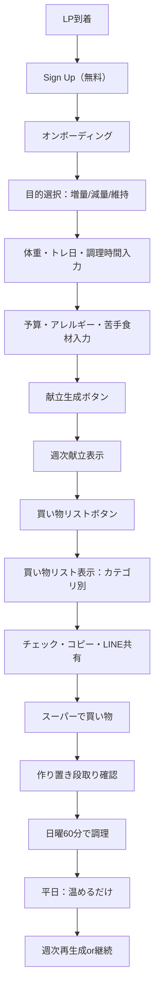
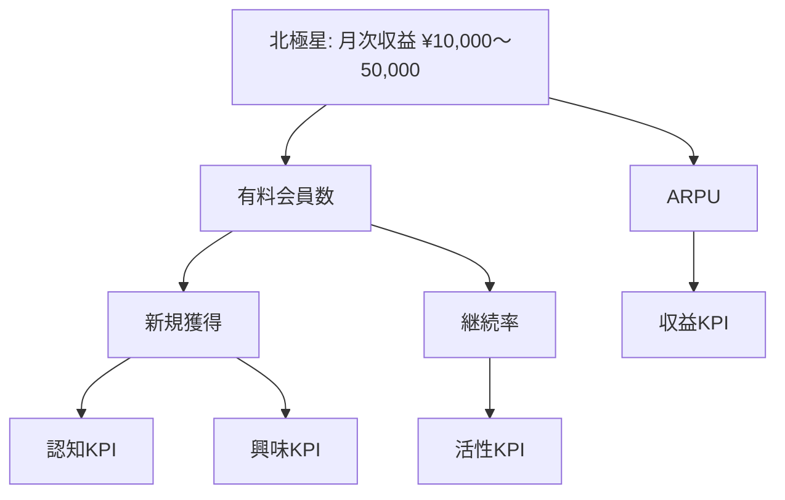
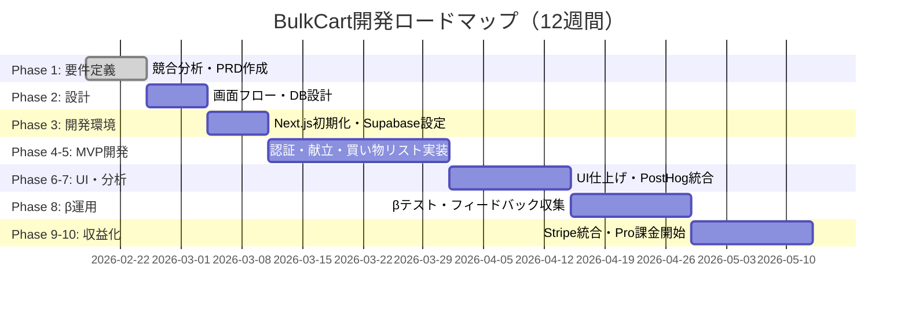

# BulkCart Product Requirements Document (PRD)

**作成日**: 2026年2月18日  
**バージョン**: 1.0  
**ステータス**: MVP定義  
**作成者**: BulkCart開発チーム

---

## 目次

1. [プロダクト概要](#1-プロダクト概要)
2. [ターゲットペルソナ](#2-ターゲットペルソナ)
3. [ユースケース](#3-ユースケース)
4. [MVPスコープ](#4-mvpスコープ)
5. [機能要件](#5-機能要件)
6. [非機能要件](#6-非機能要件)
7. [成功指標（KPI）](#7-成功指標kpi)
8. [技術スタック](#8-技術スタック)
9. [リリース計画](#9-リリース計画)

---

## 1. プロダクト概要

### 1.1 プロダクト名

**BulkCart（バルクカート）**

- **Bulk**: 筋トレ用語で「増量期」を指す。また「大量に」「まとめて」の意味も持つ（作り置き・買い物のまとめ買いを想起）
- **Cart**: 買い物カート。献立から買い物までワンクリックで完結する体験を象徴

### 1.2 解決する課題

筋トレ継続者の最大のボトルネックは「トレーニングそのもの」ではなく、**食事（自炊）の意思決定と実行コスト**です。

**典型的な課題**:
- 献立を考えるのが面倒（意思決定疲れ）
- PFC（たんぱく質・脂質・炭水化物）目標に合わせるのが難しい（知識負債）
- 買い物が面倒（買い忘れ・無駄買い・食材ロス）
- 作り置きや時短の段取りが組めない（平日に崩壊→外食・コンビニに逃げる）
- 食費が高い（プロテイン＋鶏むね＋野菜で予算オーバー、特に学生・若手社会人）

### 1.3 提供価値

BulkCartは、**「記録」ではなく「実行」に極端に特化**することで、筋トレ継続の最大のボトルネックを解消します。

- ✅ **目的別（増量/減量/維持）に合わせた週次献立を自動生成**
- ✅ **その献立から買い物リストを自動集約**（カテゴリ別、分量、代替可）
- ✅ **「作り置き」前提の段取り（何をいつ作るか）まで提示**
- ✅ **食費・節約の最適化**（食材の共通化、作り置きによる外食回避、¥10,000/月の削減を目指す）

**結果**: ユーザーは「考える」を減らし、「実行する」だけになる

### 1.4 差別化ポイント

**競合との比較**:

| 軸 | あすけん | カロミル | Eat This Much | **BulkCart** |
|---|---|---|---|---|
| **主軸** | 記録→分析 | 記録→分析 | 献立生成 | **実行支援** |
| **記録の要求** | ◎（毎食） | ◎（毎食） | △ | ✅ **ゼロ** |
| **献立生成** | △ | ○（有料） | ◎ | ✅ **ワンクリック** |
| **買い物リスト** | △（Myセット） | △ | ◎ | ✅ **カテゴリ別・チェック可・共有** |
| **作り置き段取り** | × | × | × | ✅ **タイムライン提示** |
| **筋トレ特化** | × | × | △ | ✅ **増量/減量/維持** |
| **食費最適化** | × | × | × | ✅ **¥10,000/月削減** |
| **日本の食材** | ◎ | ◎ | × | ✅ **和食最適化** |

**コアメッセージ**:
> 「記録はもういい。ワンクリックで、今週の献立が完成する。」  
> 「日曜の60分で、平日5日分が完成する。献立も、買い物も、段取りも、全部出す。」  
> 「外食より安く、ちゃんと伸びる。月1万円節約できる筋トレ飯。」

---

## 2. ターゲットペルソナ

### 2.1 ペルソナA：増量したいジム初心者の大学生

**属性**
- **年齢**: 19〜23歳
- **属性**: 週2〜3回ジム、バイト/授業で忙しい、料理スキル中〜低
- **収入**: バイト月5〜8万円、食費月2〜3万円（プロテイン含む）

**行動**
- YouTube/TikTokで筋トレ情報収集（「沼」「世界一美味しい減量食」などを視聴）
- プロテインは飲むが食事が雑（コンビニ飯・学食・外食が多い）
- 「増量したいけど何をどれくらい食べればいいかわからない」

**課題**
- たんぱく質が足りない（目標：体重×2g/日 = 140g、実際：60〜80g）
- 献立がマンネリ（鶏むね/卵/白米のループ）
- 買い物/自炊が面倒で継続できない（週2〜3回自炊→週0〜1回に崩壊）
- 食費が高い（プロテイン・鶏むね・野菜で予算オーバー）

**ニーズ**
- ✅ 「何をどれくらい食べればいいか」を自動で教えてほしい
- ✅ 買い物リストが自動で出てほしい（スーパーで迷わない）
- ✅ 平日は15分以内で調理したい（作り置き→温めるだけ）
- ✅ 食費を抑えたい（月2〜3万円以内、外食を減らす）

**重要KPI**
- 週の献立生成回数（≥1回/週）
- 買い物リスト閲覧→チェック率（≥70%）
- 1週間あたりの「目標たんぱく質達成日数」（自己申告で可、≥4日/週）
- 月次継続率（≥60%）

---

### 2.2 ペルソナB：減量したい若手社会人（時短重視）

**属性**
- **年齢**: 23〜30歳
- **属性**: 週1〜2回ジムor宅トレ、残業あり、外食/コンビニ多め
- **収入**: 月給20〜30万円、食費月3〜5万円（外食含む）

**行動**
- 健康アプリを入れるが続かない（「あすけん」「カロミル」を3ヶ月で挫折）
- 平日は料理15分以内が限界（それ以上は外食・コンビニに逃げる）
- 「痩せたいけど、意思決定が苦痛」

**課題**
- 平日の意思決定が苦痛（「今日何食べよう」が毎日発生）
- カロリー管理が破綻（記録を忘れる→罪悪感→離脱）
- 買い忘れで外食になる（「冷蔵庫に何もない→コンビニ」）
- 食費が高い（外食・コンビニで月5万円超）

**ニーズ**
- ✅ 「考える」を減らしてほしい（献立・買い物を自動化）
- ✅ 平日15分以内で調理したい（作り置き→レンチンのみ）
- ✅ 記録を求めないでほしい（継続の障壁）
- ✅ 外食を減らして食費を節約したい（月3万円台に抑える）

**重要KPI**
- "作り置きDay"の実行率（週1回）
- 平日自炊回数（≥3回/週）
- 退会理由「使ってない（Not enough usage）」を減らす（継続率≥50%）
- 食費削減額（自己申告：月¥10,000以上）

---

### 2.3 ペルソナC：コスパ重視の筋トレ中級者（自炊慣れ）

**属性**
- **年齢**: 20代後半〜30代前半
- **属性**: 週3〜5回トレ、PFC理解あり、弁当持参もする
- **収入**: 月給25〜40万円、食費月3〜4万円（自炊中心）

**行動**
- 自作テンプレ飯を回している（鶏むね/卵/オートミール/ブロッコリー）
- PFC管理は自分でできる（たんぱく質150g/日を維持）
- 増量期/減量期で献立を切り替えたいが、計画が面倒

**課題**
- マンネリ（同じレシピのループで飽きる）
- 食材の余り（キャベツ1玉買ったけど使い切れない）
- 増量/減量期で献立を切り替えるのが面倒（PFC計算を毎回やり直す）
- もっと効率化したい（食費・時間・食材ロスを減らす）

**ニーズ**
- ✅ マンネリを解消したい（新しいレシピ提案）
- ✅ 食材の使い切りを最適化したい（余りを救済するレシピ）
- ✅ 増量/減量の切り替えをワンクリックで（PFC再計算不要）
- ✅ さらに効率化したい（作り置き段取りの最適化）

**重要KPI**
- 既存テンプレ飯の置換率（提案レシピ採用率≥30%）
- 食材ロス自己申告（週あたり廃棄回数↓）
- 継続課金（月次継続率≥70%）
- NPS（Net Promoter Score）≥40（口コミ拡散）

---

## 3. ユースケース

### 3.1 メインフロー（初回ユーザー）



### 3.2 詳細ユースケース

#### UC-1: オンボーディング（初回登録）

**アクター**: 新規ユーザー  
**トリガー**: Sign Up完了  
**事前条件**: メールアドレス認証完了  

**ステップ**:
1. 目的選択（増量/減量/維持）
2. 体重入力（任意：目標たんぱく質計算用）
3. トレーニング日数（週0〜7回）
4. 調理可能時間（平日15分/日曜60分 etc.）
5. 予算感（月2〜4万円）
6. アレルギー・苦手食材（チェックボックス）
7. 「献立を生成する」ボタン

**結果**: `user_profile`に保存 → 献立生成画面へ遷移

---

#### UC-2: 週次献立生成

**アクター**: ログイン済みユーザー  
**トリガー**: 「献立を生成する」ボタン押下  
**事前条件**: `user_profile`に目的・制約が保存済み

**ステップ**:
1. ユーザーの目的（増量/減量/維持）を読み込み
2. レシピDBから制約条件（アレルギー、調理時間、予算）でフィルタ
3. スコアリング関数で最適な7日分を選定
   - 増量: 高たんぱく＋高炭水化物
   - 減量: 高たんぱく＋低脂質＋野菜多め
   - 維持: バランス
4. 食材共通化スコアを加味（買い物点数を減らす）
5. 週次献立（7日×2食）を生成
6. `plans` / `plan_items` テーブルに保存

**結果**: 週次献立画面に表示（カレンダー形式 or リスト）

---

#### UC-3: 買い物リスト生成

**アクター**: ログイン済みユーザー  
**トリガー**: 「買い物リストを見る」ボタン押下  
**事前条件**: 週次献立が生成済み

**ステップ**:
1. 献立から全レシピの食材を抽出
2. 食材を正規化（例：「鶏むね」「鶏胸」→「鶏むね」）
3. 必要量を合算（例：鶏むね 1200g）
4. カテゴリ別に並べ替え（肉/魚/卵乳/野菜/主食/調味料）
5. `grocery_items` テーブルにキャッシュ

**結果**: 買い物リスト画面に表示（チェック可・コピー可・LINE共有可）

---

#### UC-4: 作り置き段取り確認

**アクター**: ログイン済みユーザー  
**トリガー**: 「作り置き段取り」ボタン押下  
**事前条件**: 週次献立が生成済み

**ステップ**:
1. ユーザーの「作り置き可能時間」を読み込み（例：日曜60分）
2. 献立から「バッチ調理可能なレシピ」を抽出（`batchable`タグ）
3. タイムライン生成
   - 00:00 米を炊く（3合）
   - 00:05 鶏むね下処理（塩麹/酒）
   - 00:20 野菜を切る（玉ねぎ/人参）
   - 00:35 そぼろを作る
   - 00:55 保存（冷蔵/冷凍）
4. 表示（チェック可能）

**結果**: 作り置き段取り画面に表示（タイムライン形式）

---

#### UC-5: Pro課金（Free→Pro転換）

**アクター**: Freeプランユーザー  
**トリガー**: 献立生成回数が月1回に到達 or Proボタン押下  
**事前条件**: Free枠を使い切った or 自発的にProを選択

**ステップ**:
1. Pricing画面に遷移（Free vs Pro比較表）
2. 「Proプランを始める」ボタン押下
3. Stripe Checkout Session生成（`/api/billing/create-checkout-session`）
4. Stripe決済画面で支払い
5. Webhook（`payment_intent.succeeded`）で`subscription_status`を`pro`に更新
6. 献立生成制限解除

**結果**: Pro機能利用可能（無制限献立生成・買い物リスト共有・段取り表示）

---

## 4. MVPスコープ

### 4.1 MVP（v1.0）に含めるもの ✅

**認証・オンボーディング**
- ✅ Supabase Authによるメール認証
- ✅ オンボーディング（目的・体重・トレ日・調理時間・予算・制約）
- ✅ `user_profile`への保存

**献立生成**
- ✅ ルールベース生成（スコアリング関数）
- ✅ 増量/減量/維持の最適化
- ✅ 食材共通化アルゴリズム（Greedy）
- ✅ 週次献立（7日×2食）表示（カレンダー or リスト）

**買い物リスト**
- ✅ 食材の名寄せ・合算
- ✅ カテゴリ別表示（肉/魚/卵乳/野菜/主食/調味料）
- ✅ チェックボックス（localStorage）
- ✅ コピー・LINE共有・印刷用PDF

**作り置き段取り**
- ✅ タイムライン表示（日曜60分想定）
- ✅ チェック機能

**レシピ詳細**
- ✅ 材料一覧（正規化名、分量）
- ✅ 調理手順（ステップ番号付き）
- ✅ 栄養情報（P/F/C、kcal）

**課金**
- ✅ Stripe Checkout Session（月額¥780 / 年額¥7,800）
- ✅ Webhook統合（`payment_intent.succeeded` / `customer.subscription.deleted`）
- ✅ Free制限（月1回献立生成、買い物リスト閲覧のみ）
- ✅ Pro制限解除（無制限献立生成・共有・段取り）

**分析・ログ**
- ✅ PostHog統合（イベントトラッキング）
- ✅ Error Boundary（Sentry等）

**レシピDB**
- ✅ 初期30〜50レシピ（手作業 + CSV）
- ✅ 筋トレ向け（鶏むね、卵、豆腐、鮭、オートミール等）
- ✅ PFC値、調理時間、タグ付き（`batchable`, `high-protein`, `low-fat` etc.）

**UI/UX**
- ✅ レスポンシブ（モバイル優先）
- ✅ 軽量・高速（Lighthouse >80）
- ✅ ダークモード（Tailwind CSS）

---

### 4.2 MVP（v1.0）に含めないもの ❌（v2.0以降）

**機能**
- ❌ ネットスーパー統合（楽天西友、Amazon Fresh等）
- ❌ 食材単価の学習（レシート入力で"あなたの近所価格"に最適化）
- ❌ 余り食材の救済（「キャベツが余る→2レシピ提案」）
- ❌ 外食/コンビニ置換（「今日は無理」ボタン→低ダメージ代替）
- ❌ 週間のPFC達成度ダッシュボード（"記録"ではなく"履行"中心）
- ❌ レシピの難易度フィルタ（電子レンジのみ等）
- ❌ 画像解析・バーコードスキャン（重くなる）
- ❌ AI栄養士チャット（コスト高）
- ❌ コミュニティ機能（Discord/LINEオープンチャットで代替）

**UI/UX**
- ❌ アプリ版（iOS/Android）→ PWAで代替
- ❌ 高度なアニメーション（軽量優先）

**分析**
- ❌ A/Bテスト基盤（PostHogの標準機能で十分）
- ❌ リアルタイムダッシュボード（週次レビューで十分）

---

## 5. 機能要件

### 5.1 認証・プロフィール管理

| ID | 機能 | 優先度 | 詳細 |
|---|---|---|---|
| F-001 | メール認証（Supabase Auth） | P0 | Sign Up / Sign In / パスワードリセット |
| F-002 | OAuth認証（Google/Apple） | P2 | v2.0以降（摩擦を減らす） |
| F-003 | オンボーディング | P0 | 目的・体重・トレ日・調理時間・予算・制約 |
| F-004 | プロフィール編集 | P0 | 設定画面から変更可能 |
| F-005 | アカウント削除 | P1 | GDPR対応（個人情報削除） |

---

### 5.2 献立生成

| ID | 機能 | 優先度 | 詳細 |
|---|---|---|---|
| F-101 | 献立生成（ルールベース） | P0 | 増量/減量/維持に応じたスコアリング関数 |
| F-102 | 制約条件フィルタ | P0 | アレルギー、調理時間、予算 |
| F-103 | 食材共通化アルゴリズム | P0 | 買い物点数を減らす（Greedy Algorithm） |
| F-104 | 週次献立表示 | P0 | カレンダー形式 or リスト |
| F-105 | 献立再生成 | P0 | 「もう一度生成」ボタン |
| F-106 | 献立の部分編集 | P2 | 「この日だけ変更」（v2.0以降） |

---

### 5.3 買い物リスト

| ID | 機能 | 優先度 | 詳細 |
|---|---|---|---|
| F-201 | 買い物リスト自動生成 | P0 | 献立→食材抽出→名寄せ→合算 |
| F-202 | カテゴリ別表示 | P0 | 肉/魚/卵乳/野菜/主食/調味料 |
| F-203 | チェックボックス | P0 | localStorage（オフライン対応） |
| F-204 | コピー機能 | P0 | Clipboard API |
| F-205 | LINE共有 | P0 | 共有リンク生成 |
| F-206 | 印刷用PDF | P1 | ブラウザ印刷（CSS最適化） |
| F-207 | ネットスーパー統合 | P3 | v2.0以降（楽天西友、Amazon Fresh等） |

---

### 5.4 作り置き段取り

| ID | 機能 | 優先度 | 詳細 |
|---|---|---|---|
| F-301 | 段取り自動生成 | P0 | タイムライン表示（例：日曜60分） |
| F-302 | チェック機能 | P0 | 完了マーク（localStorage） |
| F-303 | タイマー連携 | P2 | v2.0以降（ブラウザTimer API） |

---

### 5.5 レシピ詳細

| ID | 機能 | 優先度 | 詳細 |
|---|---|---|---|
| F-401 | 材料一覧表示 | P0 | 正規化名、分量 |
| F-402 | 調理手順表示 | P0 | ステップ番号付き |
| F-403 | 栄養情報表示 | P0 | P/F/C、kcal |
| F-404 | お気に入り機能 | P2 | v2.0以降 |

---

### 5.6 課金・サブスクリプション

| ID | 機能 | 優先度 | 詳細 |
|---|---|---|---|
| F-501 | Free制限 | P0 | 月1回献立生成、買い物リスト閲覧のみ |
| F-502 | Pro課金 | P0 | Stripe Checkout Session（¥780/月、¥7,800/年） |
| F-503 | Webhook統合 | P0 | `payment_intent.succeeded` / `customer.subscription.deleted` |
| F-504 | サブスク管理 | P1 | Stripe Customer Portal |
| F-505 | 学生トライアル | P1 | 14日無料（自己申告） |
| F-506 | 紹介コード | P2 | v2.0以降（紹介者＋被紹介者に特典） |

---

### 5.7 分析・ログ

| ID | 機能 | 優先度 | 詳細 |
|---|---|---|---|
| F-601 | イベントトラッキング | P0 | PostHog統合（献立生成、買い物リスト閲覧等） |
| F-602 | エラーログ | P0 | Sentry統合（Error Boundary） |
| F-603 | ユーザーフィードバック | P1 | Google Form連携（β期間） |
| F-604 | A/Bテスト | P2 | v2.0以降（PostHog標準機能） |

---

## 6. 非機能要件

### 6.1 パフォーマンス

| NFR-ID | 項目 | 目標値 | 測定方法 |
|---|---|---|---|
| NFR-001 | ページ読み込み時間 | <2秒（First Contentful Paint） | Lighthouse |
| NFR-002 | API応答時間 | <200ms（献立生成は除く） | PostHog Performance Monitor |
| NFR-003 | 献立生成時間 | <5秒 | ユーザーテスト |
| NFR-004 | Lighthouseスコア | >80（すべてのカテゴリ） | Lighthouse CI |

---

### 6.2 スケーラビリティ

| NFR-ID | 項目 | 目標値 | 対応策 |
|---|---|---|---|
| NFR-101 | 同時接続ユーザー | 1,000人（MVP期間） | Vercel無料枠→有料へ段階移行 |
| NFR-102 | DB接続数 | Supabase無料枠（500MB） | インデックス最適化、必要に応じて有料プラン |
| NFR-103 | API Rate Limit | 10req/sec/user | Vercel Edge Functions |

---

### 6.3 セキュリティ

| NFR-ID | 項目 | 対応策 |
|---|---|---|
| NFR-201 | 認証・認可 | Supabase Row Level Security（RLS） |
| NFR-202 | パスワード管理 | Supabase Auth（bcrypt自動） |
| NFR-203 | 個人情報保護 | 最小収集、暗号化、削除要求対応 |
| NFR-204 | HTTPS通信 | Vercel標準（SSL証明書自動） |
| NFR-205 | CSRF/XSS対策 | Next.js標準機能、CSP設定 |

---

### 6.4 ユーザビリティ

| NFR-ID | 項目 | 目標値 | 測定方法 |
|---|---|---|---|
| NFR-301 | モバイル最適化 | レスポンシブ対応（iPhone SE〜13 Pro Max） | 実機テスト |
| NFR-302 | タップ領域 | 最小44×44px（WCAG準拠） | Figma/実機確認 |
| NFR-303 | フォーム入力 | エラー表示は即座（Zod + React Hook Form） | ユーザーテスト |
| NFR-304 | ダークモード | 対応（Tailwind CSS） | 設定画面から切り替え |

---

### 6.5 法務・コンプライアンス

| NFR-ID | 項目 | 対応策 |
|---|---|---|
| NFR-401 | プライバシーポリシー | 作成・公開（`/legal/privacy`） |
| NFR-402 | 利用規約 | 作成・公開（`/legal/terms`） |
| NFR-403 | 栄養免責 | 「目安値であり変動がある」「医療行為ではない」を明記 |
| NFR-404 | GDPR対応 | アカウント削除、データエクスポート |
| NFR-405 | Cookie同意 | PostHog/分析ツール使用時の同意取得 |

---

## 7. 成功指標（KPI）

### 7.1 KPIツリー



---

### 7.2 認知KPI（Awareness）

| KPI | 目標値（3ヶ月） | 測定方法 |
|---|---|---|
| TikTok/IG再生数 | 累計50,000回 | SNS Analytics |
| 保存数 | 累計500件 | SNS Analytics |
| プロフィール遷移率 | 5% | SNS Analytics |
| LP訪問数 | 1,000人 | PostHog |

---

### 7.3 興味KPI（Interest）

| KPI | 目標値（3ヶ月） | 測定方法 |
|---|---|---|
| Sign Up完了率 | 30%（LP訪問→Sign Up） | PostHog Funnel |
| オンボーディング完了率 | 80%（Sign Up→献立生成） | PostHog Funnel |
| 献立生成完了率 | 70%（オンボーディング→生成） | PostHog Event |

---

### 7.4 活性KPI（Engagement）

| KPI | 目標値（3ヶ月） | 測定方法 |
|---|---|---|
| 週次献立再生成率 | 40% | PostHog Cohort Analysis |
| 買い物リスト閲覧率 | 80%（献立生成→買い物リスト） | PostHog Funnel |
| チェック率 | 70%（買い物リスト表示→1個以上チェック） | PostHog Event |
| 作り置き段取り閲覧率 | 50% | PostHog Event |
| 週次アクティブ率（WAU/MAU） | 60% | PostHog Retention |

---

### 7.5 収益KPI（Revenue）

| KPI | 目標値（3ヶ月） | 測定方法 |
|---|---|---|
| Free→Pro転換率 | 10%（献立3回生成→Pro） | PostHog Funnel |
| 有料会員数 | 13〜64人（目標¥10,000〜50,000） | Stripe Dashboard |
| 月次継続率（MRR） | 60%（1ヶ月後） | Stripe Dashboard |
| 解約理由「使ってない」 | <50% | Stripe Cancellation Survey |
| NPS（Net Promoter Score） | >30 | Google Form / PostHog Survey |

---

### 7.6 KPIダッシュボード構成

**PostHogダッシュボード（週次確認）**:
- Funnel: LP→Sign Up→オンボーディング→献立生成→買い物リスト
- Retention: D1/D7/D30保持率
- Event: 献立生成、買い物リスト閲覧、チェック、段取り閲覧
- Cohort: Free vs Pro の行動差分

**Stripeダッシュボード（週次確認）**:
- MRR（Monthly Recurring Revenue）
- 新規課金数、解約数、純増減
- 解約理由分析

---

## 8. 技術スタック

### 8.1 フロントエンド

| レイヤー | 技術 | 理由 |
|---|---|---|
| フレームワーク | **Next.js 14（App Router）** | React Server Components、高速、Vercel統合 |
| 言語 | **TypeScript** | 型安全、開発効率 |
| UI | **Tailwind CSS** + **shadcn/ui** | 軽量、カスタマイズ可、コンポーネント再利用 |
| フォーム | **React Hook Form** + **Zod** | バリデーション、型安全 |
| 状態管理 | React Context（最小限） | Zustand/Reduxは不要（サーバー状態中心） |

---

### 8.2 バックエンド

| レイヤー | 技術 | 理由 |
|---|---|---|
| API | **Next.js Route Handler** | 軽量、フロントと一体化 |
| DB | **Supabase（Postgres）** | 無料枠、Auth統合、RLS、リアルタイム |
| Auth | **Supabase Auth** | メール認証、OAuth、セッション管理 |
| 決済 | **Stripe** | サブスク管理、Webhook統合、手数料3.6% |

---

### 8.3 インフラ・運用

| レイヤー | 技術 | 理由 |
|---|---|---|
| ホスティング | **Vercel** | 無料枠、Next.js最適化、Edge Functions |
| ドメイン | お名前.com等 | ¥1,000〜2,000/年 |
| 分析 | **PostHog** | 無料枠、イベントトラッキング、Funnel、Retention |
| エラー監視 | **Sentry** | 無料枠、Error Boundary統合 |
| メール配信 | **Resend** | 無料枠月3,000通、開発者UX良 |

---

### 8.4 データモデル（DB設計）

**主要テーブル**:

```sql
-- ユーザープロフィール
CREATE TABLE user_profile (
  id UUID PRIMARY KEY REFERENCES auth.users(id),
  goal TEXT CHECK (goal IN ('bulk', 'cut', 'maintain')), -- 増量/減量/維持
  weight_kg DECIMAL(5,2),
  training_days_per_week INT CHECK (training_days_per_week >= 0 AND training_days_per_week <= 7),
  cooking_time_weekday INT, -- 分
  cooking_time_weekend INT, -- 分
  budget_per_month INT, -- 円
  allergies TEXT[], -- ['卵', '乳製品']
  dislikes TEXT[], -- ['セロリ', 'パクチー']
  created_at TIMESTAMP DEFAULT NOW(),
  updated_at TIMESTAMP DEFAULT NOW()
);

-- レシピ
CREATE TABLE recipes (
  id UUID PRIMARY KEY DEFAULT gen_random_uuid(),
  name TEXT NOT NULL,
  description TEXT,
  cooking_time INT, -- 分
  difficulty TEXT CHECK (difficulty IN ('easy', 'medium', 'hard')),
  protein_g DECIMAL(5,1),
  fat_g DECIMAL(5,1),
  carb_g DECIMAL(5,1),
  calories INT,
  tags TEXT[], -- ['high-protein', 'low-fat', 'batchable']
  steps JSONB, -- [{"step": 1, "text": "米を炊く"}]
  created_at TIMESTAMP DEFAULT NOW()
);

-- 食材
CREATE TABLE ingredients (
  id UUID PRIMARY KEY DEFAULT gen_random_uuid(),
  name TEXT NOT NULL UNIQUE, -- 正規化名（例：鶏むね）
  aliases TEXT[], -- ['鶏胸', 'とりむね']
  category TEXT CHECK (category IN ('meat', 'fish', 'egg_dairy', 'vegetable', 'grain', 'seasoning')),
  unit TEXT DEFAULT 'g', -- g, 個, ml
  created_at TIMESTAMP DEFAULT NOW()
);

-- レシピ×食材
CREATE TABLE recipe_ingredients (
  id UUID PRIMARY KEY DEFAULT gen_random_uuid(),
  recipe_id UUID REFERENCES recipes(id) ON DELETE CASCADE,
  ingredient_id UUID REFERENCES ingredients(id) ON DELETE CASCADE,
  amount DECIMAL(7,2), -- 量（例：300.0）
  unit TEXT, -- g, 個, ml
  UNIQUE(recipe_id, ingredient_id)
);

-- 週次プラン
CREATE TABLE plans (
  id UUID PRIMARY KEY DEFAULT gen_random_uuid(),
  user_id UUID REFERENCES auth.users(id) ON DELETE CASCADE,
  week_start_date DATE NOT NULL,
  goal TEXT CHECK (goal IN ('bulk', 'cut', 'maintain')),
  created_at TIMESTAMP DEFAULT NOW()
);

-- プラン×日×食×レシピ
CREATE TABLE plan_items (
  id UUID PRIMARY KEY DEFAULT gen_random_uuid(),
  plan_id UUID REFERENCES plans(id) ON DELETE CASCADE,
  day_of_week INT CHECK (day_of_week >= 0 AND day_of_week <= 6), -- 0=月, 6=日
  meal_slot TEXT CHECK (meal_slot IN ('lunch', 'dinner', 'snack')),
  recipe_id UUID REFERENCES recipes(id) ON DELETE CASCADE,
  UNIQUE(plan_id, day_of_week, meal_slot)
);

-- 買い物リスト（キャッシュ）
CREATE TABLE grocery_items (
  id UUID PRIMARY KEY DEFAULT gen_random_uuid(),
  plan_id UUID REFERENCES plans(id) ON DELETE CASCADE,
  ingredient_id UUID REFERENCES ingredients(id) ON DELETE CASCADE,
  amount DECIMAL(7,2),
  unit TEXT,
  category TEXT,
  UNIQUE(plan_id, ingredient_id)
);

-- サブスクリプション
CREATE TABLE subscriptions (
  id UUID PRIMARY KEY DEFAULT gen_random_uuid(),
  user_id UUID REFERENCES auth.users(id) ON DELETE CASCADE UNIQUE,
  stripe_customer_id TEXT UNIQUE,
  stripe_subscription_id TEXT UNIQUE,
  status TEXT CHECK (status IN ('free', 'pro', 'cancelled')),
  current_period_end TIMESTAMP,
  created_at TIMESTAMP DEFAULT NOW(),
  updated_at TIMESTAMP DEFAULT NOW()
);
```

**Row-Level Security（RLS）**:
- `user_profile`: ユーザー自身のみ読み書き可能
- `plans` / `plan_items` / `grocery_items`: ユーザー自身のみ読み書き可能
- `recipes` / `ingredients` / `recipe_ingredients`: 全ユーザー読み取り可能、管理者のみ書き込み可能
- `subscriptions`: ユーザー自身のみ読み取り可能、Stripe Webhookのみ書き込み可能

---

## 9. リリース計画

### 9.1 開発スケジュール（12週間）



---

### 9.2 マイルストーン

| マイルストーン | 完了日（目標） | 成果物 |
|---|---|---|
| **M1: 要件確定** | Week 1（2026-02-25） | PRD、競合分析、差別化戦略 |
| **M2: 設計完了** | Week 2（2026-03-04） | 画面フロー、DB設計、API仕様 |
| **M3: 基盤構築** | Week 3（2026-03-11） | Next.js + Supabase + Vercel |
| **M4: MVP実装** | Week 6（2026-04-01） | 認証・献立・買い物・レシピ |
| **M5: UI完成** | Week 8（2026-04-15） | レスポンシブ、PostHog統合 |
| **M6: β公開** | Week 10（2026-04-29） | 30人βテスト、フィードバック収集 |
| **M7: 収益化** | Week 12（2026-05-13） | Stripe統合、Pro課金開始 |

---

### 9.3 ローンチ戦略

#### Phase 1: β募集（Week 1-2）
- TikTok/IGで毎週5本投稿（「献立の悩み」「買い物の課題」を訴求）
- Waitlist登録フォーム（Google Form）
- 目標: β登録30人

#### Phase 2: β運用（Week 8-10）
- 30人に招待メール送信
- Discord/LINEオープンチャットで定期フィードバック会議（週1回）
- 目標: 献立生成20件、買い物リスト閲覧率80%

#### Phase 3: 課金開始（Week 12）
- Stripe Pro課金開始（¥780/月、¥7,800/年）
- 初月50%OFF（¥390）で獲得促進
- 目標: 有料10人（月次収益¥7,800）

#### Phase 4: 拡大（Week 13-24）
- マイクロインフルエンサー提携（フォロワー1万人以下、筋トレ系）
- UGC促進（「買い物リストのスクショ」を投稿→#BulkCart）
- 目標: 有料50〜70人（月次収益¥39,000〜54,600）

---

### 9.4 リスクと対策

| リスク | 影響度 | 発生確率 | 対策 |
|---|---|---|---|
| 献立生成の品質低下 | 高 | 中 | レシピDBの段階拡充（30→50→100）、βテストで検証 |
| 継続率低下（"使ってない"解約） | 高 | 高 | オンボーディング強化、初週の価値体験（献立→買い物→調理）を徹底 |
| 競合の後追い（あすけん/カロミルが模倣） | 中 | 低 | 「筋トレ×作り置き」に極端に特化、軽量・高速で勝つ |
| 開発時間不足（学生の時間制約） | 中 | 中 | LLM全面依存を避け、ルールベース＋小さなレシピDBでMVP成立 |
| 法務リスク（栄養情報の免責） | 中 | 低 | 「目安値であり変動がある」「医療行為ではない」を明記、医療相談導線 |

---

## 10. 付録

### 10.1 用語集

| 用語 | 定義 |
|---|---|
| PFC | たんぱく質（Protein）・脂質（Fat）・炭水化物（Carbohydrate）の略 |
| 増量（Bulk） | 筋肉量を増やすために高カロリー・高たんぱく質を摂取する期間 |
| 減量（Cut） | 体脂肪を減らすために低カロリー・高たんぱく質を摂取する期間 |
| 作り置き | 週末にまとめて調理し、平日に温めるだけで食べられるようにする調理法 |
| WAU/MAU | Weekly Active Users / Monthly Active Users（週次/月次アクティブユーザー） |
| MRR | Monthly Recurring Revenue（月次経常収益） |
| NPS | Net Promoter Score（推奨度を測る指標：-100〜+100） |

### 10.2 参考資料

- [競合分析レポート](./competitive-analysis.md)
- [差別化戦略](./differentiation-strategy.md)
- [アプリレビュー分析レポート](./app-review-analysis.md)
- [deep-research-report.md](../deep-research-report.md)

---

**終わり**
